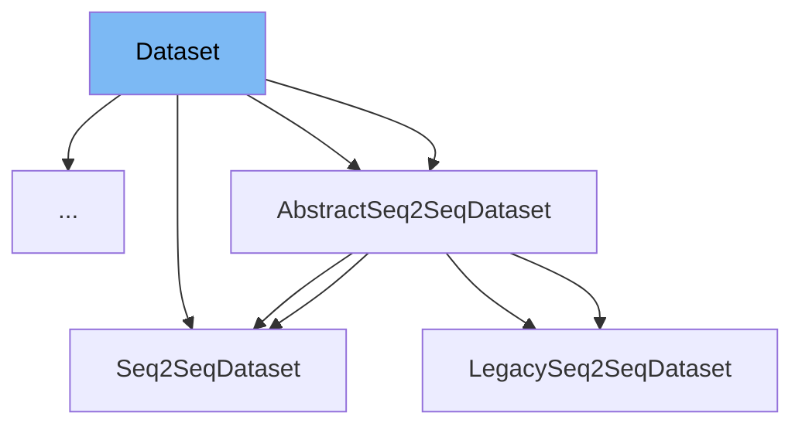

This document will cover the <SwmToken path="examples/research_projects/pplm/run_pplm_discrim_train.py" pos="212:1:1" line-data="        dataset=Dataset(xs, ys), batch_size=batch_size, shuffle=shuffle, collate_fn=cached_collate_fn">`dataset`</SwmToken> class in the file <SwmPath>[examples/research_projects/pplm/run_pplm_discrim_train.py](examples/research_projects/pplm/run_pplm_discrim_train.py)</SwmPath>. We will cover:

1. What is <SwmToken path="examples/research_projects/pplm/run_pplm_discrim_train.py" pos="212:1:1" line-data="        dataset=Dataset(xs, ys), batch_size=batch_size, shuffle=shuffle, collate_fn=cached_collate_fn">`dataset`</SwmToken>
2. Variables and functions
3. Usage example



# What is Dataset

The <SwmToken path="examples/research_projects/pplm/run_pplm_discrim_train.py" pos="212:1:1" line-data="        dataset=Dataset(xs, ys), batch_size=batch_size, shuffle=shuffle, collate_fn=cached_collate_fn">`dataset`</SwmToken> class in <SwmPath>[examples/research_projects/pplm/run_pplm_discrim_train.py](examples/research_projects/pplm/run_pplm_discrim_train.py)</SwmPath> is a custom dataset class used for handling data in the training of a discriminator model. It is designed to read source and target sequences from text files and provide them in a format suitable for training machine learning models. This class is essential for organizing and managing the input data, ensuring that it can be efficiently fed into the model during training.

<SwmSnippet path="/examples/research_projects/pplm/run_pplm_discrim_train.py" line="85">

---

# Variables and functions

The variable <SwmToken path="examples/research_projects/pplm/run_pplm_discrim_train.py" pos="85:8:8" line-data="    def __init__(self, X, y):">`X`</SwmToken> is used to store the input sequences. It is initialized in the constructor and holds the data that will be used as input to the model.

```python
    def __init__(self, X, y):
```

---

</SwmSnippet>

<SwmSnippet path="/examples/research_projects/pplm/run_pplm_discrim_train.py" line="88">

---

The variable <SwmToken path="examples/research_projects/pplm/run_pplm_discrim_train.py" pos="88:3:3" line-data="        self.y = y">`y`</SwmToken> is used to store the target sequences. It is initialized in the constructor and holds the labels or target values corresponding to the input data.

```python
        self.y = y
```

---

</SwmSnippet>

<SwmSnippet path="/examples/research_projects/pplm/run_pplm_discrim_train.py" line="90">

---

The function <SwmToken path="examples/research_projects/pplm/run_pplm_discrim_train.py" pos="90:3:3" line-data="    def __len__(self):">`__len__`</SwmToken> returns the length of the dataset, which is the number of input sequences stored in <SwmToken path="examples/research_projects/pplm/run_pplm_discrim_train.py" pos="91:7:7" line-data="        return len(self.X)">`X`</SwmToken>. This is useful for determining the size of the dataset.

```python
    def __len__(self):
        return len(self.X)
```

---

</SwmSnippet>

<SwmSnippet path="/examples/research_projects/pplm/run_pplm_discrim_train.py" line="93">

---

The function <SwmToken path="examples/research_projects/pplm/run_pplm_discrim_train.py" pos="93:3:3" line-data="    def __getitem__(self, index):">`__getitem__`</SwmToken> returns a data pair (input and target) at the specified index. It retrieves the input sequence from <SwmToken path="examples/research_projects/pplm/run_pplm_discrim_train.py" pos="96:4:4" line-data="        data[&quot;X&quot;] = self.X[index]">`X`</SwmToken> and the corresponding target sequence from <SwmToken path="examples/research_projects/pplm/run_pplm_discrim_train.py" pos="97:4:4" line-data="        data[&quot;y&quot;] = self.y[index]">`y`</SwmToken>, and returns them as a dictionary.

```python
    def __getitem__(self, index):
        """Returns one data pair (source and target)."""
        data = {}
        data["X"] = self.X[index]
        data["y"] = self.y[index]
        return data
```

---

</SwmSnippet>

# Usage example

Here is an example of how to use the <SwmToken path="examples/research_projects/pplm/run_pplm_discrim_train.py" pos="212:1:1" line-data="        dataset=Dataset(xs, ys), batch_size=batch_size, shuffle=shuffle, collate_fn=cached_collate_fn">`dataset`</SwmToken> class in the context of `TextDatasetForNextSentencePrediction`.

<SwmSnippet path="/examples/research_projects/pplm/run_pplm_discrim_train.py" line="211">

---

The <SwmToken path="examples/research_projects/pplm/run_pplm_discrim_train.py" pos="212:1:1" line-data="        dataset=Dataset(xs, ys), batch_size=batch_size, shuffle=shuffle, collate_fn=cached_collate_fn">`dataset`</SwmToken> class is instantiated with input and target sequences, and then used to create a data loader for training. This example shows how the <SwmToken path="examples/research_projects/pplm/run_pplm_discrim_train.py" pos="212:1:1" line-data="        dataset=Dataset(xs, ys), batch_size=batch_size, shuffle=shuffle, collate_fn=cached_collate_fn">`dataset`</SwmToken> class is utilized to prepare data for the training process.

```python
    data_loader = torch.utils.data.DataLoader(
        dataset=Dataset(xs, ys), batch_size=batch_size, shuffle=shuffle, collate_fn=cached_collate_fn
    )
```

---

</SwmSnippet>

&nbsp;

*This is an auto-generated document by Swimm AI 🌊 and has not yet been verified by a human*

<SwmMeta version="3.0.0" repo-id="Z2l0aHViJTNBJTNBdHJhbnNmb3JtZXJzJTNBJTNBc2h1anV1dQ==" repo-name="transformers" doc-type="general-class"><sup>Powered by [Swimm](/)</sup></SwmMeta>
