This document will cover the class <SwmToken path="src/transformers/file_utils.py" pos="1829:2:2" line-data="class ExplicitEnum(Enum):">`ExplicitEnum`</SwmToken> in the <SwmToken path="src/transformers/file_utils.py" pos="52:2:2" line-data="from transformers.utils.versions import importlib_metadata">`transformers`</SwmToken> repository. We will cover:

1. What is <SwmToken path="src/transformers/file_utils.py" pos="1829:2:2" line-data="class ExplicitEnum(Enum):">`ExplicitEnum`</SwmToken>
2. Variables and functions
3. Usage example

```mermaid
graph TD;
  ExplicitEnum:::currentBaseStyle
ExplicitEnum --> TensorType
ExplicitEnum --> PaddingStrategy
ExplicitEnum --> SchedulerType
ExplicitEnum --> TruncationStrategy
ExplicitEnum --> IntervalStrategy
ExplicitEnum --> AggregationStrategy
ExplicitEnum --> ShardedDDPOption
ExplicitEnum --> HPSearchBackend
ExplicitEnum --> EvaluationStrategy
ExplicitEnum --> DebugOption
ExplicitEnum --> 1[...]

 classDef currentBaseStyle color:#000000,fill:#7CB9F4

%% Swimm:
%% graph TD;
%%   ExplicitEnum:::currentBaseStyle
%% <SwmToken path="src/transformers/file_utils.py" pos="1829:2:2" line-data="class ExplicitEnum(Enum):">`ExplicitEnum`</SwmToken> --> <SwmToken path="src/transformers/file_utils.py" pos="1852:2:2" line-data="class TensorType(ExplicitEnum):">`TensorType`</SwmToken>
%% <SwmToken path="src/transformers/file_utils.py" pos="1829:2:2" line-data="class ExplicitEnum(Enum):">`ExplicitEnum`</SwmToken> --> <SwmToken path="src/transformers/file_utils.py" pos="1841:2:2" line-data="class PaddingStrategy(ExplicitEnum):">`PaddingStrategy`</SwmToken>
%% <SwmToken path="src/transformers/file_utils.py" pos="1829:2:2" line-data="class ExplicitEnum(Enum):">`ExplicitEnum`</SwmToken> --> SchedulerType
%% <SwmToken path="src/transformers/file_utils.py" pos="1829:2:2" line-data="class ExplicitEnum(Enum):">`ExplicitEnum`</SwmToken> --> TruncationStrategy
%% <SwmToken path="src/transformers/file_utils.py" pos="1829:2:2" line-data="class ExplicitEnum(Enum):">`ExplicitEnum`</SwmToken> --> IntervalStrategy
%% <SwmToken path="src/transformers/file_utils.py" pos="1829:2:2" line-data="class ExplicitEnum(Enum):">`ExplicitEnum`</SwmToken> --> AggregationStrategy
%% <SwmToken path="src/transformers/file_utils.py" pos="1829:2:2" line-data="class ExplicitEnum(Enum):">`ExplicitEnum`</SwmToken> --> ShardedDDPOption
%% <SwmToken path="src/transformers/file_utils.py" pos="1829:2:2" line-data="class ExplicitEnum(Enum):">`ExplicitEnum`</SwmToken> --> HPSearchBackend
%% <SwmToken path="src/transformers/file_utils.py" pos="1829:2:2" line-data="class ExplicitEnum(Enum):">`ExplicitEnum`</SwmToken> --> EvaluationStrategy
%% <SwmToken path="src/transformers/file_utils.py" pos="1829:2:2" line-data="class ExplicitEnum(Enum):">`ExplicitEnum`</SwmToken> --> <SwmToken path="src/transformers/debug_utils.py" pos="324:2:2" line-data="class DebugOption(ExplicitEnum):">`DebugOption`</SwmToken>
%% <SwmToken path="src/transformers/file_utils.py" pos="1829:2:2" line-data="class ExplicitEnum(Enum):">`ExplicitEnum`</SwmToken> --> 1[...]
%% 
%%  classDef currentBaseStyle color:#000000,fill:#7CB9F4
```



# What is <SwmToken path="src/transformers/file_utils.py" pos="1829:2:2" line-data="class ExplicitEnum(Enum):">`ExplicitEnum`</SwmToken>

The <SwmToken path="src/transformers/file_utils.py" pos="1829:2:2" line-data="class ExplicitEnum(Enum):">`ExplicitEnum`</SwmToken> class is a custom enumeration class defined in <SwmPath>[src/transformers/file_utils.py](src/transformers/file_utils.py)</SwmPath>. It extends the standard <SwmToken path="src/transformers/file_utils.py" pos="1829:4:4" line-data="class ExplicitEnum(Enum):">`Enum`</SwmToken> class and provides a more explicit error message when an invalid value is used. This class is useful for defining enumerations with clear error messages, making it easier to debug issues related to invalid enumeration values.

<SwmSnippet path="/src/transformers/file_utils.py" line="1829">

---

# Variables and functions

The <SwmToken path="src/transformers/file_utils.py" pos="1829:2:2" line-data="class ExplicitEnum(Enum):">`ExplicitEnum`</SwmToken> class itself is defined here. It extends the <SwmToken path="src/transformers/file_utils.py" pos="1829:4:4" line-data="class ExplicitEnum(Enum):">`Enum`</SwmToken> class and overrides the <SwmToken path="src/transformers/file_utils.py" pos="1835:3:3" line-data="    def _missing_(cls, value):">`_missing_`</SwmToken> method to provide a custom error message when an invalid value is used.

```python
class ExplicitEnum(Enum):
    """
    Enum with more explicit error message for missing values.
    """

    @classmethod
    def _missing_(cls, value):
        raise ValueError(
            f"{value} is not a valid {cls.__name__}, please select one of {list(cls._value2member_map_.keys())}"
        )

```

---

</SwmSnippet>

<SwmSnippet path="/src/transformers/file_utils.py" line="1834">

---

The <SwmToken path="src/transformers/file_utils.py" pos="1835:3:3" line-data="    def _missing_(cls, value):">`_missing_`</SwmToken> method is a class method that is called when an invalid value is used for the enumeration. It raises a <SwmToken path="src/transformers/file_utils.py" pos="1836:3:3" line-data="        raise ValueError(">`ValueError`</SwmToken> with a message that includes the invalid value and the list of valid values for the enumeration.

```python
    @classmethod
    def _missing_(cls, value):
        raise ValueError(
            f"{value} is not a valid {cls.__name__}, please select one of {list(cls._value2member_map_.keys())}"
        )
```

---

</SwmSnippet>

# Usage example

Here is an example of how to use <SwmToken path="src/transformers/file_utils.py" pos="1829:2:2" line-data="class ExplicitEnum(Enum):">`ExplicitEnum`</SwmToken> in the <SwmToken path="src/transformers/debug_utils.py" pos="324:2:2" line-data="class DebugOption(ExplicitEnum):">`DebugOption`</SwmToken> class.

<SwmSnippet path="/src/transformers/debug_utils.py" line="58">

---

# Usage example

The <SwmToken path="src/transformers/debug_utils.py" pos="324:2:2" line-data="class DebugOption(ExplicitEnum):">`DebugOption`</SwmToken> class extends <SwmToken path="src/transformers/file_utils.py" pos="1829:2:2" line-data="class ExplicitEnum(Enum):">`ExplicitEnum`</SwmToken> and defines several enumeration values. This example shows how <SwmToken path="src/transformers/file_utils.py" pos="1829:2:2" line-data="class ExplicitEnum(Enum):">`ExplicitEnum`</SwmToken> can be used to create enumerations with explicit error messages.

```python
        2.17e-07 4.50e+00 weight
        1.79e-06 4.65e+00 input[0]
        2.68e-06 3.70e+01 output
                          encoder.block.2.layer.1.DenseReluDense.wi_1 Linear
```

---

</SwmSnippet>

&nbsp;

*This is an auto-generated document by Swimm AI 🌊 and has not yet been verified by a human*

<SwmMeta version="3.0.0" repo-id="Z2l0aHViJTNBJTNBdHJhbnNmb3JtZXJzJTNBJTNBc2h1anV1dQ==" repo-name="transformers"><sup>Powered by [Swimm](/)</sup></SwmMeta>
