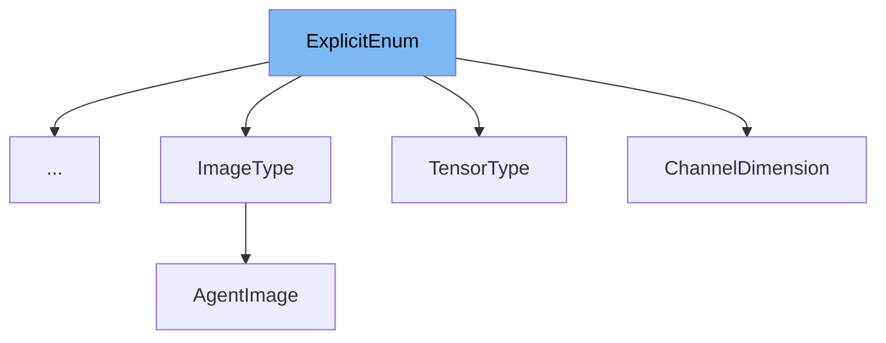

This document will cover the class <SwmToken path="src/transformers/utils/generic.py" pos="489:2:2" line-data="class ExplicitEnum(str, Enum):">`ExplicitEnum`</SwmToken> in the <SwmToken path="examples/research_projects/self-training-text-classification/finetuning.py" pos="35:2:2" line-data="from transformers import (">`transformers`</SwmToken> repository. We will cover:

1. What is <SwmToken path="src/transformers/utils/generic.py" pos="489:2:2" line-data="class ExplicitEnum(str, Enum):">`ExplicitEnum`</SwmToken>
2. Variables and functions
3. Usage example



# What is <SwmToken path="src/transformers/utils/generic.py" pos="489:2:2" line-data="class ExplicitEnum(str, Enum):">`ExplicitEnum`</SwmToken>

The <SwmToken path="src/transformers/utils/generic.py" pos="489:2:2" line-data="class ExplicitEnum(str, Enum):">`ExplicitEnum`</SwmToken> class in <SwmPath>[src/transformers/utils/generic.py](src/transformers/utils/generic.py)</SwmPath> is a specialized enumeration class that provides more explicit error messages for missing values. It is used to define enumerations with clear error handling when an invalid value is accessed.

<SwmSnippet path="/src/transformers/utils/generic.py" line="489">

---

# Variables and functions

The <SwmToken path="src/transformers/utils/generic.py" pos="489:2:2" line-data="class ExplicitEnum(str, Enum):">`ExplicitEnum`</SwmToken> class inherits from <SwmToken path="src/transformers/utils/generic.py" pos="489:4:4" line-data="class ExplicitEnum(str, Enum):">`str`</SwmToken> and <SwmToken path="src/transformers/utils/generic.py" pos="489:7:7" line-data="class ExplicitEnum(str, Enum):">`Enum`</SwmToken>. This allows it to behave like a string enumeration while providing additional functionality.

```python
class ExplicitEnum(str, Enum):
    """
    Enum with more explicit error message for missing values.
    """
```

---

</SwmSnippet>

<SwmSnippet path="/src/transformers/utils/generic.py" line="494">

---

The <SwmToken path="src/transformers/utils/generic.py" pos="495:3:3" line-data="    def _missing_(cls, value):">`_missing_`</SwmToken> class method is overridden to raise a <SwmToken path="src/transformers/utils/generic.py" pos="496:3:3" line-data="        raise ValueError(">`ValueError`</SwmToken> with a clear message when an invalid value is accessed. This method ensures that users are informed about the valid values for the enumeration.

```python
    @classmethod
    def _missing_(cls, value):
        raise ValueError(
            f"{value} is not a valid {cls.__name__}, please select one of {list(cls._value2member_map_.keys())}"
        )
```

---

</SwmSnippet>

# Usage example

The <SwmToken path="src/transformers/utils/generic.py" pos="489:2:2" line-data="class ExplicitEnum(str, Enum):">`ExplicitEnum`</SwmToken> class is used in the <SwmToken path="src/transformers/utils/generic.py" pos="501:2:2" line-data="class PaddingStrategy(ExplicitEnum):">`PaddingStrategy`</SwmToken> and <SwmToken path="src/transformers/utils/generic.py" pos="512:2:2" line-data="class TensorType(ExplicitEnum):">`TensorType`</SwmToken> classes to define specific enumeration values. Here is an example of how to use <SwmToken path="src/transformers/utils/generic.py" pos="489:2:2" line-data="class ExplicitEnum(str, Enum):">`ExplicitEnum`</SwmToken> in <SwmToken path="examples/research_projects/self-training-text-classification/finetuning.py" pos="52:2:2" line-data="class Split(ExplicitEnum):">`Split`</SwmToken>.

<SwmSnippet path="/examples/research_projects/self-training-text-classification/finetuning.py" line="33">

---

In this example, <SwmToken path="examples/research_projects/self-training-text-classification/finetuning.py" pos="52:2:2" line-data="class Split(ExplicitEnum):">`Split`</SwmToken> is an enumeration that uses <SwmToken path="src/transformers/utils/generic.py" pos="489:2:2" line-data="class ExplicitEnum(str, Enum):">`ExplicitEnum`</SwmToken> to define different split types. This ensures that any invalid split type accessed will raise a clear error message.

```python
from tqdm.auto import tqdm

from transformers import (
    AdamW,
    AutoConfig,
    AutoModelForSequenceClassification,
    AutoTokenizer,
```

---

</SwmSnippet>

&nbsp;

*This is an auto-generated document by Swimm AI 🌊 and has not yet been verified by a human*

<SwmMeta version="3.0.0" repo-id="Z2l0aHViJTNBJTNBdHJhbnNmb3JtZXJzJTNBJTNBc2h1anV1dQ==" repo-name="transformers" doc-type="class"><sup>Powered by [Swimm](/)</sup></SwmMeta>
