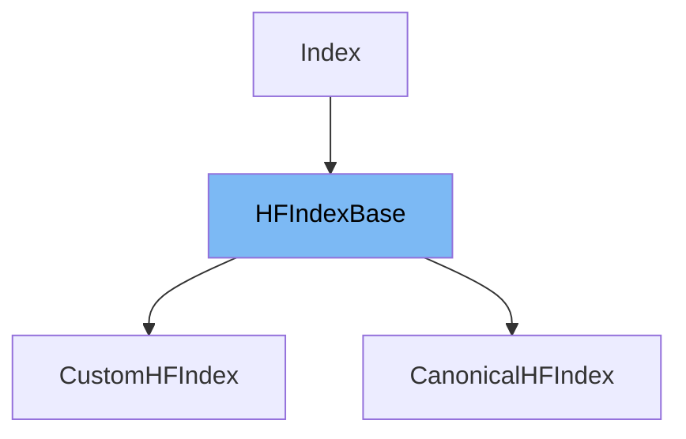

This document will cover the class <SwmToken path="src/transformers/models/rag/retrieval_rag.py" pos="229:4:4" line-data="class CanonicalHFIndex(HFIndexBase):">`HFIndexBase`</SwmToken> in the <SwmToken path="src/transformers/models/rag/retrieval_rag.py" pos="47:22:22" line-data="    A base class for the Indices encapsulated by the :class:`~transformers.RagRetriever`.">`transformers`</SwmToken> repository. We will cover:

1. What is <SwmToken path="src/transformers/models/rag/retrieval_rag.py" pos="229:4:4" line-data="class CanonicalHFIndex(HFIndexBase):">`HFIndexBase`</SwmToken>
2. Variables and functions
3. Usage example



# What is <SwmToken path="src/transformers/models/rag/retrieval_rag.py" pos="229:4:4" line-data="class CanonicalHFIndex(HFIndexBase):">`HFIndexBase`</SwmToken>

The <SwmToken path="src/transformers/models/rag/retrieval_rag.py" pos="229:4:4" line-data="class CanonicalHFIndex(HFIndexBase):">`HFIndexBase`</SwmToken> class is a base class for handling indices in the RAG (Retrieval-Augmented Generation) model. It is used to manage datasets and their embeddings, ensuring they are in the correct format and providing methods to retrieve documents based on query vectors.

<SwmSnippet path="/src/transformers/models/rag/retrieval_rag.py" line="188">

---

# Variables and functions

The constructor <SwmToken path="src/transformers/models/rag/retrieval_rag.py" pos="188:3:3" line-data="    def __init__(self, vector_size, dataset, index_initialized=False):">`__init__`</SwmToken> initializes the <SwmToken path="src/transformers/models/rag/retrieval_rag.py" pos="229:4:4" line-data="class CanonicalHFIndex(HFIndexBase):">`HFIndexBase`</SwmToken> class with the given <SwmToken path="src/transformers/models/rag/retrieval_rag.py" pos="188:8:8" line-data="    def __init__(self, vector_size, dataset, index_initialized=False):">`vector_size`</SwmToken>, <SwmToken path="src/transformers/models/rag/retrieval_rag.py" pos="188:11:11" line-data="    def __init__(self, vector_size, dataset, index_initialized=False):">`dataset`</SwmToken>, and <SwmToken path="src/transformers/models/rag/retrieval_rag.py" pos="188:14:14" line-data="    def __init__(self, vector_size, dataset, index_initialized=False):">`index_initialized`</SwmToken> flag. It also sets the dataset format to numpy with the specified columns.

```python
    def __init__(self, vector_size, dataset, index_initialized=False):
        self.vector_size = vector_size
        self.dataset = dataset
        self._index_initialized = index_initialized
        self._check_dataset_format(with_index=index_initialized)
        dataset.set_format("numpy", columns=["embeddings"], output_all_columns=True, dtype="float32")
```

---

</SwmSnippet>

<SwmSnippet path="/src/transformers/models/rag/retrieval_rag.py" line="195">

---

The <SwmToken path="src/transformers/models/rag/retrieval_rag.py" pos="195:3:3" line-data="    def _check_dataset_format(self, with_index: bool):">`_check_dataset_format`</SwmToken> function ensures that the dataset has the required columns: <SwmToken path="src/transformers/models/rag/retrieval_rag.py" pos="198:7:7" line-data="        if len({&quot;title&quot;, &quot;text&quot;, &quot;embeddings&quot;} - set(self.dataset.column_names)) &gt; 0:">`title`</SwmToken>, <SwmToken path="src/transformers/models/rag/retrieval_rag.py" pos="198:12:12" line-data="        if len({&quot;title&quot;, &quot;text&quot;, &quot;embeddings&quot;} - set(self.dataset.column_names)) &gt; 0:">`text`</SwmToken>, and <SwmToken path="src/transformers/models/rag/retrieval_rag.py" pos="198:17:17" line-data="        if len({&quot;title&quot;, &quot;text&quot;, &quot;embeddings&quot;} - set(self.dataset.column_names)) &gt; 0:">`embeddings`</SwmToken>. It also checks if the dataset has a faiss index if <SwmToken path="src/transformers/models/rag/retrieval_rag.py" pos="195:8:8" line-data="    def _check_dataset_format(self, with_index: bool):">`with_index`</SwmToken> is True.

```python
    def _check_dataset_format(self, with_index: bool):
        if not isinstance(self.dataset, Dataset):
            raise ValueError(f"Dataset should be a datasets.Dataset object, but got {type(self.dataset)}")
        if len({"title", "text", "embeddings"} - set(self.dataset.column_names)) > 0:
            raise ValueError(
                "Dataset should be a dataset with the following columns: "
                "title (str), text (str) and embeddings (arrays of dimension vector_size), "
                f"but got columns {self.dataset.column_names}"
            )
        if with_index and "embeddings" not in self.dataset.list_indexes():
            raise ValueError(
                "Missing faiss index in the dataset. Make sure you called `dataset.add_faiss_index` to compute it "
                "or `dataset.load_faiss_index` to load one from the disk."
            )
```

---

</SwmSnippet>

<SwmSnippet path="/src/transformers/models/rag/retrieval_rag.py" line="210">

---

The <SwmToken path="src/transformers/models/rag/retrieval_rag.py" pos="210:3:3" line-data="    def init_index(self):">`init_index`</SwmToken> function is a placeholder that raises a <SwmToken path="src/transformers/models/rag/retrieval_rag.py" pos="211:3:3" line-data="        raise NotImplementedError()">`NotImplementedError`</SwmToken>. It is intended to be overridden by subclasses to initialize the index.

```python
    def init_index(self):
        raise NotImplementedError()
```

---

</SwmSnippet>

<SwmSnippet path="/src/transformers/models/rag/retrieval_rag.py" line="213">

---

The <SwmToken path="src/transformers/models/rag/retrieval_rag.py" pos="213:3:3" line-data="    def is_initialized(self):">`is_initialized`</SwmToken> function returns the value of the <SwmToken path="src/transformers/models/rag/retrieval_rag.py" pos="214:5:5" line-data="        return self._index_initialized">`_index_initialized`</SwmToken> flag, indicating whether the index has been initialized.

```python
    def is_initialized(self):
        return self._index_initialized
```

---

</SwmSnippet>

<SwmSnippet path="/src/transformers/models/rag/retrieval_rag.py" line="216">

---

The <SwmToken path="src/transformers/models/rag/retrieval_rag.py" pos="216:3:3" line-data="    def get_doc_dicts(self, doc_ids: np.ndarray) -&gt; List[dict]:">`get_doc_dicts`</SwmToken> function takes an array of document <SwmToken path="src/transformers/models/rag/retrieval_rag.py" pos="220:4:4" line-data="        _, ids = self.dataset.search_batch(&quot;embeddings&quot;, question_hidden_states, n_docs)">`ids`</SwmToken> and returns a list of dictionaries containing the corresponding documents from the dataset.

```python
    def get_doc_dicts(self, doc_ids: np.ndarray) -> List[dict]:
        return [self.dataset[doc_ids[i].tolist()] for i in range(doc_ids.shape[0])]
```

---

</SwmSnippet>

<SwmSnippet path="/src/transformers/models/rag/retrieval_rag.py" line="219">

---

The <SwmToken path="src/transformers/models/rag/retrieval_rag.py" pos="219:3:3" line-data="    def get_top_docs(self, question_hidden_states: np.ndarray, n_docs=5) -&gt; Tuple[np.ndarray, np.ndarray]:">`get_top_docs`</SwmToken> function retrieves the top <SwmToken path="src/transformers/models/rag/retrieval_rag.py" pos="219:16:16" line-data="    def get_top_docs(self, question_hidden_states: np.ndarray, n_docs=5) -&gt; Tuple[np.ndarray, np.ndarray]:">`n_docs`</SwmToken> documents for each query in the <SwmToken path="src/transformers/models/rag/retrieval_rag.py" pos="219:8:8" line-data="    def get_top_docs(self, question_hidden_states: np.ndarray, n_docs=5) -&gt; Tuple[np.ndarray, np.ndarray]:">`question_hidden_states`</SwmToken> array. It returns the document <SwmToken path="src/transformers/models/rag/retrieval_rag.py" pos="220:4:4" line-data="        _, ids = self.dataset.search_batch(&quot;embeddings&quot;, question_hidden_states, n_docs)">`ids`</SwmToken> and their corresponding embeddings.

```python
    def get_top_docs(self, question_hidden_states: np.ndarray, n_docs=5) -> Tuple[np.ndarray, np.ndarray]:
        _, ids = self.dataset.search_batch("embeddings", question_hidden_states, n_docs)
        docs = [self.dataset[[i for i in indices if i >= 0]] for indices in ids]
        vectors = [doc["embeddings"] for doc in docs]
        for i in range(len(vectors)):
            if len(vectors[i]) < n_docs:
                vectors[i] = np.vstack([vectors[i], np.zeros((n_docs - len(vectors[i]), self.vector_size))])
        return np.array(ids), np.array(vectors)  # shapes (batch_size, n_docs) and (batch_size, n_docs, d)
```

---

</SwmSnippet>

# Usage example

The <SwmToken path="src/transformers/models/rag/retrieval_rag.py" pos="229:4:4" line-data="class CanonicalHFIndex(HFIndexBase):">`HFIndexBase`</SwmToken> class is used as a base class for other index classes, such as <SwmToken path="src/transformers/models/rag/retrieval_rag.py" pos="229:2:2" line-data="class CanonicalHFIndex(HFIndexBase):">`CanonicalHFIndex`</SwmToken>. Here is an example of how <SwmToken path="src/transformers/models/rag/retrieval_rag.py" pos="229:4:4" line-data="class CanonicalHFIndex(HFIndexBase):">`HFIndexBase`</SwmToken> is extended and used in <SwmToken path="src/transformers/models/rag/retrieval_rag.py" pos="229:2:2" line-data="class CanonicalHFIndex(HFIndexBase):">`CanonicalHFIndex`</SwmToken>.

<SwmSnippet path="/src/transformers/models/rag/retrieval_rag.py" line="229">

---

# Usage example

The <SwmToken path="src/transformers/models/rag/retrieval_rag.py" pos="229:2:2" line-data="class CanonicalHFIndex(HFIndexBase):">`CanonicalHFIndex`</SwmToken> class extends <SwmToken path="src/transformers/models/rag/retrieval_rag.py" pos="229:4:4" line-data="class CanonicalHFIndex(HFIndexBase):">`HFIndexBase`</SwmToken> and provides implementations for the <SwmToken path="src/transformers/models/rag/retrieval_rag.py" pos="210:3:3" line-data="    def init_index(self):">`init_index`</SwmToken> function. It loads the dataset and initializes the index from a specified path or a <SwmToken path="src/transformers/models/rag/retrieval_rag.py" pos="232:1:3" line-data="    pre-computed index available with the :class:`~datasets.arrow_dataset.Dataset`, otherwise, we load the index from">`pre-computed`</SwmToken> index.

```python
class CanonicalHFIndex(HFIndexBase):
    """
    A wrapper around an instance of :class:`~datasets.Datasets`. If ``index_path`` is set to ``None``, we load the
    pre-computed index available with the :class:`~datasets.arrow_dataset.Dataset`, otherwise, we load the index from
    the indicated path on disk.

    Args:
        vector_size (:obj:`int`): the dimension of the passages embeddings used by the index
        dataset_name (:obj:`str`, optional, defaults to ``wiki_dpr``):
            A dataset identifier of the indexed dataset on HuggingFace AWS bucket (list all available datasets and ids
            with ``datasets.list_datasets()``).
        dataset_split (:obj:`str`, optional, defaults to ``train``)
            Which split of the ``dataset`` to load.
        index_name (:obj:`str`, optional, defaults to ``train``)
            The index_name of the index associated with the ``dataset``. The index loaded from ``index_path`` will be
            saved under this name.
        index_path (:obj:`str`, optional, defaults to ``None``)
            The path to the serialized faiss index on disk.
        use_dummy_dataset (:obj:`bool`, optional, defaults to ``False``): If True, use the dummy configuration of the dataset for tests.
    """

```

---

</SwmSnippet>

&nbsp;

*This is an auto-generated document by Swimm AI 🌊 and has not yet been verified by a human*

<SwmMeta version="3.0.0" repo-id="Z2l0aHViJTNBJTNBdHJhbnNmb3JtZXJzJTNBJTNBc2h1anV1dQ==" repo-name="transformers"><sup>Powered by [Swimm](/)</sup></SwmMeta>
