```mermaid
graph TD;
  LogitsProcessor:::currentBaseStyle
LogitsProcessor --> ForcedBOSTokenLogitsProcessor
LogitsProcessor --> ForcedEOSTokenLogitsProcessor
LogitsProcessor --> HammingDiversityLogitsProcessor
LogitsProcessor --> InfNanRemoveLogitsProcessor
LogitsProcessor --> MinLengthLogitsProcessor
LogitsProcessor --> EncoderNoRepeatNGramLogitsProcessor
LogitsProcessor --> 1[...]

 classDef currentBaseStyle color:#000000,fill:#7CB9F4

%% Swimm:
%% graph TD;
%%   LogitsProcessor:::currentBaseStyle
%% <SwmToken path="src/transformers/generation_logits_process.py" pos="53:2:2" line-data="class LogitsProcessor(ABC):">`LogitsProcessor`</SwmToken> --> <SwmToken path="src/transformers/generation_logits_process.py" pos="534:2:2" line-data="class ForcedBOSTokenLogitsProcessor(LogitsProcessor):">`ForcedBOSTokenLogitsProcessor`</SwmToken>
%% <SwmToken path="src/transformers/generation_logits_process.py" pos="53:2:2" line-data="class LogitsProcessor(ABC):">`LogitsProcessor`</SwmToken> --> <SwmToken path="src/transformers/generation_logits_process.py" pos="555:2:2" line-data="class ForcedEOSTokenLogitsProcessor(LogitsProcessor):">`ForcedEOSTokenLogitsProcessor`</SwmToken>
%% <SwmToken path="src/transformers/generation_logits_process.py" pos="53:2:2" line-data="class LogitsProcessor(ABC):">`LogitsProcessor`</SwmToken> --> <SwmToken path="src/transformers/generation_logits_process.py" pos="474:2:2" line-data="class HammingDiversityLogitsProcessor(LogitsProcessor):">`HammingDiversityLogitsProcessor`</SwmToken>
%% <SwmToken path="src/transformers/generation_logits_process.py" pos="53:2:2" line-data="class LogitsProcessor(ABC):">`LogitsProcessor`</SwmToken> --> <SwmToken path="src/transformers/generation_logits_process.py" pos="580:2:2" line-data="class InfNanRemoveLogitsProcessor(LogitsProcessor):">`InfNanRemoveLogitsProcessor`</SwmToken>
%% <SwmToken path="src/transformers/generation_logits_process.py" pos="53:2:2" line-data="class LogitsProcessor(ABC):">`LogitsProcessor`</SwmToken> --> <SwmToken path="src/transformers/generation_logits_process.py" pos="97:2:2" line-data="class MinLengthLogitsProcessor(LogitsProcessor):">`MinLengthLogitsProcessor`</SwmToken>
%% <SwmToken path="src/transformers/generation_logits_process.py" pos="53:2:2" line-data="class LogitsProcessor(ABC):">`LogitsProcessor`</SwmToken> --> <SwmToken path="src/transformers/generation_logits_process.py" pos="303:2:2" line-data="class EncoderNoRepeatNGramLogitsProcessor(LogitsProcessor):">`EncoderNoRepeatNGramLogitsProcessor`</SwmToken>
%% <SwmToken path="src/transformers/generation_logits_process.py" pos="53:2:2" line-data="class LogitsProcessor(ABC):">`LogitsProcessor`</SwmToken> --> 1[...]
%% 
%%  classDef currentBaseStyle color:#000000,fill:#7CB9F4
```

This document will cover the <SwmToken path="src/transformers/generation_logits_process.py" pos="53:2:2" line-data="class LogitsProcessor(ABC):">`LogitsProcessor`</SwmToken> class in the <SwmPath>[src/transformers/generation_logits_process.py](src/transformers/generation_logits_process.py)</SwmPath> file. We will cover:

1. What <SwmToken path="src/transformers/generation_logits_process.py" pos="53:2:2" line-data="class LogitsProcessor(ABC):">`LogitsProcessor`</SwmToken> is.
2. Variables and functions defined in <SwmToken path="src/transformers/generation_logits_process.py" pos="53:2:2" line-data="class LogitsProcessor(ABC):">`LogitsProcessor`</SwmToken>.
3. Usage example of <SwmToken path="src/transformers/generation_logits_process.py" pos="53:2:2" line-data="class LogitsProcessor(ABC):">`LogitsProcessor`</SwmToken> in <SwmToken path="src/transformers/generation_logits_process.py" pos="97:2:2" line-data="class MinLengthLogitsProcessor(LogitsProcessor):">`MinLengthLogitsProcessor`</SwmToken>.



# What is <SwmToken path="src/transformers/generation_logits_process.py" pos="53:2:2" line-data="class LogitsProcessor(ABC):">`LogitsProcessor`</SwmToken>

The <SwmToken path="src/transformers/generation_logits_process.py" pos="53:2:2" line-data="class LogitsProcessor(ABC):">`LogitsProcessor`</SwmToken> class is an abstract base class for all logit processors that can be applied during the generation of sequences in NLP models. It is used to modify the prediction scores (logits) of a language model head during the generation process. This class ensures that specific constraints or modifications are applied to the logits before they are used to generate the next token in a sequence.

<SwmSnippet path="/src/transformers/generation_logits_process.py" line="53">

---

# Variables and functions

The <SwmToken path="src/transformers/generation_logits_process.py" pos="57:3:3" line-data="    def __call__(self, input_ids: torch.LongTensor, scores: torch.FloatTensor) -&gt; torch.FloatTensor:">`__call__`</SwmToken> function is an abstract method that must be implemented by any subclass of <SwmToken path="src/transformers/generation_logits_process.py" pos="53:2:2" line-data="class LogitsProcessor(ABC):">`LogitsProcessor`</SwmToken>. It takes <SwmToken path="src/transformers/generation_logits_process.py" pos="57:8:8" line-data="    def __call__(self, input_ids: torch.LongTensor, scores: torch.FloatTensor) -&gt; torch.FloatTensor:">`input_ids`</SwmToken> and <SwmToken path="src/transformers/generation_logits_process.py" pos="57:16:16" line-data="    def __call__(self, input_ids: torch.LongTensor, scores: torch.FloatTensor) -&gt; torch.FloatTensor:">`scores`</SwmToken> as inputs and returns the processed prediction scores. This method raises a <SwmToken path="src/transformers/generation_logits_process.py" pos="59:3:3" line-data="        raise NotImplementedError(">`NotImplementedError`</SwmToken> if called directly on the <SwmToken path="src/transformers/generation_logits_process.py" pos="53:2:2" line-data="class LogitsProcessor(ABC):">`LogitsProcessor`</SwmToken> class.

```python
class LogitsProcessor(ABC):
    """Abstract base class for all logit processors that can be applied during generation."""

    @add_start_docstrings(LOGITS_PROCESSOR_INPUTS_DOCSTRING)
    def __call__(self, input_ids: torch.LongTensor, scores: torch.FloatTensor) -> torch.FloatTensor:
        """Torch method for processing logits."""
        raise NotImplementedError(
            f"{self.__class__} is an abstract class. Only classes inheriting this class can be called."
        )
```

---

</SwmSnippet>

# Usage example

Here is an example of how to use <SwmToken path="src/transformers/generation_logits_process.py" pos="53:2:2" line-data="class LogitsProcessor(ABC):">`LogitsProcessor`</SwmToken> in the <SwmToken path="src/transformers/generation_logits_process.py" pos="97:2:2" line-data="class MinLengthLogitsProcessor(LogitsProcessor):">`MinLengthLogitsProcessor`</SwmToken> class.

<SwmSnippet path="/src/transformers/generation_logits_process.py" line="97">

---

# Usage example

The <SwmToken path="src/transformers/generation_logits_process.py" pos="97:2:2" line-data="class MinLengthLogitsProcessor(LogitsProcessor):">`MinLengthLogitsProcessor`</SwmToken> class inherits from <SwmToken path="src/transformers/generation_logits_process.py" pos="97:4:4" line-data="class MinLengthLogitsProcessor(LogitsProcessor):">`LogitsProcessor`</SwmToken> and enforces a minimum sequence length by setting the <SwmToken path="src/transformers/generation_logits_process.py" pos="105:10:14" line-data="            The id of the `end-of-sequence` token.">`end-of-sequence`</SwmToken> (EOS) token probability to 0 if the current sequence length is less than the specified minimum length. The <SwmToken path="src/transformers/generation_logits_process.py" pos="57:3:3" line-data="    def __call__(self, input_ids: torch.LongTensor, scores: torch.FloatTensor) -&gt; torch.FloatTensor:">`__call__`</SwmToken> method is implemented to apply this constraint to the logits.

```python
class MinLengthLogitsProcessor(LogitsProcessor):
    r"""
    :class:`transformers.LogitsProcessor` enforcing a min-length by setting EOS probability to 0.

    Args:
        min_length (:obj:`int`):
            The minimum length below which the score of :obj:`eos_token_id` is set to :obj:`-float("Inf")`.
        eos_token_id (:obj:`int`):
            The id of the `end-of-sequence` token.
    """

    def __init__(self, min_length: int, eos_token_id: int):
        if not isinstance(min_length, int) or min_length < 0:
            raise ValueError(f"`min_length` has to be a positive integer, but is {min_length}")

        if not isinstance(eos_token_id, int) or eos_token_id < 0:
            raise ValueError(f"`eos_token_id` has to be a positive integer, but is {eos_token_id}")

        self.min_length = min_length
        self.eos_token_id = eos_token_id

```

---

</SwmSnippet>

&nbsp;

*This is an auto-generated document by Swimm AI 🌊 and has not yet been verified by a human*

<SwmMeta version="3.0.0" repo-id="Z2l0aHViJTNBJTNBdHJhbnNmb3JtZXJzJTNBJTNBc2h1anV1dQ==" repo-name="transformers"><sup>Powered by [Swimm](/)</sup></SwmMeta>
