```mermaid
graph TD;
 PreTrainedModel --> MegatronBertPreTrainedModel:::currentBaseStyle
MegatronBertPreTrainedModel --> MegatronBertModel
MegatronBertPreTrainedModel --> MegatronBertForCausalLM
MegatronBertPreTrainedModel --> MegatronBertForMaskedLM
MegatronBertPreTrainedModel --> MegatronBertForMultipleChoice
MegatronBertPreTrainedModel --> MegatronBertForNextSentencePrediction
MegatronBertPreTrainedModel --> MegatronBertForPreTraining
MegatronBertPreTrainedModel --> MegatronBertForQuestionAnswering
MegatronBertPreTrainedModel --> 1[...]

 classDef currentBaseStyle color:#000000,fill:#7CB9F4

%% Swimm:
%% graph TD;
%%  <SwmToken path="src/transformers/models/megatron_bert/modeling_megatron_bert.py" pos="50:1:1" line-data="    PreTrainedModel,">`PreTrainedModel`</SwmToken> --> MegatronBertPreTrainedModel:::currentBaseStyle
%% <SwmToken path="src/transformers/models/megatron_bert/modeling_megatron_bert.py" pos="830:4:4" line-data="class MegatronBertModel(MegatronBertPreTrainedModel):">`MegatronBertPreTrainedModel`</SwmToken> --> <SwmToken path="src/transformers/models/megatron_bert/modeling_megatron_bert.py" pos="830:2:2" line-data="class MegatronBertModel(MegatronBertPreTrainedModel):">`MegatronBertModel`</SwmToken>
%% <SwmToken path="src/transformers/models/megatron_bert/modeling_megatron_bert.py" pos="830:4:4" line-data="class MegatronBertModel(MegatronBertPreTrainedModel):">`MegatronBertPreTrainedModel`</SwmToken> --> <SwmToken path="src/transformers/models/megatron_bert/modeling_megatron_bert.py" pos="1110:2:2" line-data="class MegatronBertForCausalLM(MegatronBertPreTrainedModel):">`MegatronBertForCausalLM`</SwmToken>
%% <SwmToken path="src/transformers/models/megatron_bert/modeling_megatron_bert.py" pos="830:4:4" line-data="class MegatronBertModel(MegatronBertPreTrainedModel):">`MegatronBertPreTrainedModel`</SwmToken> --> <SwmToken path="src/transformers/models/megatron_bert/modeling_megatron_bert.py" pos="1254:2:2" line-data="class MegatronBertForMaskedLM(MegatronBertPreTrainedModel):">`MegatronBertForMaskedLM`</SwmToken>
%% <SwmToken path="src/transformers/models/megatron_bert/modeling_megatron_bert.py" pos="830:4:4" line-data="class MegatronBertModel(MegatronBertPreTrainedModel):">`MegatronBertPreTrainedModel`</SwmToken> --> <SwmToken path="src/transformers/models/megatron_bert/modeling_megatron_bert.py" pos="1551:2:2" line-data="class MegatronBertForMultipleChoice(MegatronBertPreTrainedModel):">`MegatronBertForMultipleChoice`</SwmToken>
%% <SwmToken path="src/transformers/models/megatron_bert/modeling_megatron_bert.py" pos="830:4:4" line-data="class MegatronBertModel(MegatronBertPreTrainedModel):">`MegatronBertPreTrainedModel`</SwmToken> --> <SwmToken path="src/transformers/models/megatron_bert/modeling_megatron_bert.py" pos="1362:2:2" line-data="class MegatronBertForNextSentencePrediction(MegatronBertPreTrainedModel):">`MegatronBertForNextSentencePrediction`</SwmToken>
%% <SwmToken path="src/transformers/models/megatron_bert/modeling_megatron_bert.py" pos="830:4:4" line-data="class MegatronBertModel(MegatronBertPreTrainedModel):">`MegatronBertPreTrainedModel`</SwmToken> --> <SwmToken path="src/transformers/models/megatron_bert/modeling_megatron_bert.py" pos="727:12:12" line-data="    Output type of :class:`~transformers.MegatronBertForPreTraining`.">`MegatronBertForPreTraining`</SwmToken>
%% <SwmToken path="src/transformers/models/megatron_bert/modeling_megatron_bert.py" pos="830:4:4" line-data="class MegatronBertModel(MegatronBertPreTrainedModel):">`MegatronBertPreTrainedModel`</SwmToken> --> <SwmToken path="src/transformers/models/megatron_bert/modeling_megatron_bert.py" pos="1735:2:2" line-data="class MegatronBertForQuestionAnswering(MegatronBertPreTrainedModel):">`MegatronBertForQuestionAnswering`</SwmToken>
%% <SwmToken path="src/transformers/models/megatron_bert/modeling_megatron_bert.py" pos="830:4:4" line-data="class MegatronBertModel(MegatronBertPreTrainedModel):">`MegatronBertPreTrainedModel`</SwmToken> --> 1[...]
%% 
%%  classDef currentBaseStyle color:#000000,fill:#7CB9F4
```

This document will cover the class <SwmToken path="src/transformers/models/megatron_bert/modeling_megatron_bert.py" pos="830:4:4" line-data="class MegatronBertModel(MegatronBertPreTrainedModel):">`MegatronBertPreTrainedModel`</SwmToken> in detail. We will cover:

1. What <SwmToken path="src/transformers/models/megatron_bert/modeling_megatron_bert.py" pos="830:4:4" line-data="class MegatronBertModel(MegatronBertPreTrainedModel):">`MegatronBertPreTrainedModel`</SwmToken> is.
2. Variables and functions defined in <SwmToken path="src/transformers/models/megatron_bert/modeling_megatron_bert.py" pos="830:4:4" line-data="class MegatronBertModel(MegatronBertPreTrainedModel):">`MegatronBertPreTrainedModel`</SwmToken>.
3. Usage example of <SwmToken path="src/transformers/models/megatron_bert/modeling_megatron_bert.py" pos="830:4:4" line-data="class MegatronBertModel(MegatronBertPreTrainedModel):">`MegatronBertPreTrainedModel`</SwmToken> in <SwmToken path="src/transformers/models/megatron_bert/modeling_megatron_bert.py" pos="830:2:2" line-data="class MegatronBertModel(MegatronBertPreTrainedModel):">`MegatronBertModel`</SwmToken>.



# What is <SwmToken path="src/transformers/models/megatron_bert/modeling_megatron_bert.py" pos="830:4:4" line-data="class MegatronBertModel(MegatronBertPreTrainedModel):">`MegatronBertPreTrainedModel`</SwmToken>

<SwmToken path="src/transformers/models/megatron_bert/modeling_megatron_bert.py" pos="830:4:4" line-data="class MegatronBertModel(MegatronBertPreTrainedModel):">`MegatronBertPreTrainedModel`</SwmToken> is an abstract class in <SwmPath>[src/transformers/models/megatron_bert/modeling_megatron_bert.py](src/transformers/models/megatron_bert/modeling_megatron_bert.py)</SwmPath>. It handles weights initialization and provides a simple interface for downloading and loading pretrained models. This class is essential for setting up the <SwmToken path="src/transformers/models/megatron_bert/modeling_megatron_bert.py" pos="16:6:6" line-data="&quot;&quot;&quot; PyTorch MegatronBERT model. &quot;&quot;&quot;">`MegatronBERT`</SwmToken> models with the correct configurations and weights.

<SwmSnippet path="/src/transformers/models/megatron_bert/modeling_megatron_bert.py" line="705">

---

# Variables and functions

The variable <SwmToken path="src/transformers/models/megatron_bert/modeling_megatron_bert.py" pos="705:1:1" line-data="    config_class = MegatronBertConfig">`config_class`</SwmToken> is set to <SwmToken path="src/transformers/models/megatron_bert/modeling_megatron_bert.py" pos="705:5:5" line-data="    config_class = MegatronBertConfig">`MegatronBertConfig`</SwmToken>. This specifies the configuration class to be used with the model.

```python
    config_class = MegatronBertConfig
```

---

</SwmSnippet>

<SwmSnippet path="/src/transformers/models/megatron_bert/modeling_megatron_bert.py" line="706">

---

The variable <SwmToken path="src/transformers/models/megatron_bert/modeling_megatron_bert.py" pos="706:1:1" line-data="    load_tf_weights = load_tf_weights_in_megatron_bert">`load_tf_weights`</SwmToken> is assigned the function <SwmToken path="src/transformers/models/megatron_bert/modeling_megatron_bert.py" pos="706:5:5" line-data="    load_tf_weights = load_tf_weights_in_megatron_bert">`load_tf_weights_in_megatron_bert`</SwmToken>. This function is used to load <SwmToken path="src/transformers/models/megatron_bert/modeling_megatron_bert.py" pos="77:3:3" line-data="        import tensorflow as tf">`tensorflow`</SwmToken> checkpoints into the <SwmToken path="src/transformers/models/megatron_bert/modeling_megatron_bert.py" pos="714:11:11" line-data="            # cf https://github.com/pytorch/pytorch/pull/5617">`pytorch`</SwmToken> model.

```python
    load_tf_weights = load_tf_weights_in_megatron_bert
```

---

</SwmSnippet>

<SwmSnippet path="/src/transformers/models/megatron_bert/modeling_megatron_bert.py" line="707">

---

The variable <SwmToken path="src/transformers/models/megatron_bert/modeling_megatron_bert.py" pos="707:1:1" line-data="    base_model_prefix = &quot;bert&quot;">`base_model_prefix`</SwmToken> is set to <SwmToken path="src/transformers/models/megatron_bert/modeling_megatron_bert.py" pos="707:6:6" line-data="    base_model_prefix = &quot;bert&quot;">`bert`</SwmToken>. This prefix is used for loading and saving the model.

```python
    base_model_prefix = "bert"
```

---

</SwmSnippet>

<SwmSnippet path="/src/transformers/models/megatron_bert/modeling_megatron_bert.py" line="708">

---

The variable <SwmToken path="src/transformers/models/megatron_bert/modeling_megatron_bert.py" pos="708:1:1" line-data="    _keys_to_ignore_on_load_missing = [r&quot;position_ids&quot;]">`_keys_to_ignore_on_load_missing`</SwmToken> is a list containing the regex pattern <SwmToken path="src/transformers/models/megatron_bert/modeling_megatron_bert.py" pos="708:6:9" line-data="    _keys_to_ignore_on_load_missing = [r&quot;position_ids&quot;]">`r"position_ids"`</SwmToken>. This is used to ignore missing keys related to position <SwmToken path="src/transformers/models/megatron_bert/modeling_megatron_bert.py" pos="784:8:8" line-data="            `What are input IDs? &lt;../glossary.html#input-ids&gt;`__">`IDs`</SwmToken> when loading the model.

```python
    _keys_to_ignore_on_load_missing = [r"position_ids"]
```

---

</SwmSnippet>

<SwmSnippet path="/src/transformers/models/megatron_bert/modeling_megatron_bert.py" line="710">

---

The function <SwmToken path="src/transformers/models/megatron_bert/modeling_megatron_bert.py" pos="710:3:3" line-data="    def _init_weights(self, module):">`_init_weights`</SwmToken> initializes the weights of the model. It handles different types of layers such as <SwmToken path="src/transformers/models/megatron_bert/modeling_megatron_bert.py" pos="712:9:11" line-data="        if isinstance(module, (nn.Linear, nn.Embedding)):">`nn.Linear`</SwmToken>, <SwmToken path="src/transformers/models/megatron_bert/modeling_megatron_bert.py" pos="712:14:16" line-data="        if isinstance(module, (nn.Linear, nn.Embedding)):">`nn.Embedding`</SwmToken>, and <SwmToken path="src/transformers/models/megatron_bert/modeling_megatron_bert.py" pos="716:8:10" line-data="        elif isinstance(module, nn.LayerNorm):">`nn.LayerNorm`</SwmToken>. For <SwmToken path="src/transformers/models/megatron_bert/modeling_megatron_bert.py" pos="712:9:11" line-data="        if isinstance(module, (nn.Linear, nn.Embedding)):">`nn.Linear`</SwmToken> and <SwmToken path="src/transformers/models/megatron_bert/modeling_megatron_bert.py" pos="712:14:16" line-data="        if isinstance(module, (nn.Linear, nn.Embedding)):">`nn.Embedding`</SwmToken>, it initializes the weights with a normal distribution. For <SwmToken path="src/transformers/models/megatron_bert/modeling_megatron_bert.py" pos="716:8:10" line-data="        elif isinstance(module, nn.LayerNorm):">`nn.LayerNorm`</SwmToken>, it initializes the bias to zero and the weight to one.

```python
    def _init_weights(self, module):
        """Initialize the weights"""
        if isinstance(module, (nn.Linear, nn.Embedding)):
            # Slightly different from the TF version which uses truncated_normal for initialization
            # cf https://github.com/pytorch/pytorch/pull/5617
            module.weight.data.normal_(mean=0.0, std=self.config.initializer_range)
        elif isinstance(module, nn.LayerNorm):
            module.bias.data.zero_()
            module.weight.data.fill_(1.0)
        if isinstance(module, nn.Linear) and module.bias is not None:
            module.bias.data.zero_()
```

---

</SwmSnippet>

# Usage example

Here is an example of how to use <SwmToken path="src/transformers/models/megatron_bert/modeling_megatron_bert.py" pos="830:4:4" line-data="class MegatronBertModel(MegatronBertPreTrainedModel):">`MegatronBertPreTrainedModel`</SwmToken> in <SwmToken path="src/transformers/models/megatron_bert/modeling_megatron_bert.py" pos="830:2:2" line-data="class MegatronBertModel(MegatronBertPreTrainedModel):">`MegatronBertModel`</SwmToken>.

<SwmSnippet path="/src/transformers/models/megatron_bert/modeling_megatron_bert.py" line="830">

---

# Usage example

<SwmToken path="src/transformers/models/megatron_bert/modeling_megatron_bert.py" pos="830:2:2" line-data="class MegatronBertModel(MegatronBertPreTrainedModel):">`MegatronBertModel`</SwmToken> extends <SwmToken path="src/transformers/models/megatron_bert/modeling_megatron_bert.py" pos="830:4:4" line-data="class MegatronBertModel(MegatronBertPreTrainedModel):">`MegatronBertPreTrainedModel`</SwmToken>. It initializes the embeddings, encoder, and pooler components of the model. The <SwmToken path="src/transformers/models/megatron_bert/modeling_megatron_bert.py" pos="853:3:3" line-data="        self.init_weights()">`init_weights`</SwmToken> function from <SwmToken path="src/transformers/models/megatron_bert/modeling_megatron_bert.py" pos="830:4:4" line-data="class MegatronBertModel(MegatronBertPreTrainedModel):">`MegatronBertPreTrainedModel`</SwmToken> is called to initialize the weights of these components.

```python
class MegatronBertModel(MegatronBertPreTrainedModel):
    """

    The model can behave as an encoder (with only self-attention) as well as a decoder, in which case a layer of
    cross-attention is added between the self-attention layers, following the architecture described in `Attention is
    all you need <https://arxiv.org/abs/1706.03762>`__ by Ashish Vaswani, Noam Shazeer, Niki Parmar, Jakob Uszkoreit,
    Llion Jones, Aidan N. Gomez, Lukasz Kaiser and Illia Polosukhin.

    To behave as an decoder the model needs to be initialized with the :obj:`is_decoder` argument of the configuration
    set to :obj:`True`. To be used in a Seq2Seq model, the model needs to initialized with both :obj:`is_decoder`
    argument and :obj:`add_cross_attention` set to :obj:`True`; an :obj:`encoder_hidden_states` is then expected as an
    input to the forward pass.
    """

    def __init__(self, config, add_pooling_layer=True):
        super().__init__(config)
        self.config = config

        self.embeddings = MegatronBertEmbeddings(config)
        self.encoder = MegatronBertEncoder(config)

```

---

</SwmSnippet>

&nbsp;

*This is an auto-generated document by Swimm AI 🌊 and has not yet been verified by a human*

<SwmMeta version="3.0.0" repo-id="Z2l0aHViJTNBJTNBdHJhbnNmb3JtZXJzJTNBJTNBc2h1anV1dQ==" repo-name="transformers"><sup>Powered by [Swimm](/)</sup></SwmMeta>
