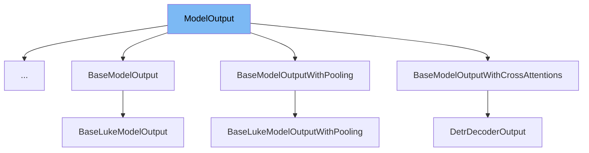

This document will provide an overview of the <SwmToken path="src/transformers/file_utils.py" pos="1740:2:2" line-data="class ModelOutput(OrderedDict):">`ModelOutput`</SwmToken> class. We will cover:

1. What <SwmToken path="src/transformers/file_utils.py" pos="1740:2:2" line-data="class ModelOutput(OrderedDict):">`ModelOutput`</SwmToken> is in the repo.
2. <SwmToken path="src/transformers/file_utils.py" pos="1740:2:2" line-data="class ModelOutput(OrderedDict):">`ModelOutput`</SwmToken>'s main variables and functions.
3. Example of how to use <SwmToken path="src/transformers/file_utils.py" pos="1740:2:2" line-data="class ModelOutput(OrderedDict):">`ModelOutput`</SwmToken> in <SwmToken path="src/transformers/modeling_utils.py" pos="1674:2:2" line-data="class SquadHeadOutput(ModelOutput):">`SquadHeadOutput`</SwmToken>.



# What is <SwmToken path="src/transformers/file_utils.py" pos="1740:2:2" line-data="class ModelOutput(OrderedDict):">`ModelOutput`</SwmToken>

<SwmToken path="src/transformers/file_utils.py" pos="1740:2:2" line-data="class ModelOutput(OrderedDict):">`ModelOutput`</SwmToken> is a base class for all model outputs in the <SwmToken path="src/transformers/file_utils.py" pos="1747:27:27" line-data="        You can&#39;t unpack a :obj:`ModelOutput` directly. Use the :meth:`~transformers.file_utils.ModelOutput.to_tuple`">`transformers`</SwmToken> library. It is designed to behave like a regular Python dictionary but with additional functionalities. It allows indexing by integer or slice (like a tuple) or strings (like a dictionary) while ignoring `None` attributes. This class is used to standardize the output format of various models in the library.

<SwmSnippet path="/src/transformers/file_utils.py" line="1740">

---

# Variables and functions

The <SwmToken path="src/transformers/file_utils.py" pos="1740:2:2" line-data="class ModelOutput(OrderedDict):">`ModelOutput`</SwmToken> class inherits from <SwmToken path="src/transformers/file_utils.py" pos="1740:4:4" line-data="class ModelOutput(OrderedDict):">`OrderedDict`</SwmToken> and provides a base class for all model outputs. It includes a <SwmToken path="src/transformers/file_utils.py" pos="1742:23:23" line-data="    Base class for all model outputs as dataclass. Has a ``__getitem__`` that allows indexing by integer or slice (like">`__getitem__`</SwmToken> method that allows indexing by integer or slice (like a tuple) or strings (like a dictionary) while ignoring `None` attributes.

```python
class ModelOutput(OrderedDict):
    """
    Base class for all model outputs as dataclass. Has a ``__getitem__`` that allows indexing by integer or slice (like
    a tuple) or strings (like a dictionary) that will ignore the ``None`` attributes. Otherwise behaves like a regular
    python dictionary.

    .. warning::
        You can't unpack a :obj:`ModelOutput` directly. Use the :meth:`~transformers.file_utils.ModelOutput.to_tuple`
        method to convert it to a tuple before.
    """
```

---

</SwmSnippet>

<SwmSnippet path="/src/transformers/file_utils.py" line="1751">

---

The <SwmToken path="src/transformers/file_utils.py" pos="1751:3:3" line-data="    def __post_init__(self):">`__post_init__`</SwmToken> method performs safety and consistency checks on the fields of the class. It ensures that the class has fields and that all fields except the first one have a default value of `None`. It also sets the associated fields if the first field is an iterator.

```python
    def __post_init__(self):
        class_fields = fields(self)

        # Safety and consistency checks
        assert len(class_fields), f"{self.__class__.__name__} has no fields."
        assert all(
            field.default is None for field in class_fields[1:]
        ), f"{self.__class__.__name__} should not have more than one required field."

        first_field = getattr(self, class_fields[0].name)
        other_fields_are_none = all(getattr(self, field.name) is None for field in class_fields[1:])

        if other_fields_are_none and not is_tensor(first_field):
            try:
                iterator = iter(first_field)
                first_field_iterator = True
            except TypeError:
                first_field_iterator = False

            # if we provided an iterator as first field and the iterator is a (key, value) iterator
            # set the associated fields
```

---

</SwmSnippet>

<SwmSnippet path="/src/transformers/file_utils.py" line="1791">

---

The <SwmToken path="src/transformers/file_utils.py" pos="1791:3:3" line-data="    def __delitem__(self, *args, **kwargs):">`__delitem__`</SwmToken>, <SwmToken path="src/transformers/file_utils.py" pos="1794:3:3" line-data="    def setdefault(self, *args, **kwargs):">`setdefault`</SwmToken>, <SwmToken path="src/transformers/file_utils.py" pos="1797:3:3" line-data="    def pop(self, *args, **kwargs):">`pop`</SwmToken>, and <SwmToken path="src/transformers/file_utils.py" pos="1800:3:3" line-data="    def update(self, *args, **kwargs):">`update`</SwmToken> methods are overridden to raise exceptions, preventing their use on <SwmToken path="src/transformers/file_utils.py" pos="1740:2:2" line-data="class ModelOutput(OrderedDict):">`ModelOutput`</SwmToken> instances.

```python
    def __delitem__(self, *args, **kwargs):
        raise Exception(f"You cannot use ``__delitem__`` on a {self.__class__.__name__} instance.")

    def setdefault(self, *args, **kwargs):
        raise Exception(f"You cannot use ``setdefault`` on a {self.__class__.__name__} instance.")

    def pop(self, *args, **kwargs):
        raise Exception(f"You cannot use ``pop`` on a {self.__class__.__name__} instance.")

    def update(self, *args, **kwargs):
        raise Exception(f"You cannot use ``update`` on a {self.__class__.__name__} instance.")

```

---

</SwmSnippet>

<SwmSnippet path="/src/transformers/file_utils.py" line="1803">

---

The <SwmToken path="src/transformers/file_utils.py" pos="1803:3:3" line-data="    def __getitem__(self, k):">`__getitem__`</SwmToken> method allows indexing by integer or slice (like a tuple) or strings (like a dictionary) while ignoring `None` attributes.

```python
    def __getitem__(self, k):
        if isinstance(k, str):
            inner_dict = {k: v for (k, v) in self.items()}
            return inner_dict[k]
        else:
            return self.to_tuple()[k]

```

---

</SwmSnippet>

<SwmSnippet path="/src/transformers/file_utils.py" line="1810">

---

The <SwmToken path="src/transformers/file_utils.py" pos="1810:3:3" line-data="    def __setattr__(self, name, value):">`__setattr__`</SwmToken> method sets the attribute value if the name is a key in the dictionary and the value is not `None`.

```python
    def __setattr__(self, name, value):
        if name in self.keys() and value is not None:
            # Don't call self.__setitem__ to avoid recursion errors
            super().__setitem__(name, value)
        super().__setattr__(name, value)

```

---

</SwmSnippet>

<SwmSnippet path="/src/transformers/file_utils.py" line="1816">

---

The <SwmToken path="src/transformers/file_utils.py" pos="1816:3:3" line-data="    def __setitem__(self, key, value):">`__setitem__`</SwmToken> method sets the item value and also sets the attribute value to avoid recursion errors.

```python
    def __setitem__(self, key, value):
        # Will raise a KeyException if needed
        super().__setitem__(key, value)
        # Don't call self.__setattr__ to avoid recursion errors
        super().__setattr__(key, value)
```

---

</SwmSnippet>

<SwmSnippet path="/src/transformers/file_utils.py" line="1822">

---

The <SwmToken path="src/transformers/file_utils.py" pos="1822:3:3" line-data="    def to_tuple(self) -&gt; Tuple[Any]:">`to_tuple`</SwmToken> method converts the <SwmToken path="src/transformers/file_utils.py" pos="1740:2:2" line-data="class ModelOutput(OrderedDict):">`ModelOutput`</SwmToken> instance to a tuple containing all the <SwmToken path="src/transformers/file_utils.py" pos="1824:17:19" line-data="        Convert self to a tuple containing all the attributes/keys that are not ``None``.">`attributes/keys`</SwmToken> that are not `None`.

```python
    def to_tuple(self) -> Tuple[Any]:
        """
        Convert self to a tuple containing all the attributes/keys that are not ``None``.
        """
        return tuple(self[k] for k in self.keys())
```

---

</SwmSnippet>

# Usage example

Here is an example of how to use <SwmToken path="src/transformers/file_utils.py" pos="1740:2:2" line-data="class ModelOutput(OrderedDict):">`ModelOutput`</SwmToken> in <SwmToken path="src/transformers/modeling_utils.py" pos="1674:2:2" line-data="class SquadHeadOutput(ModelOutput):">`SquadHeadOutput`</SwmToken>.

<SwmSnippet path="/src/transformers/modeling_utils.py" line="58">

---

# Usage example

The <SwmToken path="src/transformers/modeling_utils.py" pos="1674:2:2" line-data="class SquadHeadOutput(ModelOutput):">`SquadHeadOutput`</SwmToken> class extends <SwmToken path="src/transformers/file_utils.py" pos="1740:2:2" line-data="class ModelOutput(OrderedDict):">`ModelOutput`</SwmToken> to provide a specific output structure for the <SwmToken path="src/transformers/modeling_utils.py" pos="1507:3:3" line-data="    Compute SQuAD start logits from sequence hidden states.">`SQuAD`</SwmToken> head. It demonstrates how <SwmToken path="src/transformers/file_utils.py" pos="1740:2:2" line-data="class ModelOutput(OrderedDict):">`ModelOutput`</SwmToken> can be used to standardize model outputs.

```python
    """
```

---

</SwmSnippet>

&nbsp;

*This is an auto-generated document by Swimm AI 🌊 and has not yet been verified by a human*

<SwmMeta version="3.0.0" repo-id="Z2l0aHViJTNBJTNBdHJhbnNmb3JtZXJzJTNBJTNBc2h1anV1dQ==" repo-name="transformers"><sup>Powered by [Swimm](/)</sup></SwmMeta>
