This document will cover the class <SwmToken path="src/transformers/onnx/config.py" pos="128:31:31" line-data="    def from_model_config(cls, config: &quot;PretrainedConfig&quot;, task: str = &quot;default&quot;) -&gt; &quot;OnnxConfig&quot;:">`OnnxConfig`</SwmToken> in detail. We will discuss:

1. What is <SwmToken path="src/transformers/onnx/config.py" pos="128:31:31" line-data="    def from_model_config(cls, config: &quot;PretrainedConfig&quot;, task: str = &quot;default&quot;) -&gt; &quot;OnnxConfig&quot;:">`OnnxConfig`</SwmToken>
2. Variables and functions
3. Usage example

```mermaid
graph TD;
  OnnxConfig:::currentBaseStyle
OnnxConfig --> OnnxSeq2SeqConfigWithPast
OnnxSeq2SeqConfigWithPast --> BartOnnxConfig
OnnxSeq2SeqConfigWithPast --> T5OnnxConfig
OnnxSeq2SeqConfigWithPast --> BigBirdPegasusOnnxConfig
OnnxSeq2SeqConfigWithPast --> 1[...]
OnnxConfig --> OnnxConfigWithPast
OnnxConfigWithPast --> OnnxSeq2SeqConfigWithPast
OnnxSeq2SeqConfigWithPast --> 2[...]
OnnxConfigWithPast --> GPT2OnnxConfig
OnnxConfigWithPast --> BloomOnnxConfig
OnnxConfigWithPast --> 3[...]
OnnxConfig --> BertOnnxConfig
OnnxConfig --> 4[...]

 classDef currentBaseStyle color:#000000,fill:#7CB9F4

%% Swimm:
%% graph TD;
%%   OnnxConfig:::currentBaseStyle
%% <SwmToken path="src/transformers/onnx/config.py" pos="128:31:31" line-data="    def from_model_config(cls, config: &quot;PretrainedConfig&quot;, task: str = &quot;default&quot;) -&gt; &quot;OnnxConfig&quot;:">`OnnxConfig`</SwmToken> --> <SwmToken path="src/transformers/onnx/config.py" pos="590:2:2" line-data="class OnnxSeq2SeqConfigWithPast(OnnxConfigWithPast):">`OnnxSeq2SeqConfigWithPast`</SwmToken>
%% <SwmToken path="src/transformers/onnx/config.py" pos="590:2:2" line-data="class OnnxSeq2SeqConfigWithPast(OnnxConfigWithPast):">`OnnxSeq2SeqConfigWithPast`</SwmToken> --> BartOnnxConfig
%% <SwmToken path="src/transformers/onnx/config.py" pos="590:2:2" line-data="class OnnxSeq2SeqConfigWithPast(OnnxConfigWithPast):">`OnnxSeq2SeqConfigWithPast`</SwmToken> --> T5OnnxConfig
%% <SwmToken path="src/transformers/onnx/config.py" pos="590:2:2" line-data="class OnnxSeq2SeqConfigWithPast(OnnxConfigWithPast):">`OnnxSeq2SeqConfigWithPast`</SwmToken> --> BigBirdPegasusOnnxConfig
%% <SwmToken path="src/transformers/onnx/config.py" pos="590:2:2" line-data="class OnnxSeq2SeqConfigWithPast(OnnxConfigWithPast):">`OnnxSeq2SeqConfigWithPast`</SwmToken> --> 1[...]
%% <SwmToken path="src/transformers/onnx/config.py" pos="128:31:31" line-data="    def from_model_config(cls, config: &quot;PretrainedConfig&quot;, task: str = &quot;default&quot;) -&gt; &quot;OnnxConfig&quot;:">`OnnxConfig`</SwmToken> --> <SwmToken path="src/transformers/onnx/config.py" pos="443:2:2" line-data="class OnnxConfigWithPast(OnnxConfig, ABC):">`OnnxConfigWithPast`</SwmToken>
%% <SwmToken path="src/transformers/onnx/config.py" pos="443:2:2" line-data="class OnnxConfigWithPast(OnnxConfig, ABC):">`OnnxConfigWithPast`</SwmToken> --> <SwmToken path="src/transformers/onnx/config.py" pos="590:2:2" line-data="class OnnxSeq2SeqConfigWithPast(OnnxConfigWithPast):">`OnnxSeq2SeqConfigWithPast`</SwmToken>
%% <SwmToken path="src/transformers/onnx/config.py" pos="590:2:2" line-data="class OnnxSeq2SeqConfigWithPast(OnnxConfigWithPast):">`OnnxSeq2SeqConfigWithPast`</SwmToken> --> 2[...]
%% <SwmToken path="src/transformers/onnx/config.py" pos="443:2:2" line-data="class OnnxConfigWithPast(OnnxConfig, ABC):">`OnnxConfigWithPast`</SwmToken> --> GPT2OnnxConfig
%% <SwmToken path="src/transformers/onnx/config.py" pos="443:2:2" line-data="class OnnxConfigWithPast(OnnxConfig, ABC):">`OnnxConfigWithPast`</SwmToken> --> BloomOnnxConfig
%% <SwmToken path="src/transformers/onnx/config.py" pos="443:2:2" line-data="class OnnxConfigWithPast(OnnxConfig, ABC):">`OnnxConfigWithPast`</SwmToken> --> 3[...]
%% <SwmToken path="src/transformers/onnx/config.py" pos="128:31:31" line-data="    def from_model_config(cls, config: &quot;PretrainedConfig&quot;, task: str = &quot;default&quot;) -&gt; &quot;OnnxConfig&quot;:">`OnnxConfig`</SwmToken> --> BertOnnxConfig
%% <SwmToken path="src/transformers/onnx/config.py" pos="128:31:31" line-data="    def from_model_config(cls, config: &quot;PretrainedConfig&quot;, task: str = &quot;default&quot;) -&gt; &quot;OnnxConfig&quot;:">`OnnxConfig`</SwmToken> --> 4[...]
%% 
%%  classDef currentBaseStyle color:#000000,fill:#7CB9F4
```



# What is <SwmToken path="src/transformers/onnx/config.py" pos="128:31:31" line-data="    def from_model_config(cls, config: &quot;PretrainedConfig&quot;, task: str = &quot;default&quot;) -&gt; &quot;OnnxConfig&quot;:">`OnnxConfig`</SwmToken>

The <SwmToken path="src/transformers/onnx/config.py" pos="128:31:31" line-data="    def from_model_config(cls, config: &quot;PretrainedConfig&quot;, task: str = &quot;default&quot;) -&gt; &quot;OnnxConfig&quot;:">`OnnxConfig`</SwmToken> class in <SwmPath>[src/transformers/onnx/config.py](src/transformers/onnx/config.py)</SwmPath> is a base class for models that can be exported to the ONNX format. It provides metadata and methods to facilitate the export process. This class is essential for converting models into a format that can be used for inference in various environments that support ONNX.

<SwmSnippet path="/src/transformers/onnx/config.py" line="73">

---

# Variables and functions

The variable <SwmToken path="src/transformers/onnx/config.py" pos="73:1:1" line-data="    default_fixed_batch = 2">`default_fixed_batch`</SwmToken> is used to set a default batch size of 2. This helps avoid ONNX making assumptions about single sample batches.

```python
    default_fixed_batch = 2
```

---

</SwmSnippet>

<SwmSnippet path="/src/transformers/onnx/config.py" line="74">

---

The variable <SwmToken path="src/transformers/onnx/config.py" pos="74:1:1" line-data="    default_fixed_sequence = 8">`default_fixed_sequence`</SwmToken> sets a default sequence length of 8. This is used to avoid ONNX optimizations for single sequence lengths.

```python
    default_fixed_sequence = 8
```

---

</SwmSnippet>

<SwmSnippet path="/src/transformers/onnx/config.py" line="75">

---

The variable <SwmToken path="src/transformers/onnx/config.py" pos="75:1:1" line-data="    default_fixed_num_choices = 4">`default_fixed_num_choices`</SwmToken> sets a default number of choices to 4. This is useful for tasks like <SwmToken path="src/transformers/onnx/config.py" pos="90:2:4" line-data="        &quot;multiple-choice&quot;: OrderedDict({&quot;logits&quot;: {0: &quot;batch&quot;}}),">`multiple-choice`</SwmToken> question answering.

```python
    default_fixed_num_choices = 4
```

---

</SwmSnippet>

<SwmSnippet path="/src/transformers/onnx/config.py" line="76">

---

The variable <SwmToken path="src/transformers/onnx/config.py" pos="76:1:1" line-data="    torch_onnx_minimum_version = version.parse(&quot;1.8&quot;)">`torch_onnx_minimum_version`</SwmToken> specifies the minimum version of <SwmToken path="src/transformers/onnx/config.py" pos="229:5:5" line-data="        The minimum PyTorch version required to export the model.">`PyTorch`</SwmToken> required for exporting the model to ONNX. It is set to version <SwmToken path="src/transformers/onnx/config.py" pos="76:10:12" line-data="    torch_onnx_minimum_version = version.parse(&quot;1.8&quot;)">`1.8`</SwmToken>.

```python
    torch_onnx_minimum_version = version.parse("1.8")
```

---

</SwmSnippet>

<SwmSnippet path="/src/transformers/onnx/config.py" line="111">

---

The constructor <SwmToken path="src/transformers/onnx/config.py" pos="111:3:3" line-data="    def __init__(self, config: &quot;PretrainedConfig&quot;, task: str = &quot;default&quot;, patching_specs: List[PatchingSpec] = None):">`__init__`</SwmToken> initializes the <SwmToken path="src/transformers/onnx/config.py" pos="128:31:31" line-data="    def from_model_config(cls, config: &quot;PretrainedConfig&quot;, task: str = &quot;default&quot;) -&gt; &quot;OnnxConfig&quot;:">`OnnxConfig`</SwmToken> class with a model configuration, task type, and optional patching specifications. It validates the task and sets up patching specifications if provided.

```python
    def __init__(self, config: "PretrainedConfig", task: str = "default", patching_specs: List[PatchingSpec] = None):
        self._config = config

        if task not in self._tasks_to_common_outputs:
            raise ValueError(
                f"{task} is not a supported task, supported tasks: {self._tasks_to_common_outputs.keys()}"
            )
        self.task = task

        self._patching_specs = []
        for spec in patching_specs if patching_specs is not None else []:
            final_spec = spec
            if spec.orig_op is None:
                final_spec = dataclasses.replace(spec, orig_op=getattr(spec.o, spec.name))
            self._patching_specs.append(final_spec)

```

---

</SwmSnippet>

<SwmSnippet path="/src/transformers/onnx/config.py" line="128">

---

The class method <SwmToken path="src/transformers/onnx/config.py" pos="128:3:3" line-data="    def from_model_config(cls, config: &quot;PretrainedConfig&quot;, task: str = &quot;default&quot;) -&gt; &quot;OnnxConfig&quot;:">`from_model_config`</SwmToken> instantiates an <SwmToken path="src/transformers/onnx/config.py" pos="128:31:31" line-data="    def from_model_config(cls, config: &quot;PretrainedConfig&quot;, task: str = &quot;default&quot;) -&gt; &quot;OnnxConfig&quot;:">`OnnxConfig`</SwmToken> for a specific model using its configuration and task type.

```python
    def from_model_config(cls, config: "PretrainedConfig", task: str = "default") -> "OnnxConfig":
        """
        Instantiate a OnnxConfig for a specific model

        Args:
            config: The model's configuration to use when exporting to ONNX

        Returns:
            OnnxConfig for this model
        """
        return cls(config, task=task)
```

---

</SwmSnippet>

<SwmSnippet path="/src/transformers/onnx/config.py" line="140">

---

The abstract property <SwmToken path="src/transformers/onnx/config.py" pos="142:3:3" line-data="    def inputs(self) -&gt; Mapping[str, Mapping[int, str]]:">`inputs`</SwmToken> defines the axis mapping for the input tensors required by the model. This must be implemented by subclasses.

```python
    @property
    @abstractmethod
    def inputs(self) -> Mapping[str, Mapping[int, str]]:
        """
        Mapping containing the axis definition of the input tensors to provide to the model

        Returns:
            For each input: its name associated to the axes symbolic name and the axis position within the tensor
        """
        raise NotImplementedError()
```

---

</SwmSnippet>

<SwmSnippet path="/src/transformers/onnx/config.py" line="151">

---

The property <SwmToken path="src/transformers/onnx/config.py" pos="152:3:3" line-data="    def outputs(self) -&gt; Mapping[str, Mapping[int, str]]:">`outputs`</SwmToken> provides the axis mapping for the output tensors of the model. It uses a predefined mapping based on the task type.

```python
    @property
    def outputs(self) -> Mapping[str, Mapping[int, str]]:
        """
        Mapping containing the axis definition of the output tensors to provide to the model

        Returns:
            For each output: its name associated to the axes symbolic name and the axis position within the tensor
        """
        common_outputs = self._tasks_to_common_outputs[self.task]
        return copy.deepcopy(common_outputs)
```

---

</SwmSnippet>

<SwmSnippet path="/src/transformers/onnx/config.py" line="162">

---

The property <SwmToken path="src/transformers/onnx/config.py" pos="163:3:3" line-data="    def values_override(self) -&gt; Optional[Mapping[str, Any]]:">`values_override`</SwmToken> returns a dictionary of configuration keys to override before exporting the model. For example, it disables caching if the model configuration has the <SwmToken path="src/transformers/onnx/config.py" pos="170:11:11" line-data="        if hasattr(self._config, &quot;use_cache&quot;):">`use_cache`</SwmToken> attribute.

```python
    @property
    def values_override(self) -> Optional[Mapping[str, Any]]:
        """
        Dictionary of keys to override in the model's config before exporting

        Returns:
            Dictionary with the keys (and their corresponding values) to override
        """
        if hasattr(self._config, "use_cache"):
            return {"use_cache": False}

        return None
```

---

</SwmSnippet>

<SwmSnippet path="/src/transformers/onnx/config.py" line="175">

---

The property <SwmToken path="src/transformers/onnx/config.py" pos="176:3:3" line-data="    def default_batch_size(self) -&gt; int:">`default_batch_size`</SwmToken> returns the default batch size to use if no other indication is provided. It is set to avoid ONNX making assumptions about single sample batches.

```python
    @property
    def default_batch_size(self) -> int:
        """
        The default batch size to use if no other indication

        Returns:
            Integer > 0
        """
        # Using 2 avoid ONNX making assumption about single sample batch
        return OnnxConfig.default_fixed_batch
```

---

</SwmSnippet>

<SwmSnippet path="/src/transformers/onnx/config.py" line="186">

---

The property <SwmToken path="src/transformers/onnx/config.py" pos="187:3:3" line-data="    def default_sequence_length(self) -&gt; int:">`default_sequence_length`</SwmToken> returns the default sequence length to use if no other indication is provided. It is set to avoid ONNX optimizations for single sequence lengths.

```python
    @property
    def default_sequence_length(self) -> int:
        """
        The default sequence length to use if no other indication

        Returns:
            Integer > 0
        """
        return OnnxConfig.default_fixed_sequence
```

---

</SwmSnippet>

<SwmSnippet path="/src/transformers/onnx/config.py" line="196">

---

The property <SwmToken path="src/transformers/onnx/config.py" pos="197:3:3" line-data="    def default_num_choices(self) -&gt; int:">`default_num_choices`</SwmToken> returns the default number of choices to use if no other indication is provided. It is useful for tasks like <SwmToken path="src/transformers/onnx/config.py" pos="90:2:4" line-data="        &quot;multiple-choice&quot;: OrderedDict({&quot;logits&quot;: {0: &quot;batch&quot;}}),">`multiple-choice`</SwmToken> question answering.

```python
    @property
    def default_num_choices(self) -> int:
        """
        The default number of choices to use if no other indication

        Returns:
            Integer > 0
        """
        return OnnxConfig.default_fixed_num_choices
```

---

</SwmSnippet>

<SwmSnippet path="/src/transformers/onnx/config.py" line="206">

---

The property <SwmToken path="src/transformers/onnx/config.py" pos="207:3:3" line-data="    def default_onnx_opset(self) -&gt; int:">`default_onnx_opset`</SwmToken> returns the ONNX opset version to use when exporting the model. It is set to a default value of 11.

```python
    @property
    def default_onnx_opset(self) -> int:
        """
        Which onnx opset to use when exporting the model

        Returns:
            Integer ONNX Opset version
        """
        return DEFAULT_ONNX_OPSET
```

---

</SwmSnippet>

<SwmSnippet path="/src/transformers/onnx/config.py" line="216">

---

The property <SwmToken path="src/transformers/onnx/config.py" pos="217:3:3" line-data="    def atol_for_validation(self) -&gt; float:">`atol_for_validation`</SwmToken> returns the absolute tolerance value to use during model conversion validation. It is set to a default value of <SwmToken path="src/transformers/onnx/config.py" pos="224:3:5" line-data="        return 1e-5">`1e-5`</SwmToken>.

```python
    @property
    def atol_for_validation(self) -> float:
        """
        What absolute tolerance value to use during model conversion validation.

        Returns:
            Float absolute tolerance value.
        """
        return 1e-5
```

---

</SwmSnippet>

<SwmSnippet path="/src/transformers/onnx/config.py" line="226">

---

The property <SwmToken path="src/transformers/onnx/config.py" pos="227:3:3" line-data="    def is_torch_support_available(self) -&gt; bool:">`is_torch_support_available`</SwmToken> checks if the installed version of <SwmToken path="src/transformers/onnx/config.py" pos="229:5:5" line-data="        The minimum PyTorch version required to export the model.">`PyTorch`</SwmToken> is compatible with the model. It returns a boolean indicating whether the minimum required version of <SwmToken path="src/transformers/onnx/config.py" pos="229:5:5" line-data="        The minimum PyTorch version required to export the model.">`PyTorch`</SwmToken> is available.

```python
    @property
    def is_torch_support_available(self) -> bool:
        """
        The minimum PyTorch version required to export the model.

        Returns:
            `bool`: Whether the installed version of PyTorch is compatible with the model.
        """
        if is_torch_available():
            from transformers.utils import get_torch_version

            return version.parse(get_torch_version()) >= self.torch_onnx_minimum_version
        else:
            return False
```

---

</SwmSnippet>

<SwmSnippet path="/src/transformers/onnx/config.py" line="241">

---

The static method <SwmToken path="src/transformers/onnx/config.py" pos="242:3:3" line-data="    def use_external_data_format(num_parameters: int) -&gt; bool:">`use_external_data_format`</SwmToken> determines if the model requires using external data format based on the number of parameters. It returns `True` if the serialized parameter size exceeds <SwmToken path="src/transformers/onnx/config.py" pos="250:20:20" line-data="            True if model.num_parameters() * size_of(float32) &gt;= 2Gb False otherwise">`2Gb`</SwmToken>.

```python
    @staticmethod
    def use_external_data_format(num_parameters: int) -> bool:
        """
        Flag indicating if the model requires using external data format

        Args:
            num_parameters: Number of parameter on the model

        Returns:
            True if model.num_parameters() * size_of(float32) >= 2Gb False otherwise
        """

        return (
            compute_serialized_parameters_size(num_parameters, ParameterFormat.Float)
            >= EXTERNAL_DATA_FORMAT_SIZE_LIMIT
        )
```

---

</SwmSnippet>

<SwmSnippet path="/src/transformers/onnx/config.py" line="258">

---

The method <SwmToken path="src/transformers/onnx/config.py" pos="258:3:3" line-data="    def _generate_dummy_images(">`_generate_dummy_images`</SwmToken> generates dummy image data for testing purposes. It creates random images with specified dimensions and returns them as a list.

```python
    def _generate_dummy_images(
        self, batch_size: int = 2, num_channels: int = 3, image_height: int = 40, image_width: int = 40
    ):
        images = []
        for _ in range(batch_size):
            data = np.random.rand(image_height, image_width, num_channels) * 255
            images.append(Image.fromarray(data.astype("uint8")).convert("RGB"))
        return images
```

---

</SwmSnippet>

<SwmSnippet path="/src/transformers/onnx/config.py" line="267">

---

The method <SwmToken path="src/transformers/onnx/config.py" pos="267:3:3" line-data="    def _generate_dummy_audio(">`_generate_dummy_audio`</SwmToken> generates dummy audio data for testing purposes. It creates pure sine wave audio samples with specified parameters and returns them as a list.

```python
    def _generate_dummy_audio(
        self, batch_size: int = 2, sampling_rate: int = 22050, time_duration: float = 5.0, frequency: int = 220
    ):
        audio_data = []
        for _ in range(batch_size):
            # time variable
            t = np.linspace(0, time_duration, int(time_duration * sampling_rate), endpoint=False)

            # generate pure sine wave at `frequency` Hz
            audio_data.append(0.5 * np.sin(2 * np.pi * frequency * t))

        return audio_data
```

---

</SwmSnippet>

<SwmSnippet path="/src/transformers/onnx/config.py" line="280">

---

The method <SwmToken path="src/transformers/onnx/config.py" pos="280:3:3" line-data="    def generate_dummy_inputs(">`generate_dummy_inputs`</SwmToken> generates inputs to provide to the ONNX exporter for the specific framework. It supports various preprocessors like tokenizers, feature extractors, and image processors.

```python
    def generate_dummy_inputs(
        self,
        preprocessor: Union["PreTrainedTokenizerBase", "FeatureExtractionMixin", "ImageProcessingMixin"],
        batch_size: int = -1,
        seq_length: int = -1,
        num_choices: int = -1,
        is_pair: bool = False,
        framework: Optional[TensorType] = None,
        num_channels: int = 3,
        image_width: int = 40,
        image_height: int = 40,
        sampling_rate: int = 22050,
        time_duration: float = 5.0,
        frequency: int = 220,
        tokenizer: "PreTrainedTokenizerBase" = None,
    ) -> Mapping[str, Any]:
        """
        Generate inputs to provide to the ONNX exporter for the specific framework

        Args:
            preprocessor: ([`PreTrainedTokenizerBase`], [`FeatureExtractionMixin`], or [`ImageProcessingMixin`]):
```

---

</SwmSnippet>

<SwmSnippet path="/src/transformers/onnx/config.py" line="400">

---

The method <SwmToken path="src/transformers/onnx/config.py" pos="400:3:3" line-data="    def generate_dummy_inputs_onnxruntime(self, reference_model_inputs: Mapping[str, Any]) -&gt; Mapping[str, Any]:">`generate_dummy_inputs_onnxruntime`</SwmToken> generates inputs for ONNX Runtime using the reference model inputs. It can be overridden to run inference with <SwmToken path="src/transformers/onnx/config.py" pos="402:34:34" line-data="        Generate inputs for ONNX Runtime using the reference model inputs. Override this to run inference with seq2seq">`seq2seq`</SwmToken> models that have separate encoder and decoder ONNX files.

```python
    def generate_dummy_inputs_onnxruntime(self, reference_model_inputs: Mapping[str, Any]) -> Mapping[str, Any]:
        """
        Generate inputs for ONNX Runtime using the reference model inputs. Override this to run inference with seq2seq
        models which have the encoder and decoder exported as separate ONNX files.

        Args:
            reference_model_inputs ([`Mapping[str, Tensor]`):
                Reference inputs for the model.

        Returns:
            `Mapping[str, Tensor]`: The mapping holding the kwargs to provide to the model's forward function
        """
        return reference_model_inputs
```

---

</SwmSnippet>

<SwmSnippet path="/src/transformers/onnx/config.py" line="414">

---

The method <SwmToken path="src/transformers/onnx/config.py" pos="414:3:3" line-data="    def patch_ops(self):">`patch_ops`</SwmToken> applies custom operations to the model based on the patching specifications provided during initialization.

```python
    def patch_ops(self):
        for spec in self._patching_specs:
            custom_op = spec.custom_op if spec.op_wrapper is None else spec.op_wrapper(spec.custom_op)
            setattr(spec.o, spec.name, custom_op)

```

---

</SwmSnippet>

<SwmSnippet path="/src/transformers/onnx/config.py" line="419">

---

The method <SwmToken path="src/transformers/onnx/config.py" pos="419:3:3" line-data="    def restore_ops(self):">`restore_ops`</SwmToken> restores the original operations of the model that were patched using the <SwmToken path="src/transformers/onnx/config.py" pos="414:3:3" line-data="    def patch_ops(self):">`patch_ops`</SwmToken> method.

```python
    def restore_ops(self):
        for spec in self._patching_specs:
            orig_op = spec.orig_op if spec.op_wrapper is None else spec.op_wrapper(spec.orig_op)
            setattr(spec.o, spec.name, orig_op)

```

---

</SwmSnippet>

<SwmSnippet path="/src/transformers/onnx/config.py" line="424">

---

The class method <SwmToken path="src/transformers/onnx/config.py" pos="425:3:3" line-data="    def flatten_output_collection_property(cls, name: str, field: Iterable[Any]) -&gt; Dict[str, Any]:">`flatten_output_collection_property`</SwmToken> flattens any potential nested structure in the output collection, expanding the name of the field with the index of the element within the structure.

```python
    @classmethod
    def flatten_output_collection_property(cls, name: str, field: Iterable[Any]) -> Dict[str, Any]:
        """
        Flatten any potential nested structure expanding the name of the field with the index of the element within the
        structure.

        Args:
            name: The name of the nested structure
            field: The structure to, potentially, be flattened

        Returns:
            (Dict[str, Any]): Outputs with flattened structure and key mapping this new structure.

        """
        from itertools import chain

        return {f"{name}.{idx}": item for idx, item in enumerate(chain.from_iterable(field))}
```

---

</SwmSnippet>

# Usage example

Here is an example of how to use <SwmToken path="src/transformers/onnx/config.py" pos="128:31:31" line-data="    def from_model_config(cls, config: &quot;PretrainedConfig&quot;, task: str = &quot;default&quot;) -&gt; &quot;OnnxConfig&quot;:">`OnnxConfig`</SwmToken> in <SwmToken path="src/transformers/models/vision_encoder_decoder/configuration_vision_encoder_decoder.py" pos="173:2:2" line-data="class VisionEncoderDecoderOnnxConfig(OnnxConfig):">`VisionEncoderDecoderOnnxConfig`</SwmToken>.

<SwmSnippet path="/src/transformers/models/vision_encoder_decoder/configuration_vision_encoder_decoder.py" line="28">

---

The <SwmToken path="src/transformers/models/vision_encoder_decoder/configuration_vision_encoder_decoder.py" pos="173:2:2" line-data="class VisionEncoderDecoderOnnxConfig(OnnxConfig):">`VisionEncoderDecoderOnnxConfig`</SwmToken> class extends <SwmToken path="src/transformers/onnx/config.py" pos="128:31:31" line-data="    def from_model_config(cls, config: &quot;PretrainedConfig&quot;, task: str = &quot;default&quot;) -&gt; &quot;OnnxConfig&quot;:">`OnnxConfig`</SwmToken> to provide specific configurations for vision <SwmToken path="src/transformers/onnx/config.py" pos="691:5:7" line-data="                # For encoder-decoder models, past_key_values contains pre-computed values for both the encoder and the">`encoder-decoder`</SwmToken> models. It uses the methods and properties defined in <SwmToken path="src/transformers/onnx/config.py" pos="128:31:31" line-data="    def from_model_config(cls, config: &quot;PretrainedConfig&quot;, task: str = &quot;default&quot;) -&gt; &quot;OnnxConfig&quot;:">`OnnxConfig`</SwmToken> to facilitate the ONNX export process.

```python
    from ... import PreTrainedTokenizerBase, TensorType

logger = logging.get_logger(__name__)


class VisionEncoderDecoderConfig(PretrainedConfig):
    r"""
    [`VisionEncoderDecoderConfig`] is the configuration class to store the configuration of a
    [`VisionEncoderDecoderModel`]. It is used to instantiate a Vision-Encoder-Text-Decoder model according to the
```

---

</SwmSnippet>

&nbsp;

*This is an auto-generated document by Swimm AI 🌊 and has not yet been verified by a human*

<SwmMeta version="3.0.0" repo-id="Z2l0aHViJTNBJTNBdHJhbnNmb3JtZXJzJTNBJTNBc2h1anV1dQ==" repo-name="transformers" doc-type="general-class"><sup>Powered by [Swimm](/)</sup></SwmMeta>
