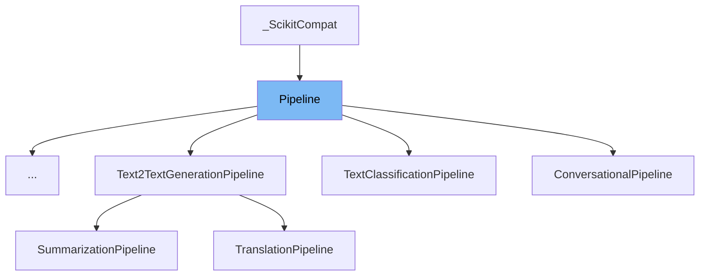

This document will provide an overview of the <SwmToken path="src/transformers/pipelines/base.py" pos="644:5:5" line-data="        Save the pipeline&#39;s model and tokenizer.">`pipeline`</SwmToken> class. We will cover:

1. What the <SwmToken path="src/transformers/pipelines/base.py" pos="644:5:5" line-data="        Save the pipeline&#39;s model and tokenizer.">`pipeline`</SwmToken> class is in the repo.
2. Main variables and functions of the <SwmToken path="src/transformers/pipelines/base.py" pos="644:5:5" line-data="        Save the pipeline&#39;s model and tokenizer.">`pipeline`</SwmToken> class.
3. Example of how to use the <SwmToken path="src/transformers/pipelines/base.py" pos="644:5:5" line-data="        Save the pipeline&#39;s model and tokenizer.">`pipeline`</SwmToken> class in <SwmToken path="src/transformers/pipelines/image_classification.py" pos="28:2:2" line-data="class ImageClassificationPipeline(Pipeline):">`ImageClassificationPipeline`</SwmToken>.



# What is Pipeline

The <SwmToken path="src/transformers/pipelines/base.py" pos="644:5:5" line-data="        Save the pipeline&#39;s model and tokenizer.">`pipeline`</SwmToken> class in <SwmPath>[src/transformers/pipelines/base.py](src/transformers/pipelines/base.py)</SwmPath> is a base class from which all specific pipeline classes inherit. It defines a standard workflow for processing inputs through a sequence of operations: tokenization, model inference, <SwmToken path="src/transformers/pipelines/base.py" pos="596:15:17" line-data="        Input -&gt; Tokenization -&gt; Model Inference -&gt; Post-Processing (task dependent) -&gt; Output">`Post-Processing`</SwmToken>, and output generation. The <SwmToken path="src/transformers/pipelines/base.py" pos="644:5:5" line-data="        Save the pipeline&#39;s model and tokenizer.">`pipeline`</SwmToken> class supports running on both CPU and GPU and can handle various NLP tasks by leveraging pretrained models, tokenizers, and feature extractors.

<SwmSnippet path="/src/transformers/pipelines/base.py" line="606">

---

# Variables and functions

The variable <SwmToken path="src/transformers/pipelines/base.py" pos="606:1:1" line-data="    default_input_names = None">`default_input_names`</SwmToken> is used to store the default input names for the pipeline. It is initialized to `None`.

```python
    default_input_names = None
```

---

</SwmSnippet>

<SwmSnippet path="/src/transformers/pipelines/base.py" line="608">

---

The <SwmToken path="src/transformers/pipelines/base.py" pos="608:3:3" line-data="    def __init__(">`__init__`</SwmToken> function initializes the <SwmToken path="src/transformers/pipelines/base.py" pos="644:5:5" line-data="        Save the pipeline&#39;s model and tokenizer.">`pipeline`</SwmToken> class. It sets up the model, tokenizer, feature extractor, model card, framework, task, argument parser, device, and binary output flag. It also handles special configurations for the model based on the task.

```python
    def __init__(
        self,
        model: Union["PreTrainedModel", "TFPreTrainedModel"],
        tokenizer: Optional[PreTrainedTokenizer] = None,
        feature_extractor: Optional[PreTrainedFeatureExtractor] = None,
        modelcard: Optional[ModelCard] = None,
        framework: Optional[str] = None,
        task: str = "",
        args_parser: ArgumentHandler = None,
        device: int = -1,
        binary_output: bool = False,
    ):

        if framework is None:
            framework, model = infer_framework_load_model(model, config=model.config)

        self.task = task
        self.model = model
        self.tokenizer = tokenizer
        self.feature_extractor = feature_extractor
        self.modelcard = modelcard
```

---

</SwmSnippet>

<SwmSnippet path="/src/transformers/pipelines/base.py" line="642">

---

The <SwmToken path="src/transformers/pipelines/base.py" pos="642:3:3" line-data="    def save_pretrained(self, save_directory: str):">`save_pretrained`</SwmToken> function saves the pipeline's model, tokenizer, feature extractor, and model card to a specified directory.

```python
    def save_pretrained(self, save_directory: str):
        """
        Save the pipeline's model and tokenizer.

        Args:
            save_directory (:obj:`str`):
                A path to the directory where to saved. It will be created if it doesn't exist.
        """
        if os.path.isfile(save_directory):
            logger.error(f"Provided path ({save_directory}) should be a directory, not a file")
            return
        os.makedirs(save_directory, exist_ok=True)

        self.model.save_pretrained(save_directory)

        if self.tokenizer is not None:
            self.tokenizer.save_pretrained(save_directory)

        if self.feature_extractor is not None:
            self.feature_extractor.save_pretrained(save_directory)

```

---

</SwmSnippet>

<SwmSnippet path="/src/transformers/pipelines/base.py" line="666">

---

The <SwmToken path="src/transformers/pipelines/base.py" pos="666:3:3" line-data="    def transform(self, X):">`transform`</SwmToken> function provides a Scikit/Keras interface to the pipeline. It forwards the input to the <SwmToken path="src/transformers/pipelines/base.py" pos="668:27:27" line-data="        Scikit / Keras interface to transformers&#39; pipelines. This method will forward to __call__().">`__call__`</SwmToken> method.

```python
    def transform(self, X):
        """
        Scikit / Keras interface to transformers' pipelines. This method will forward to __call__().
        """
        return self(X=X)

```

---

</SwmSnippet>

<SwmSnippet path="/src/transformers/pipelines/base.py" line="672">

---

The <SwmToken path="src/transformers/pipelines/base.py" pos="672:3:3" line-data="    def predict(self, X):">`predict`</SwmToken> function provides a Scikit/Keras interface to the pipeline. It forwards the input to the <SwmToken path="src/transformers/pipelines/base.py" pos="674:27:27" line-data="        Scikit / Keras interface to transformers&#39; pipelines. This method will forward to __call__().">`__call__`</SwmToken> method.

```python
    def predict(self, X):
        """
        Scikit / Keras interface to transformers' pipelines. This method will forward to __call__().
        """
        return self(X=X)

```

---

</SwmSnippet>

<SwmSnippet path="/src/transformers/pipelines/base.py" line="678">

---

The <SwmToken path="src/transformers/pipelines/base.py" pos="679:3:3" line-data="    def device_placement(self):">`device_placement`</SwmToken> function is a context manager that ensures tensor allocation on the <SwmToken path="src/transformers/pipelines/base.py" pos="681:15:17" line-data="        Context Manager allowing tensor allocation on the user-specified device in framework agnostic way.">`user-specified`</SwmToken> device in a framework-agnostic way.

```python
    @contextmanager
    def device_placement(self):
        """
        Context Manager allowing tensor allocation on the user-specified device in framework agnostic way.

        Returns:
            Context manager

        Examples::

            # Explicitly ask for tensor allocation on CUDA device :0
            pipe = pipeline(..., device=0)
            with pipe.device_placement():
                # Every framework specific tensor allocation will be done on the request device
                output = pipe(...)
        """
        if self.framework == "tf":
            with tf.device("/CPU:0" if self.device == -1 else f"/device:GPU:{self.device}"):
                yield
        else:
            if self.device.type == "cuda":
```

---

</SwmSnippet>

<SwmSnippet path="/src/transformers/pipelines/base.py" line="703">

---

The <SwmToken path="src/transformers/pipelines/base.py" pos="703:3:3" line-data="    def ensure_tensor_on_device(self, **inputs):">`ensure_tensor_on_device`</SwmToken> function ensures that <SwmToken path="src/transformers/pipelines/base.py" pos="705:3:3" line-data="        Ensure PyTorch tensors are on the specified device.">`PyTorch`</SwmToken> tensors are placed on the specified device.

```python
    def ensure_tensor_on_device(self, **inputs):
        """
        Ensure PyTorch tensors are on the specified device.

        Args:
            inputs (keyword arguments that should be :obj:`torch.Tensor`): The tensors to place on :obj:`self.device`.

        Return:
            :obj:`Dict[str, torch.Tensor]`: The same as :obj:`inputs` but on the proper device.
        """
        return {
            name: tensor.to(self.device) if isinstance(tensor, torch.Tensor) else tensor
            for name, tensor in inputs.items()
        }
```

---

</SwmSnippet>

<SwmSnippet path="/src/transformers/pipelines/base.py" line="718">

---

The <SwmToken path="src/transformers/pipelines/base.py" pos="718:3:3" line-data="    def check_model_type(self, supported_models: Union[List[str], dict]):">`check_model_type`</SwmToken> function checks if the model class is supported by the pipeline. It raises a <SwmToken path="src/transformers/pipelines/base.py" pos="736:3:3" line-data="            raise PipelineException(">`PipelineException`</SwmToken> if the model is not supported.

```python
    def check_model_type(self, supported_models: Union[List[str], dict]):
        """
        Check if the model class is in supported by the pipeline.

        Args:
            supported_models (:obj:`List[str]` or :obj:`dict`):
                The list of models supported by the pipeline, or a dictionary with model class values.
        """
        if not isinstance(supported_models, list):  # Create from a model mapping
            supported_models_names = []
            for config, model in supported_models.items():
                # Mapping can now contain tuples of models for the same configuration.
                if isinstance(model, tuple):
                    supported_models_names.extend([_model.__name__ for _model in model])
                else:
                    supported_models_names.append(model.__name__)
            supported_models = supported_models_names
        if self.model.__class__.__name__ not in supported_models:
            raise PipelineException(
                self.task,
                self.model.base_model_prefix,
```

---

</SwmSnippet>

<SwmSnippet path="/src/transformers/pipelines/base.py" line="742">

---

The <SwmToken path="src/transformers/pipelines/base.py" pos="742:3:3" line-data="    def _parse_and_tokenize(">`_parse_and_tokenize`</SwmToken> function parses the input arguments and tokenizes them using the tokenizer.

```python
    def _parse_and_tokenize(
        self, inputs, padding=True, add_special_tokens=True, truncation=TruncationStrategy.DO_NOT_TRUNCATE, **kwargs
    ):
        """
        Parse arguments and tokenize
        """
        # Parse arguments
        inputs = self.tokenizer(
            inputs,
            add_special_tokens=add_special_tokens,
            return_tensors=self.framework,
            padding=padding,
            truncation=truncation,
        )

```

---

</SwmSnippet>

<SwmSnippet path="/src/transformers/pipelines/base.py" line="759">

---

The <SwmToken path="src/transformers/pipelines/base.py" pos="759:3:3" line-data="    def __call__(self, *args, **kwargs):">`__call__`</SwmToken> function processes the input through the pipeline by tokenizing it and then forwarding it to the <SwmToken path="src/transformers/pipelines/base.py" pos="761:5:5" line-data="        return self._forward(inputs)">`_forward`</SwmToken> method.

```python
    def __call__(self, *args, **kwargs):
        inputs = self._parse_and_tokenize(*args, **kwargs)
        return self._forward(inputs)

```

---

</SwmSnippet>

<SwmSnippet path="/src/transformers/pipelines/base.py" line="763">

---

The <SwmToken path="src/transformers/pipelines/base.py" pos="763:3:3" line-data="    def _forward(self, inputs, return_tensors=False):">`_forward`</SwmToken> function performs the model inference and returns the predictions. It handles the framework-specific forward pass and ensures the tensors are on the correct device.

```python
    def _forward(self, inputs, return_tensors=False):
        """
        Internal framework specific forward dispatching

        Args:
            inputs: dict holding all the keyword arguments for required by the model forward method.
            return_tensors: Whether to return native framework (pt/tf) tensors rather than numpy array

        Returns:
            Numpy array
        """
        # Encode for forward
        with self.device_placement():
            if self.framework == "tf":
                # TODO trace model
                predictions = self.model(inputs.data, training=False)[0]
            else:
                with torch.no_grad():
                    inputs = self.ensure_tensor_on_device(**inputs)
                    predictions = self.model(**inputs)[0].cpu()

```

---

</SwmSnippet>

# Usage example

Here is an example of how to use the <SwmToken path="src/transformers/pipelines/base.py" pos="644:5:5" line-data="        Save the pipeline&#39;s model and tokenizer.">`pipeline`</SwmToken> class in <SwmToken path="src/transformers/pipelines/image_classification.py" pos="28:2:2" line-data="class ImageClassificationPipeline(Pipeline):">`ImageClassificationPipeline`</SwmToken>.

<SwmSnippet path="/src/transformers/pipelines/image_classification.py" line="35">

---

# Usage example

The <SwmToken path="src/transformers/pipelines/image_classification.py" pos="28:2:2" line-data="class ImageClassificationPipeline(Pipeline):">`ImageClassificationPipeline`</SwmToken> class extends the <SwmToken path="src/transformers/pipelines/base.py" pos="644:5:5" line-data="        Save the pipeline&#39;s model and tokenizer.">`pipeline`</SwmToken> class. It sets up the model, tokenizer, and feature extractor for image classification tasks.

```python

    See the list of available models on `huggingface.co/models
    <https://huggingface.co/models?filter=image-classification>`__.
    """

    def __init__(
        self,
        model: Union["PreTrainedModel", "TFPreTrainedModel"],
        feature_extractor: PreTrainedFeatureExtractor,
        framework: Optional[str] = None,
        **kwargs
    ):
        super().__init__(model, feature_extractor=feature_extractor, framework=framework, **kwargs)

```

---

</SwmSnippet>

&nbsp;

*This is an auto-generated document by Swimm AI 🌊 and has not yet been verified by a human*

<SwmMeta version="3.0.0" repo-id="Z2l0aHViJTNBJTNBdHJhbnNmb3JtZXJzJTNBJTNBc2h1anV1dQ==" repo-name="transformers"><sup>Powered by [Swimm](/)</sup></SwmMeta>
