This document will cover the <SwmToken path="src/transformers/pipelines/base.py" pos="938:5:5" line-data="        Save the pipeline&#39;s model and tokenizer.">`pipeline`</SwmToken> class in the <SwmToken path="src/transformers/pipelines/base.py" pos="1004:11:11" line-data="        Scikit / Keras interface to transformers&#39; pipelines. This method will forward to __call__().">`transformers`</SwmToken> library. We will discuss:

1. What is Pipeline
2. Variables and functions
3. Usage example

```mermaid
graph TD;
 _ScikitCompat --> Pipeline:::currentBaseStyle
Pipeline --> Text2TextGenerationPipeline
Text2TextGenerationPipeline --> SummarizationPipeline
Text2TextGenerationPipeline --> TranslationPipeline
Pipeline --> ChunkPipeline
ChunkPipeline --> QuestionAnsweringPipeline
ChunkPipeline --> TokenClassificationPipeline
ChunkPipeline --> AutomaticSpeechRecognitionPipeline
ChunkPipeline --> 1[...]
Pipeline --> FeatureExtractionPipeline
Pipeline --> 2[...]

 classDef currentBaseStyle color:#000000,fill:#7CB9F4

%% Swimm:
%% graph TD;
%%  <SwmToken path="src/transformers/pipelines/base.py" pos="700:2:2" line-data="class _ScikitCompat(ABC):">`_ScikitCompat`</SwmToken> --> Pipeline:::currentBaseStyle
%% Pipeline --> Text2TextGenerationPipeline
%% Text2TextGenerationPipeline --> SummarizationPipeline
%% Text2TextGenerationPipeline --> TranslationPipeline
%% Pipeline --> <SwmToken path="src/transformers/pipelines/base.py" pos="1254:20:20" line-data="        elif self.framework == &quot;pt&quot; and isinstance(self, ChunkPipeline):">`ChunkPipeline`</SwmToken>
%% <SwmToken path="src/transformers/pipelines/base.py" pos="1254:20:20" line-data="        elif self.framework == &quot;pt&quot; and isinstance(self, ChunkPipeline):">`ChunkPipeline`</SwmToken> --> QuestionAnsweringPipeline
%% <SwmToken path="src/transformers/pipelines/base.py" pos="1254:20:20" line-data="        elif self.framework == &quot;pt&quot; and isinstance(self, ChunkPipeline):">`ChunkPipeline`</SwmToken> --> TokenClassificationPipeline
%% <SwmToken path="src/transformers/pipelines/base.py" pos="1254:20:20" line-data="        elif self.framework == &quot;pt&quot; and isinstance(self, ChunkPipeline):">`ChunkPipeline`</SwmToken> --> AutomaticSpeechRecognitionPipeline
%% <SwmToken path="src/transformers/pipelines/base.py" pos="1254:20:20" line-data="        elif self.framework == &quot;pt&quot; and isinstance(self, ChunkPipeline):">`ChunkPipeline`</SwmToken> --> 1[...]
%% Pipeline --> <SwmToken path="src/transformers/pipelines/base.py" pos="802:14:14" line-data="    Some pipeline, like for instance [`FeatureExtractionPipeline`] (`&#39;feature-extraction&#39;`) output large tensor object">`FeatureExtractionPipeline`</SwmToken>
%% Pipeline --> 2[...]
%% 
%%  classDef currentBaseStyle color:#000000,fill:#7CB9F4
```



# What is Pipeline

The <SwmToken path="src/transformers/pipelines/base.py" pos="938:5:5" line-data="        Save the pipeline&#39;s model and tokenizer.">`pipeline`</SwmToken> class in <SwmPath>[src/transformers/pipelines/base.py](src/transformers/pipelines/base.py)</SwmPath> is a base class for all pipelines in the <SwmToken path="src/transformers/pipelines/base.py" pos="1004:11:11" line-data="        Scikit / Keras interface to transformers&#39; pipelines. This method will forward to __call__().">`transformers`</SwmToken> library. It provides a standardized way to perform various tasks such as tokenization, model inference, and <SwmToken path="src/transformers/pipelines/base.py" pos="798:15:17" line-data="        Input -&gt; Tokenization -&gt; Model Inference -&gt; Post-Processing (task dependent) -&gt; Output">`Post-Processing`</SwmToken>. The <SwmToken path="src/transformers/pipelines/base.py" pos="938:5:5" line-data="        Save the pipeline&#39;s model and tokenizer.">`pipeline`</SwmToken> class supports running on both CPU and GPU and can handle different types of input data, including text, images, and audio.

<SwmSnippet path="/src/transformers/pipelines/base.py" line="807">

---

# Variables and functions

The variable <SwmToken path="src/transformers/pipelines/base.py" pos="807:1:1" line-data="    default_input_names = None">`default_input_names`</SwmToken> is used to store the default input names for the pipeline. It is initialized to `None`.

```python
    default_input_names = None
```

---

</SwmSnippet>

<SwmSnippet path="/src/transformers/pipelines/base.py" line="809">

---

The <SwmToken path="src/transformers/pipelines/base.py" pos="809:3:3" line-data="    def __init__(">`__init__`</SwmToken> function initializes the <SwmToken path="src/transformers/pipelines/base.py" pos="938:5:5" line-data="        Save the pipeline&#39;s model and tokenizer.">`pipeline`</SwmToken> class. It sets up the model, tokenizer, feature extractor, image processor, and other components. It also determines the framework <SwmToken path="src/transformers/pipelines/base.py" pos="213:5:6" line-data="    Select framework (TensorFlow or PyTorch) to use from the `model` passed. Returns a tuple (framework, model).">`(TensorFlow`</SwmToken> or <SwmToken path="src/transformers/pipelines/base.py" pos="944:27:27" line-data="                Whether to save the model using `safetensors` or the traditional way for PyTorch or Tensorflow.">`PyTorch`</SwmToken>) to use and sets the device (CPU or GPU) for running the pipeline.

```python
    def __init__(
        self,
        model: Union["PreTrainedModel", "TFPreTrainedModel"],
        tokenizer: Optional[PreTrainedTokenizer] = None,
        feature_extractor: Optional[PreTrainedFeatureExtractor] = None,
        image_processor: Optional[BaseImageProcessor] = None,
        modelcard: Optional[ModelCard] = None,
        framework: Optional[str] = None,
        task: str = "",
        args_parser: ArgumentHandler = None,
        device: Union[int, "torch.device"] = None,
        torch_dtype: Optional[Union[str, "torch.dtype"]] = None,
        binary_output: bool = False,
        **kwargs,
    ):
```

---

</SwmSnippet>

<SwmSnippet path="/src/transformers/pipelines/base.py" line="931">

---

The <SwmToken path="src/transformers/pipelines/base.py" pos="931:3:3" line-data="    def save_pretrained(">`save_pretrained`</SwmToken> function saves the pipeline's model and tokenizer to a specified directory. It also supports saving additional components like the feature extractor and image processor.

```python
    def save_pretrained(
        self,
        save_directory: Union[str, os.PathLike],
        safe_serialization: bool = True,
        **kwargs,
    ):
        """
        Save the pipeline's model and tokenizer.

        Args:
            save_directory (`str` or `os.PathLike`):
                A path to the directory where to saved. It will be created if it doesn't exist.
            safe_serialization (`str`):
                Whether to save the model using `safetensors` or the traditional way for PyTorch or Tensorflow.
            kwargs (`Dict[str, Any]`, *optional*):
                Additional key word arguments passed along to the [`~utils.PushToHubMixin.push_to_hub`] method.
        """
        use_auth_token = kwargs.pop("use_auth_token", None)

        if use_auth_token is not None:
            warnings.warn(
```

---

</SwmSnippet>

<SwmSnippet path="/src/transformers/pipelines/base.py" line="1002">

---

The <SwmToken path="src/transformers/pipelines/base.py" pos="1002:3:3" line-data="    def transform(self, X):">`transform`</SwmToken> function provides a Scikit/Keras interface to the pipeline. It forwards the input to the <SwmToken path="src/transformers/pipelines/base.py" pos="1004:27:27" line-data="        Scikit / Keras interface to transformers&#39; pipelines. This method will forward to __call__().">`__call__`</SwmToken> method.

```python
    def transform(self, X):
        """
        Scikit / Keras interface to transformers' pipelines. This method will forward to __call__().
        """
        return self(X)
```

---

</SwmSnippet>

<SwmSnippet path="/src/transformers/pipelines/base.py" line="1008">

---

The <SwmToken path="src/transformers/pipelines/base.py" pos="1008:3:3" line-data="    def predict(self, X):">`predict`</SwmToken> function provides a Scikit/Keras interface to the pipeline. It forwards the input to the <SwmToken path="src/transformers/pipelines/base.py" pos="1010:27:27" line-data="        Scikit / Keras interface to transformers&#39; pipelines. This method will forward to __call__().">`__call__`</SwmToken> method.

```python
    def predict(self, X):
        """
        Scikit / Keras interface to transformers' pipelines. This method will forward to __call__().
        """
        return self(X)
```

---

</SwmSnippet>

<SwmSnippet path="/src/transformers/pipelines/base.py" line="1014">

---

The <SwmToken path="src/transformers/pipelines/base.py" pos="1015:3:3" line-data="    def torch_dtype(self) -&gt; Optional[&quot;torch.dtype&quot;]:">`torch_dtype`</SwmToken> property returns the Torch data type of the model if it is a <SwmToken path="src/transformers/pipelines/base.py" pos="1017:18:18" line-data="        Torch dtype of the model (if it&#39;s Pytorch model), `None` otherwise.">`Pytorch`</SwmToken> model. Otherwise, it returns `None`.

```python
    @property
    def torch_dtype(self) -> Optional["torch.dtype"]:
        """
        Torch dtype of the model (if it's Pytorch model), `None` otherwise.
        """
        return getattr(self.model, "dtype", None)
```

---

</SwmSnippet>

<SwmSnippet path="/src/transformers/pipelines/base.py" line="1021">

---

The <SwmToken path="src/transformers/pipelines/base.py" pos="1022:3:3" line-data="    def device_placement(self):">`device_placement`</SwmToken> context manager allows tensor allocation on the <SwmToken path="src/transformers/pipelines/base.py" pos="1024:15:17" line-data="        Context Manager allowing tensor allocation on the user-specified device in framework agnostic way.">`user-specified`</SwmToken> device in a framework-agnostic way. It ensures that tensor operations are performed on the correct device (CPU or GPU).

````python
    @contextmanager
    def device_placement(self):
        """
        Context Manager allowing tensor allocation on the user-specified device in framework agnostic way.

        Returns:
            Context manager

        Examples:

        ```python
        # Explicitly ask for tensor allocation on CUDA device :0
        pipe = pipeline(..., device=0)
        with pipe.device_placement():
            # Every framework specific tensor allocation will be done on the request device
            output = pipe(...)
        ```"""
        if self.framework == "tf":
            with tf.device("/CPU:0" if self.device == -1 else f"/device:GPU:{self.device}"):
                yield
        else:
````

---

</SwmSnippet>

<SwmSnippet path="/src/transformers/pipelines/base.py" line="1054">

---

The <SwmToken path="src/transformers/pipelines/base.py" pos="1054:3:3" line-data="    def ensure_tensor_on_device(self, **inputs):">`ensure_tensor_on_device`</SwmToken> function ensures that <SwmToken path="src/transformers/pipelines/base.py" pos="1056:3:3" line-data="        Ensure PyTorch tensors are on the specified device.">`PyTorch`</SwmToken> tensors are placed on the specified device. It recursively processes lists and dictionaries to move all tensors to the correct device.

```python
    def ensure_tensor_on_device(self, **inputs):
        """
        Ensure PyTorch tensors are on the specified device.

        Args:
            inputs (keyword arguments that should be `torch.Tensor`, the rest is ignored):
                The tensors to place on `self.device`.
            Recursive on lists **only**.

        Return:
            `Dict[str, torch.Tensor]`: The same as `inputs` but on the proper device.
        """
        return self._ensure_tensor_on_device(inputs, self.device)
```

---

</SwmSnippet>

<SwmSnippet path="/src/transformers/pipelines/base.py" line="1068">

---

The <SwmToken path="src/transformers/pipelines/base.py" pos="1068:3:3" line-data="    def _ensure_tensor_on_device(self, inputs, device):">`_ensure_tensor_on_device`</SwmToken> function is a helper function used by <SwmToken path="src/transformers/pipelines/base.py" pos="1054:3:3" line-data="    def ensure_tensor_on_device(self, **inputs):">`ensure_tensor_on_device`</SwmToken> to move individual tensors or collections of tensors to the specified device.

```python
    def _ensure_tensor_on_device(self, inputs, device):
        if isinstance(inputs, ModelOutput):
            return ModelOutput(
                {name: self._ensure_tensor_on_device(tensor, device) for name, tensor in inputs.items()}
            )
        elif isinstance(inputs, dict):
            return {name: self._ensure_tensor_on_device(tensor, device) for name, tensor in inputs.items()}
        elif isinstance(inputs, UserDict):
            return UserDict({name: self._ensure_tensor_on_device(tensor, device) for name, tensor in inputs.items()})
        elif isinstance(inputs, list):
            return [self._ensure_tensor_on_device(item, device) for item in inputs]
        elif isinstance(inputs, tuple):
            return tuple([self._ensure_tensor_on_device(item, device) for item in inputs])
        elif isinstance(inputs, torch.Tensor):
            return inputs.to(device)
        else:
            return inputs
```

---

</SwmSnippet>

<SwmSnippet path="/src/transformers/pipelines/base.py" line="1086">

---

The <SwmToken path="src/transformers/pipelines/base.py" pos="1086:3:3" line-data="    def check_model_type(self, supported_models: Union[List[str], dict]):">`check_model_type`</SwmToken> function checks if the model class is supported by the pipeline. It logs an error if the model class is not supported.

```python
    def check_model_type(self, supported_models: Union[List[str], dict]):
        """
        Check if the model class is in supported by the pipeline.

        Args:
            supported_models (`List[str]` or `dict`):
                The list of models supported by the pipeline, or a dictionary with model class values.
        """
        if not isinstance(supported_models, list):  # Create from a model mapping
            supported_models_names = []
            for _, model_name in supported_models.items():
                # Mapping can now contain tuples of models for the same configuration.
                if isinstance(model_name, tuple):
                    supported_models_names.extend(list(model_name))
                else:
                    supported_models_names.append(model_name)
            if hasattr(supported_models, "_model_mapping"):
                for _, model in supported_models._model_mapping._extra_content.items():
                    if isinstance(model_name, tuple):
                        supported_models_names.extend([m.__name__ for m in model])
                    else:
```

---

</SwmSnippet>

<SwmSnippet path="/src/transformers/pipelines/base.py" line="1115">

---

The <SwmToken path="src/transformers/pipelines/base.py" pos="1116:3:3" line-data="    def _sanitize_parameters(self, **pipeline_parameters):">`_sanitize_parameters`</SwmToken> function is an abstract method that should be implemented by subclasses. It processes excessive named arguments from <SwmToken path="src/transformers/pipelines/base.py" pos="1118:24:24" line-data="        _sanitize_parameters will be called with any excessive named arguments from either `__init__` or `__call__`">`__init__`</SwmToken> or <SwmToken path="src/transformers/pipelines/base.py" pos="1118:30:30" line-data="        _sanitize_parameters will be called with any excessive named arguments from either `__init__` or `__call__`">`__call__`</SwmToken> methods and returns dictionaries of resolved parameters for <SwmToken path="src/transformers/pipelines/base.py" pos="1119:31:31" line-data="        methods. It should return 3 dictionaries of the resolved parameters used by the various `preprocess`,">`preprocess`</SwmToken>, <SwmToken path="src/transformers/pipelines/base.py" pos="1120:2:2" line-data="        `forward` and `postprocess` methods. Do not fill dictionaries if the caller didn&#39;t specify a kwargs. This">`forward`</SwmToken>, and <SwmToken path="src/transformers/pipelines/base.py" pos="1120:8:8" line-data="        `forward` and `postprocess` methods. Do not fill dictionaries if the caller didn&#39;t specify a kwargs. This">`postprocess`</SwmToken> methods.

```python
    @abstractmethod
    def _sanitize_parameters(self, **pipeline_parameters):
        """
        _sanitize_parameters will be called with any excessive named arguments from either `__init__` or `__call__`
        methods. It should return 3 dictionaries of the resolved parameters used by the various `preprocess`,
        `forward` and `postprocess` methods. Do not fill dictionaries if the caller didn't specify a kwargs. This
        lets you keep defaults in function signatures, which is more "natural".

        It is not meant to be called directly, it will be automatically called and the final parameters resolved by
        `__init__` and `__call__`
        """
        raise NotImplementedError("_sanitize_parameters not implemented")
```

---

</SwmSnippet>

<SwmSnippet path="/src/transformers/pipelines/base.py" line="1128">

---

The <SwmToken path="src/transformers/pipelines/base.py" pos="1129:3:3" line-data="    def preprocess(self, input_: Any, **preprocess_parameters: Dict) -&gt; Dict[str, GenericTensor]:">`preprocess`</SwmToken> function is an abstract method that should be implemented by subclasses. It takes the input of a specific pipeline and returns a dictionary of everything necessary for <SwmToken path="src/transformers/pipelines/base.py" pos="1132:2:2" line-data="        `_forward` to run properly. It should contain at least one tensor, but might have arbitrary other items.">`_forward`</SwmToken> to run properly.

```python
    @abstractmethod
    def preprocess(self, input_: Any, **preprocess_parameters: Dict) -> Dict[str, GenericTensor]:
        """
        Preprocess will take the `input_` of a specific pipeline and return a dictionary of everything necessary for
        `_forward` to run properly. It should contain at least one tensor, but might have arbitrary other items.
        """
        raise NotImplementedError("preprocess not implemented")
```

---

</SwmSnippet>

<SwmSnippet path="/src/transformers/pipelines/base.py" line="1136">

---

The <SwmToken path="src/transformers/pipelines/base.py" pos="1137:3:3" line-data="    def _forward(self, input_tensors: Dict[str, GenericTensor], **forward_parameters: Dict) -&gt; ModelOutput:">`_forward`</SwmToken> function is an abstract method that should be implemented by subclasses. It receives the prepared dictionary from <SwmToken path="src/transformers/pipelines/base.py" pos="1139:16:16" line-data="        _forward will receive the prepared dictionary from `preprocess` and run it on the model. This method might">`preprocess`</SwmToken> and runs it on the model. This method should be agnostic to the device (CPU or GPU).

```python
    @abstractmethod
    def _forward(self, input_tensors: Dict[str, GenericTensor], **forward_parameters: Dict) -> ModelOutput:
        """
        _forward will receive the prepared dictionary from `preprocess` and run it on the model. This method might
        involve the GPU or the CPU and should be agnostic to it. Isolating this function is the reason for `preprocess`
        and `postprocess` to exist, so that the hot path, this method generally can run as fast as possible.

        It is not meant to be called directly, `forward` is preferred. It is basically the same but contains additional
        code surrounding `_forward` making sure tensors and models are on the same device, disabling the training part
        of the code (leading to faster inference).
        """
        raise NotImplementedError("_forward not implemented")
```

---

</SwmSnippet>

<SwmSnippet path="/src/transformers/pipelines/base.py" line="1149">

---

The <SwmToken path="src/transformers/pipelines/base.py" pos="1150:3:3" line-data="    def postprocess(self, model_outputs: ModelOutput, **postprocess_parameters: Dict) -&gt; Any:">`postprocess`</SwmToken> function is an abstract method that should be implemented by subclasses. It receives the raw outputs of the <SwmToken path="src/transformers/pipelines/base.py" pos="1152:18:18" line-data="        Postprocess will receive the raw outputs of the `_forward` method, generally tensors, and reformat them into">`_forward`</SwmToken> method and reformats them into a more user-friendly format, such as a list or dictionary of results.

```python
    @abstractmethod
    def postprocess(self, model_outputs: ModelOutput, **postprocess_parameters: Dict) -> Any:
        """
        Postprocess will receive the raw outputs of the `_forward` method, generally tensors, and reformat them into
        something more friendly. Generally it will output a list or a dict or results (containing just strings and
        numbers).
        """
        raise NotImplementedError("postprocess not implemented")
```

---

</SwmSnippet>

# Usage example

Here is an example of how to use the <SwmToken path="src/transformers/pipelines/base.py" pos="938:5:5" line-data="        Save the pipeline&#39;s model and tokenizer.">`pipeline`</SwmToken> class in the `TextGenerationPipeline`.

```python
from transformers import pipeline

generator = pipeline(task="text-generation")

generator(
  "Three Rings for the Elven-kings under the sky, Seven for the Dwarf-lords in their halls of stone"
) # doctest: +SKIP
```

&nbsp;

*This is an auto-generated document by Swimm AI 🌊 and has not yet been verified by a human*

<SwmMeta version="3.0.0" repo-id="Z2l0aHViJTNBJTNBdHJhbnNmb3JtZXJzJTNBJTNBc2h1anV1dQ==" repo-name="transformers" doc-type="class"><sup>Powered by [Swimm](/)</sup></SwmMeta>
