```mermaid
graph TD;
  PreTrainedModel:::currentBaseStyle
PreTrainedModel --> BlenderbotSmallPreTrainedModel
BlenderbotSmallPreTrainedModel --> BlenderbotSmallForConditionalGeneration
BlenderbotSmallPreTrainedModel --> BlenderbotSmallModel
BlenderbotSmallPreTrainedModel --> BlenderbotSmallForCausalLM
BlenderbotSmallPreTrainedModel --> 1[...]
PreTrainedModel --> CamembertPreTrainedModel
CamembertPreTrainedModel --> CamembertForMaskedLM
CamembertPreTrainedModel --> CamembertModel
CamembertPreTrainedModel --> CamembertForCausalLM
CamembertPreTrainedModel --> 2[...]
PreTrainedModel --> ClvpPreTrainedModel
ClvpPreTrainedModel --> ClvpEncoder
ClvpPreTrainedModel --> ClvpModelForConditionalGeneration
ClvpPreTrainedModel --> ClvpForCausalLM
ClvpPreTrainedModel --> 3[...]
PreTrainedModel --> 4[...]

 classDef currentBaseStyle color:#000000,fill:#7CB9F4

%% Swimm:
%% graph TD;
%%   PreTrainedModel:::currentBaseStyle
%% <SwmToken path="src/transformers/modeling_utils.py" pos="1956:8:8" line-data="                if isinstance(module, PreTrainedModel):">`PreTrainedModel`</SwmToken> --> BlenderbotSmallPreTrainedModel
%% BlenderbotSmallPreTrainedModel --> BlenderbotSmallForConditionalGeneration
%% BlenderbotSmallPreTrainedModel --> BlenderbotSmallModel
%% BlenderbotSmallPreTrainedModel --> BlenderbotSmallForCausalLM
%% BlenderbotSmallPreTrainedModel --> 1[...]
%% <SwmToken path="src/transformers/modeling_utils.py" pos="1956:8:8" line-data="                if isinstance(module, PreTrainedModel):">`PreTrainedModel`</SwmToken> --> CamembertPreTrainedModel
%% CamembertPreTrainedModel --> CamembertForMaskedLM
%% CamembertPreTrainedModel --> CamembertModel
%% CamembertPreTrainedModel --> CamembertForCausalLM
%% CamembertPreTrainedModel --> 2[...]
%% <SwmToken path="src/transformers/modeling_utils.py" pos="1956:8:8" line-data="                if isinstance(module, PreTrainedModel):">`PreTrainedModel`</SwmToken> --> ClvpPreTrainedModel
%% ClvpPreTrainedModel --> ClvpEncoder
%% ClvpPreTrainedModel --> ClvpModelForConditionalGeneration
%% ClvpPreTrainedModel --> ClvpForCausalLM
%% ClvpPreTrainedModel --> 3[...]
%% <SwmToken path="src/transformers/modeling_utils.py" pos="1956:8:8" line-data="                if isinstance(module, PreTrainedModel):">`PreTrainedModel`</SwmToken> --> 4[...]
%% 
%%  classDef currentBaseStyle color:#000000,fill:#7CB9F4
```

This document will cover the <SwmToken path="src/transformers/modeling_utils.py" pos="1956:8:8" line-data="                if isinstance(module, PreTrainedModel):">`PreTrainedModel`</SwmToken> class in the <SwmToken path="src/transformers/modeling_utils.py" pos="1415:3:3" line-data="        from transformers import AutoModel">`transformers`</SwmToken> library. We will discuss:

1. What <SwmToken path="src/transformers/modeling_utils.py" pos="1956:8:8" line-data="                if isinstance(module, PreTrainedModel):">`PreTrainedModel`</SwmToken> is.
2. Variables and functions defined in <SwmToken path="src/transformers/modeling_utils.py" pos="1956:8:8" line-data="                if isinstance(module, PreTrainedModel):">`PreTrainedModel`</SwmToken>.
3. Usage example of <SwmToken path="src/transformers/modeling_utils.py" pos="1956:8:8" line-data="                if isinstance(module, PreTrainedModel):">`PreTrainedModel`</SwmToken> in `SeamlessM4TCodeHifiGan`.



# What is <SwmToken path="src/transformers/modeling_utils.py" pos="1956:8:8" line-data="                if isinstance(module, PreTrainedModel):">`PreTrainedModel`</SwmToken>

The <SwmToken path="src/transformers/modeling_utils.py" pos="1956:8:8" line-data="                if isinstance(module, PreTrainedModel):">`PreTrainedModel`</SwmToken> class in <SwmPath>[src/transformers/modeling_utils.py](src/transformers/modeling_utils.py)</SwmPath> is a base class for all models in the <SwmToken path="src/transformers/modeling_utils.py" pos="1415:3:3" line-data="        from transformers import AutoModel">`transformers`</SwmToken> library. It handles the configuration, loading, downloading, and saving of models. It also provides methods for resizing input embeddings and pruning heads in <SwmToken path="src/transformers/modeling_utils.py" pos="1105:11:13" line-data="        # We can provide a self-attention mask of dimensions [batch_size, from_seq_length, to_seq_length]">`self-attention`</SwmToken> layers.

<SwmSnippet path="/src/transformers/modeling_utils.py" line="1301">

---

# Variables and functions

The variable <SwmToken path="src/transformers/modeling_utils.py" pos="1301:1:1" line-data="    config_class = None">`config_class`</SwmToken> is a class attribute that should be overridden by derived classes. It is used to specify the configuration class for the model architecture.

```python
    config_class = None
    base_model_prefix = ""
    main_input_name = "input_ids"
```

---

</SwmSnippet>

<SwmSnippet path="/src/transformers/modeling_utils.py" line="1304">

---

The variable <SwmToken path="src/transformers/modeling_utils.py" pos="1302:1:1" line-data="    base_model_prefix = &quot;&quot;">`base_model_prefix`</SwmToken> is a class attribute that indicates the attribute associated with the base model in derived classes.

```python
    model_tags = None
```

---

</SwmSnippet>

<SwmSnippet path="/src/transformers/modeling_utils.py" line="1305">

---

The variable <SwmToken path="src/transformers/modeling_utils.py" pos="1303:1:1" line-data="    main_input_name = &quot;input_ids&quot;">`main_input_name`</SwmToken> is a class attribute that specifies the name of the principal input to the model, such as <SwmToken path="src/transformers/modeling_utils.py" pos="1303:6:6" line-data="    main_input_name = &quot;input_ids&quot;">`input_ids`</SwmToken> for NLP models.

```python

```

---

</SwmSnippet>

<SwmSnippet path="/src/transformers/modeling_utils.py" line="1355">

---

The <SwmToken path="src/transformers/modeling_utils.py" pos="1355:3:3" line-data="    def __init__(self, config: PretrainedConfig, *inputs, **kwargs):">`__init__`</SwmToken> function initializes the <SwmToken path="src/transformers/modeling_utils.py" pos="1956:8:8" line-data="                if isinstance(module, PreTrainedModel):">`PreTrainedModel`</SwmToken> class. It takes a <SwmToken path="src/transformers/modeling_utils.py" pos="1355:8:8" line-data="    def __init__(self, config: PretrainedConfig, *inputs, **kwargs):">`config`</SwmToken> object of type <SwmToken path="src/transformers/modeling_utils.py" pos="1355:11:11" line-data="    def __init__(self, config: PretrainedConfig, *inputs, **kwargs):">`PretrainedConfig`</SwmToken> and initializes various attributes, including <SwmToken path="src/transformers/modeling_utils.py" pos="1355:8:8" line-data="    def __init__(self, config: PretrainedConfig, *inputs, **kwargs):">`config`</SwmToken>, <SwmToken path="src/transformers/modeling_utils.py" pos="1369:3:3" line-data="        self.name_or_path = config.name_or_path">`name_or_path`</SwmToken>, <SwmToken path="src/transformers/modeling_utils.py" pos="1370:3:3" line-data="        self.warnings_issued = {}">`warnings_issued`</SwmToken>, and <SwmToken path="src/transformers/modeling_utils.py" pos="1371:3:3" line-data="        self.generation_config = GenerationConfig.from_model_config(config) if self.can_generate() else None">`generation_config`</SwmToken>.

```python
    def __init__(self, config: PretrainedConfig, *inputs, **kwargs):
        super().__init__()
        if not isinstance(config, PretrainedConfig):
            raise ValueError(
                f"Parameter config in `{self.__class__.__name__}(config)` should be an instance of class "
                "`PretrainedConfig`. To create a model from a pretrained model use "
                f"`model = {self.__class__.__name__}.from_pretrained(PRETRAINED_MODEL_NAME)`"
            )
        # Save config and origin of the pretrained weights if given in model
        config = self._autoset_attn_implementation(
            config, torch_dtype=torch.get_default_dtype(), check_device_map=False
        )
        self.config = config

        self.name_or_path = config.name_or_path
        self.warnings_issued = {}
        self.generation_config = GenerationConfig.from_model_config(config) if self.can_generate() else None
        # Overwrite the class attribute to make it an instance attribute, so models like
        # `InstructBlipForConditionalGeneration` can dynamically update it without modifying the class attribute
        # when a different component (e.g. language_model) is used.
        self._keep_in_fp32_modules = copy.copy(self.__class__._keep_in_fp32_modules)
```

---

</SwmSnippet>

<SwmSnippet path="/src/transformers/modeling_utils.py" line="1377">

---

The <SwmToken path="src/transformers/modeling_utils.py" pos="1377:3:3" line-data="    def post_init(self):">`post_init`</SwmToken> function is executed at the end of each model initialization. It initializes the model's weights and sets up backward compatibility for gradient checkpointing.

```python
    def post_init(self):
        """
        A method executed at the end of each Transformer model initialization, to execute code that needs the model's
        modules properly initialized (such as weight initialization).
        """
        self.init_weights()
        self._backward_compatibility_gradient_checkpointing()

```

---

</SwmSnippet>

<SwmSnippet path="/src/transformers/modeling_utils.py" line="1385">

---

The <SwmToken path="src/transformers/modeling_utils.py" pos="1385:3:3" line-data="    def dequantize(self):">`dequantize`</SwmToken> function dequantizes the model if it has been quantized by a quantization method that supports dequantization.

```python
    def dequantize(self):
        """
        Potentially dequantize the model in case it has been quantized by a quantization method that support
        dequantization.
        """
        hf_quantizer = getattr(self, "hf_quantizer", None)

        if hf_quantizer is None:
            raise ValueError("You need to first quantize your model in order to dequantize it")

        return hf_quantizer.dequantize(self)
```

---

</SwmSnippet>

<SwmSnippet path="/src/transformers/modeling_utils.py" line="1403">

---

The <SwmToken path="src/transformers/modeling_utils.py" pos="1403:3:3" line-data="    def add_model_tags(self, tags: Union[List[str], str]) -&gt; None:">`add_model_tags`</SwmToken> function adds custom tags to the model that gets pushed to the Hugging Face Hub. It does not overwrite existing tags.

````python
    def add_model_tags(self, tags: Union[List[str], str]) -> None:
        r"""
        Add custom tags into the model that gets pushed to the Hugging Face Hub. Will
        not overwrite existing tags in the model.

        Args:
            tags (`Union[List[str], str]`):
                The desired tags to inject in the model

        Examples:

        ```python
        from transformers import AutoModel
````

---

</SwmSnippet>

<SwmSnippet path="/src/transformers/modeling_utils.py" line="1491">

---

The <SwmToken path="src/transformers/modeling_utils.py" pos="1491:3:3" line-data="    def _autoset_attn_implementation(">`_autoset_attn_implementation`</SwmToken> function automatically checks and dispatches to a default attention implementation. It prioritizes user-specified implementations, Flash Attention 2, SDPA, and the default model's implementation.

```python
    def _autoset_attn_implementation(
        cls,
        config,
        use_flash_attention_2: bool = False,
        torch_dtype: Optional[torch.dtype] = None,
        device_map: Optional[Union[str, Dict[str, int]]] = None,
        check_device_map: bool = True,
    ):
        """
        Automatically checks and dispatches to a default attention implementation. In order of priority:
            1. An implementation specified in `config._attn_implementation` (due for example to the argument attn_implementation="sdpa" in from_pretrained).
            2. DEPRECATED: if use_flash_attention_2 is set to `True` and `flash_attn` is available, flash attention. (`LlamaFlashAttention` for example)
            3. SDPA implementation, if available and supported by the model type. (`LlamaSdpaAttention` for example)
            4. The default model's implementation otherwise (`LlamaAttention` for example) .
        """
        # Here we use config._attn_implementation_internal to check whether the attention implementation was explicitely set by the user.
        # The property `PretrainedConfig._attn_implementation` is never `None`, for backward compatibility (always fall back on "eager").
        # The `hasattr` here is used as some Transformers tests for some reason do not call PretrainedConfig __init__ (e.g. test_no_super_init_config_and_model)
        requested_attn_implementation = None
        if hasattr(config, "_attn_implementation_internal") and config._attn_implementation_internal is not None:
            if config._attn_implementation != "flash_attention_2" and use_flash_attention_2:
```

---

</SwmSnippet>

<SwmSnippet path="/src/transformers/modeling_utils.py" line="1601">

---

The <SwmToken path="src/transformers/modeling_utils.py" pos="1371:18:18" line-data="        self.generation_config = GenerationConfig.from_model_config(config) if self.can_generate() else None">`can_generate`</SwmToken> function returns whether the model can generate sequences with the `.generate()` method. It checks if <SwmToken path="src/transformers/modeling_utils.py" pos="1605:8:8" line-data="        # Detects whether `prepare_inputs_for_generation` has been overwritten, which is a requirement for generation.">`prepare_inputs_for_generation`</SwmToken> and <SwmToken path="src/transformers/modeling_utils.py" pos="1603:13:13" line-data="            `bool`: Whether this model can generate sequences with `.generate()`.">`generate`</SwmToken> functions are overridden.

```python

        Returns:
            `bool`: Whether this model can generate sequences with `.generate()`.
        """
        # Detects whether `prepare_inputs_for_generation` has been overwritten, which is a requirement for generation.
        # Alternativelly, the model can also have a custom `generate` function.
        if "GenerationMixin" in str(cls.prepare_inputs_for_generation) and "GenerationMixin" in str(cls.generate):
            return False
        return True
```

---

</SwmSnippet>

<SwmSnippet path="/src/transformers/modeling_utils.py" line="1748">

---

The <SwmToken path="src/transformers/modeling_utils.py" pos="1748:3:3" line-data="    def get_input_embeddings(self) -&gt; nn.Module:">`get_input_embeddings`</SwmToken> function returns the model's input embeddings. It raises a <SwmToken path="src/transformers/modeling_utils.py" pos="1759:3:3" line-data="            raise NotImplementedError">`NotImplementedError`</SwmToken> if the base model does not implement this function.

```python
    def get_input_embeddings(self) -> nn.Module:
        """
        Returns the model's input embeddings.

        Returns:
            `nn.Module`: A torch module mapping vocabulary to hidden states.
        """
        base_model = getattr(self, self.base_model_prefix, self)
        if base_model is not self:
            return base_model.get_input_embeddings()
        else:
            raise NotImplementedError
```

---

</SwmSnippet>

<SwmSnippet path="/src/transformers/modeling_utils.py" line="1760">

---

The <SwmToken path="src/transformers/modeling_utils.py" pos="1761:3:3" line-data="    def set_input_embeddings(self, value: nn.Module):">`set_input_embeddings`</SwmToken> function sets the model's input embeddings. It raises a <SwmToken path="src/transformers/modeling_utils.py" pos="1772:3:3" line-data="            raise NotImplementedError">`NotImplementedError`</SwmToken> if the base model does not implement this function.

```python

    def set_input_embeddings(self, value: nn.Module):
        """
        Set model's input embeddings.

        Args:
            value (`nn.Module`): A module mapping vocabulary to hidden states.
        """
        base_model = getattr(self, self.base_model_prefix, self)
        if base_model is not self:
            base_model.set_input_embeddings(value)
        else:
            raise NotImplementedError
```

---

</SwmSnippet>

<SwmSnippet path="/src/transformers/modeling_utils.py" line="1783">

---

The <SwmToken path="src/transformers/modeling_utils.py" pos="1783:3:3" line-data="    def _init_weights(self, module):">`_init_weights`</SwmToken> function is a placeholder for initializing the weights. It should be overridden by derived classes.

```python
    def _init_weights(self, module):
        """
        Initialize the weights. This method should be overridden by derived class and is
        the only initialization method that will be called when loading a checkpoint
        using `from_pretrained`. Any attempt to initialize outside of this function
        will be useless as the torch.nn.init function are all replaced with skip.
        """
        pass
```

---

</SwmSnippet>

<SwmSnippet path="/src/transformers/modeling_utils.py" line="1792">

---

The <SwmToken path="src/transformers/modeling_utils.py" pos="1792:3:3" line-data="    def _initialize_weights(self, module):">`_initialize_weights`</SwmToken> function initializes the weights if they are not already initialized. It sets the <SwmToken path="src/transformers/modeling_utils.py" pos="1796:9:9" line-data="        if getattr(module, &quot;_is_hf_initialized&quot;, False):">`_is_hf_initialized`</SwmToken> attribute to `True`.

```python
    def _initialize_weights(self, module):
        """
        Initialize the weights if they are not already initialized.
        """
        if getattr(module, "_is_hf_initialized", False):
            return
        self._init_weights(module)
        module._is_hf_initialized = True
```

---

</SwmSnippet>

<SwmSnippet path="/src/transformers/modeling_utils.py" line="1801">

---

The <SwmToken path="src/transformers/modeling_utils.py" pos="1801:3:3" line-data="    def tie_weights(self):">`tie_weights`</SwmToken> function ties the weights between the input embeddings and the output embeddings. It clones the weights if the <SwmToken path="src/transformers/modeling_utils.py" pos="1805:6:6" line-data="        If the `torchscript` flag is set in the configuration, can&#39;t handle parameter sharing so we are cloning the">`torchscript`</SwmToken> flag is set in the configuration.

```python
    def tie_weights(self):
        """
        Tie the weights between the input embeddings and the output embeddings.

        If the `torchscript` flag is set in the configuration, can't handle parameter sharing so we are cloning the
        weights instead.
        """
        if getattr(self.config, "tie_word_embeddings", True):
            output_embeddings = self.get_output_embeddings()
            if output_embeddings is not None:
                self._tie_or_clone_weights(output_embeddings, self.get_input_embeddings())

```

---

</SwmSnippet>

<SwmSnippet path="/src/transformers/modeling_utils.py" line="1940">

---

The <SwmToken path="src/transformers/modeling_utils.py" pos="1938:3:3" line-data="    def _get_no_split_modules(self, device_map: str):">`_get_no_split_modules`</SwmToken> function returns the modules of the model that should not be split when using a device map. It iterates through the modules to get the underlying <SwmToken path="src/transformers/modeling_utils.py" pos="1941:8:8" line-data="        get the underlying `_no_split_modules`.">`_no_split_modules`</SwmToken>.

```python
        Get the modules of the model that should not be spit when using device_map. We iterate through the modules to
        get the underlying `_no_split_modules`.

        Args:
            device_map (`str`):
                The device map value. Options are ["auto", "balanced", "balanced_low_0", "sequential"]

        Returns:
            `List[str]`: List of modules that should not be split
        """
        _no_split_modules = set()
        modules_to_check = [self]
        while len(modules_to_check) > 0:
            module = modules_to_check.pop(-1)
            # if the module does not appear in _no_split_modules, we also check the children
            if module.__class__.__name__ not in _no_split_modules:
                if isinstance(module, PreTrainedModel):
                    if module._no_split_modules is None:
                        raise ValueError(
                            f"{module.__class__.__name__} does not support `device_map='{device_map}'`. To implement support, the model "
                            "class needs to implement the `_no_split_modules` attribute."
```

---

</SwmSnippet>

<SwmSnippet path="/src/transformers/modeling_utils.py" line="1989">

---

The <SwmToken path="src/transformers/modeling_utils.py" pos="1967:3:3" line-data="    def resize_token_embeddings(">`resize_token_embeddings`</SwmToken> function resizes the input token embeddings matrix of the model if <SwmToken path="src/transformers/modeling_utils.py" pos="1992:9:9" line-data="        model_embeds = self._resize_token_embeddings(new_num_tokens, pad_to_multiple_of)">`new_num_tokens`</SwmToken> is different from <SwmToken path="src/transformers/modeling_utils.py" pos="1971:24:26" line-data="        Resizes input token embeddings matrix of the model if `new_num_tokens != config.vocab_size`.">`config.vocab_size`</SwmToken>. It also ties the weights again if needed.

```python
        Return:
            `torch.nn.Embedding`: Pointer to the input tokens Embeddings Module of the model.
        """
        model_embeds = self._resize_token_embeddings(new_num_tokens, pad_to_multiple_of)
        if new_num_tokens is None and pad_to_multiple_of is None:
            return model_embeds

        # Since we are basically resuing the same old embeddings with new weight values, gathering is required
        is_quantized = hasattr(self, "hf_quantizer") and self.hf_quantizer is not None
        if is_deepspeed_zero3_enabled() and not is_quantized:
            import deepspeed

            with deepspeed.zero.GatheredParameters(model_embeds.weight, modifier_rank=None):
                vocab_size = model_embeds.weight.shape[0]
        else:
            vocab_size = model_embeds.weight.shape[0]

        # Update base model and current model config
        if hasattr(self.config, "text_config"):
            self.config.text_config.vocab_size = vocab_size
        else:
```

---

</SwmSnippet>

<SwmSnippet path="/src/transformers/modeling_utils.py" line="2289">

---

The <SwmToken path="src/transformers/modeling_utils.py" pos="2289:3:3" line-data="    def init_weights(self):">`init_weights`</SwmToken> function prunes and initializes weights if needed. It calls the <SwmToken path="src/transformers/modeling_utils.py" pos="1792:3:3" line-data="    def _initialize_weights(self, module):">`_initialize_weights`</SwmToken> function and ties the weights.

```python
    def init_weights(self):
        """
        If needed prunes and maybe initializes weights. If using a custom `PreTrainedModel`, you need to implement any
        initialization logic in `_init_weights`.
        """
        # Prune heads if needed
        if self.config.pruned_heads:
            self.prune_heads(self.config.pruned_heads)

```

---

</SwmSnippet>

<SwmSnippet path="/src/transformers/modeling_utils.py" line="2323">

---

The <SwmToken path="src/transformers/modeling_utils.py" pos="2323:3:3" line-data="    def gradient_checkpointing_enable(self, gradient_checkpointing_kwargs=None):">`gradient_checkpointing_enable`</SwmToken> function activates gradient checkpointing for the current model. It sets the <SwmToken path="src/transformers/modeling_utils.py" pos="1398:17:17" line-data="        if self.supports_gradient_checkpointing and getattr(self.config, &quot;gradient_checkpointing&quot;, False):">`gradient_checkpointing`</SwmToken> attribute to `True` for all modules that support it.

```python
    def gradient_checkpointing_enable(self, gradient_checkpointing_kwargs=None):
        """
        Activates gradient checkpointing for the current model.

        Note that in other frameworks this feature can be referred to as "activation checkpointing" or "checkpoint
        activations".

        We pass the `__call__` method of the modules instead of `forward` because `__call__` attaches all the hooks of
        the module. https://discuss.pytorch.org/t/any-different-between-model-input-and-model-forward-input/3690/2

        Args:
            gradient_checkpointing_kwargs (dict, *optional*):
                Additional keyword arguments passed along to the `torch.utils.checkpoint.checkpoint` function.
        """
        if not self.supports_gradient_checkpointing:
            raise ValueError(f"{self.__class__.__name__} does not support gradient checkpointing.")

        if gradient_checkpointing_kwargs is None:
            gradient_checkpointing_kwargs = {"use_reentrant": True}

        gradient_checkpointing_func = functools.partial(checkpoint, **gradient_checkpointing_kwargs)
```

---

</SwmSnippet>

<SwmSnippet path="/src/transformers/modeling_utils.py" line="2387">

---

The <SwmToken path="src/transformers/modeling_utils.py" pos="2387:3:3" line-data="    def gradient_checkpointing_disable(self):">`gradient_checkpointing_disable`</SwmToken> function deactivates gradient checkpointing for the current model. It sets the <SwmToken path="src/transformers/modeling_utils.py" pos="1398:17:17" line-data="        if self.supports_gradient_checkpointing and getattr(self.config, &quot;gradient_checkpointing&quot;, False):">`gradient_checkpointing`</SwmToken> attribute to `False` for all modules that support it.

```python
    def gradient_checkpointing_disable(self):
        """
        Deactivates gradient checkpointing for the current model.

        Note that in other frameworks this feature can be referred to as "activation checkpointing" or "checkpoint
        activations".
        """
        if self.supports_gradient_checkpointing:
            # For old GC format (transformers < 4.35.0) for models that live on the Hub
            # we will fall back to the overwritten `_set_gradient_checkpointing` methid
            _is_using_old_format = "value" in inspect.signature(self._set_gradient_checkpointing).parameters
            if not _is_using_old_format:
                self._set_gradient_checkpointing(enable=False)
            else:
                logger.warning(
                    "You are using an old version of the checkpointing format that is deprecated (We will also silently ignore `gradient_checkpointing_kwargs` in case you passed it)."
                    "Please update to the new format on your modeling file. To use the new format, you need to completely remove the definition of the method `_set_gradient_checkpointing` in your model."
                )
                self.apply(partial(self._set_gradient_checkpointing, value=False))

        if getattr(self, "_hf_peft_config_loaded", False):
```

---

</SwmSnippet>

<SwmSnippet path="/src/transformers/modeling_utils.py" line="2420">

---

The <SwmToken path="src/transformers/modeling_utils.py" pos="2420:3:3" line-data="    def save_pretrained(">`save_pretrained`</SwmToken> function saves a model and its configuration file to a directory. It handles various options such as sharding, safe serialization, and pushing to the Hugging Face Hub.

```python
    def save_pretrained(
        self,
        save_directory: Union[str, os.PathLike],
        is_main_process: bool = True,
        state_dict: Optional[dict] = None,
        save_function: Callable = torch.save,
        push_to_hub: bool = False,
        max_shard_size: Union[int, str] = "5GB",
        safe_serialization: bool = True,
        variant: Optional[str] = None,
        token: Optional[Union[str, bool]] = None,
        save_peft_format: bool = True,
        **kwargs,
    ):
        """
        Save a model and its configuration file to a directory, so that it can be re-loaded using the
        [`~PreTrainedModel.from_pretrained`] class method.

        Arguments:
            save_directory (`str` or `os.PathLike`):
                Directory to which to save. Will be created if it doesn't exist.
```

---

</SwmSnippet>

# Usage example

Here is an example of how to use <SwmToken path="src/transformers/modeling_utils.py" pos="1956:8:8" line-data="                if isinstance(module, PreTrainedModel):">`PreTrainedModel`</SwmToken> in `SeamlessM4TCodeHifiGan`.

<SwmSnippet path="/src/transformers/modeling_utils.py" line="1355">

---

In `SeamlessM4TCodeHifiGan`, you can initialize a <SwmToken path="src/transformers/modeling_utils.py" pos="1956:8:8" line-data="                if isinstance(module, PreTrainedModel):">`PreTrainedModel`</SwmToken> by passing a <SwmToken path="src/transformers/modeling_utils.py" pos="1355:11:11" line-data="    def __init__(self, config: PretrainedConfig, *inputs, **kwargs):">`PretrainedConfig`</SwmToken> object to its constructor. This will set up the model with the specified configuration.

```python
    def __init__(self, config: PretrainedConfig, *inputs, **kwargs):
        super().__init__()
        if not isinstance(config, PretrainedConfig):
            raise ValueError(
                f"Parameter config in `{self.__class__.__name__}(config)` should be an instance of class "
                "`PretrainedConfig`. To create a model from a pretrained model use "
                f"`model = {self.__class__.__name__}.from_pretrained(PRETRAINED_MODEL_NAME)`"
            )
        # Save config and origin of the pretrained weights if given in model
        config = self._autoset_attn_implementation(
            config, torch_dtype=torch.get_default_dtype(), check_device_map=False
        )
        self.config = config

        self.name_or_path = config.name_or_path
        self.warnings_issued = {}
        self.generation_config = GenerationConfig.from_model_config(config) if self.can_generate() else None
        # Overwrite the class attribute to make it an instance attribute, so models like
        # `InstructBlipForConditionalGeneration` can dynamically update it without modifying the class attribute
        # when a different component (e.g. language_model) is used.
        self._keep_in_fp32_modules = copy.copy(self.__class__._keep_in_fp32_modules)
```

---

</SwmSnippet>

&nbsp;

*This is an auto-generated document by Swimm AI 🌊 and has not yet been verified by a human*

<SwmMeta version="3.0.0" repo-id="Z2l0aHViJTNBJTNBdHJhbnNmb3JtZXJzJTNBJTNBc2h1anV1dQ==" repo-name="transformers" doc-type="general-class"><sup>Powered by [Swimm](/)</sup></SwmMeta>
