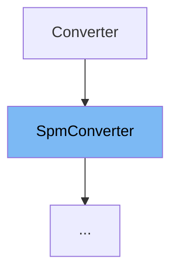

This document will cover the class <SwmToken path="src/transformers/convert_slow_tokenizer.py" pos="445:4:4" line-data="class AlbertConverter(SpmConverter):">`SpmConverter`</SwmToken> in the <SwmPath>[src/transformers/convert_slow_tokenizer.py](src/transformers/convert_slow_tokenizer.py)</SwmPath> file. We will cover:

1. What <SwmToken path="src/transformers/convert_slow_tokenizer.py" pos="445:4:4" line-data="class AlbertConverter(SpmConverter):">`SpmConverter`</SwmToken> is.
2. Variables and functions in <SwmToken path="src/transformers/convert_slow_tokenizer.py" pos="445:4:4" line-data="class AlbertConverter(SpmConverter):">`SpmConverter`</SwmToken>.
3. Usage example of <SwmToken path="src/transformers/convert_slow_tokenizer.py" pos="445:4:4" line-data="class AlbertConverter(SpmConverter):">`SpmConverter`</SwmToken> in <SwmToken path="src/transformers/convert_slow_tokenizer.py" pos="445:2:2" line-data="class AlbertConverter(SpmConverter):">`AlbertConverter`</SwmToken>.



# What is <SwmToken path="src/transformers/convert_slow_tokenizer.py" pos="445:4:4" line-data="class AlbertConverter(SpmConverter):">`SpmConverter`</SwmToken>

<SwmToken path="src/transformers/convert_slow_tokenizer.py" pos="445:4:4" line-data="class AlbertConverter(SpmConverter):">`SpmConverter`</SwmToken> is a class in the <SwmPath>[src/transformers/convert_slow_tokenizer.py](src/transformers/convert_slow_tokenizer.py)</SwmPath> file. It is used to convert slow tokenizers to their fast counterparts, specifically for tokenizers that use <SwmToken path="src/transformers/convert_slow_tokenizer.py" pos="18:17:17" line-data="    All the conversions are grouped here to gather SentencePiece dependencies outside of the fast tokenizers files and">`SentencePiece`</SwmToken> models. The class handles the conversion process by extracting the necessary information from the <SwmToken path="src/transformers/convert_slow_tokenizer.py" pos="18:17:17" line-data="    All the conversions are grouped here to gather SentencePiece dependencies outside of the fast tokenizers files and">`SentencePiece`</SwmToken> model and configuring the fast tokenizer accordingly.

<SwmSnippet path="/src/transformers/convert_slow_tokenizer.py" line="370">

---

# Variables and functions

The constructor <SwmToken path="src/transformers/convert_slow_tokenizer.py" pos="370:3:3" line-data="    def __init__(self, *args):">`__init__`</SwmToken> initializes the <SwmToken path="src/transformers/convert_slow_tokenizer.py" pos="445:4:4" line-data="class AlbertConverter(SpmConverter):">`SpmConverter`</SwmToken> class. It requires the <SwmToken path="src/transformers/convert_slow_tokenizer.py" pos="371:7:7" line-data="        requires_backends(self, &quot;protobuf&quot;)">`protobuf`</SwmToken> backend and loads the <SwmToken path="src/transformers/convert_slow_tokenizer.py" pos="18:17:17" line-data="    All the conversions are grouped here to gather SentencePiece dependencies outside of the fast tokenizers files and">`SentencePiece`</SwmToken> model from the tokenizer's vocabulary file.

```python
    def __init__(self, *args):
        requires_backends(self, "protobuf")

        super().__init__(*args)
```

---

</SwmSnippet>

<SwmSnippet path="/src/transformers/convert_slow_tokenizer.py" line="382">

---

The <SwmToken path="src/transformers/convert_slow_tokenizer.py" pos="382:3:3" line-data="    def vocab(self, proto):">`vocab`</SwmToken> function extracts the vocabulary from the <SwmToken path="src/transformers/convert_slow_tokenizer.py" pos="18:17:17" line-data="    All the conversions are grouped here to gather SentencePiece dependencies outside of the fast tokenizers files and">`SentencePiece`</SwmToken> model. It returns a list of tuples containing the piece and its score.

```python
    def vocab(self, proto):
        return [(piece.piece, piece.score) for piece in proto.pieces]

```

---

</SwmSnippet>

<SwmSnippet path="/src/transformers/convert_slow_tokenizer.py" line="385">

---

The <SwmToken path="src/transformers/convert_slow_tokenizer.py" pos="385:3:3" line-data="    def unk_id(self, proto):">`unk_id`</SwmToken> function retrieves the unknown token ID from the <SwmToken path="src/transformers/convert_slow_tokenizer.py" pos="18:17:17" line-data="    All the conversions are grouped here to gather SentencePiece dependencies outside of the fast tokenizers files and">`SentencePiece`</SwmToken> model's trainer specification.

```python
    def unk_id(self, proto):
        return proto.trainer_spec.unk_id
```

---

</SwmSnippet>

<SwmSnippet path="/src/transformers/convert_slow_tokenizer.py" line="388">

---

The <SwmToken path="src/transformers/convert_slow_tokenizer.py" pos="388:3:3" line-data="    def tokenizer(self, proto):">`tokenizer`</SwmToken> function creates a fast tokenizer based on the model type specified in the <SwmToken path="src/transformers/convert_slow_tokenizer.py" pos="18:17:17" line-data="    All the conversions are grouped here to gather SentencePiece dependencies outside of the fast tokenizers files and">`SentencePiece`</SwmToken> model. It supports both Unigram and BPE models.

```python
    def tokenizer(self, proto):
        model_type = proto.trainer_spec.model_type
        vocab = self.vocab(proto)
        unk_id = self.unk_id(proto)

        if model_type == 1:
            tokenizer = Tokenizer(Unigram(vocab, unk_id))
        elif model_type == 2:
            _, merges = SentencePieceExtractor(self.original_tokenizer.vocab_file).extract()
            bpe_vocab = {word: i for i, (word, score) in enumerate(vocab)}
            tokenizer = Tokenizer(
                BPE(
                    bpe_vocab,
                    merges,
                    unk_token=proto.trainer_spec.unk_piece,
                    fuse_unk=True,
                )
            )
        else:
            raise Exception(
                "You're trying to run a `Unigram` model but you're file was trained with a different algorithm"
```

---

</SwmSnippet>

<SwmSnippet path="/src/transformers/convert_slow_tokenizer.py" line="413">

---

The <SwmToken path="src/transformers/convert_slow_tokenizer.py" pos="413:3:3" line-data="    def normalizer(self, proto):">`normalizer`</SwmToken> function configures the normalizer for the fast tokenizer. It uses a precompiled character map if available, otherwise it uses a sequence of normalizers.

```python
    def normalizer(self, proto):
        precompiled_charsmap = proto.normalizer_spec.precompiled_charsmap
        if not precompiled_charsmap:
            return normalizers.Sequence([normalizers.Replace(Regex(" {2,}"), " ")])
        else:
            return normalizers.Sequence(
                [normalizers.Precompiled(precompiled_charsmap), normalizers.Replace(Regex(" {2,}"), " ")]
            )
```

---

</SwmSnippet>

<SwmSnippet path="/src/transformers/convert_slow_tokenizer.py" line="422">

---

The <SwmToken path="src/transformers/convert_slow_tokenizer.py" pos="422:3:3" line-data="    def pre_tokenizer(self, replacement, add_prefix_space):">`pre_tokenizer`</SwmToken> function configures the pre-tokenizer for the fast tokenizer. It uses the Metaspace pre-tokenizer with the specified replacement and prefix space settings.

```python
    def pre_tokenizer(self, replacement, add_prefix_space):
        return pre_tokenizers.Metaspace(replacement=replacement, add_prefix_space=add_prefix_space)
```

---

</SwmSnippet>

<SwmSnippet path="/src/transformers/convert_slow_tokenizer.py" line="425">

---

The <SwmToken path="src/transformers/convert_slow_tokenizer.py" pos="425:3:3" line-data="    def post_processor(self):">`post_processor`</SwmToken> function returns `None`, indicating that no post-processing is required for the fast tokenizer.

```python
    def post_processor(self):
        return None
```

---

</SwmSnippet>

<SwmSnippet path="/src/transformers/convert_slow_tokenizer.py" line="428">

---

The <SwmToken path="src/transformers/convert_slow_tokenizer.py" pos="428:3:3" line-data="    def converted(self) -&gt; Tokenizer:">`converted`</SwmToken> function assembles the fast tokenizer by configuring its normalizer, pre-tokenizer, decoder, and post-processor. It returns the fully configured fast tokenizer.

```python
    def converted(self) -> Tokenizer:
        tokenizer = self.tokenizer(self.proto)

        # Tokenizer assemble
        tokenizer.normalizer = self.normalizer(self.proto)

        replacement = "▁"
        add_prefix_space = True
        tokenizer.pre_tokenizer = self.pre_tokenizer(replacement, add_prefix_space)
        tokenizer.decoder = decoders.Metaspace(replacement=replacement, add_prefix_space=add_prefix_space)
        post_processor = self.post_processor()
        if post_processor:
            tokenizer.post_processor = post_processor

        return tokenizer
```

---

</SwmSnippet>

# Usage example

Here is an example of how to use <SwmToken path="src/transformers/convert_slow_tokenizer.py" pos="445:4:4" line-data="class AlbertConverter(SpmConverter):">`SpmConverter`</SwmToken> in <SwmToken path="src/transformers/convert_slow_tokenizer.py" pos="445:2:2" line-data="class AlbertConverter(SpmConverter):">`AlbertConverter`</SwmToken>.

<SwmSnippet path="/src/transformers/convert_slow_tokenizer.py" line="445">

---

# Usage example

<SwmToken path="src/transformers/convert_slow_tokenizer.py" pos="445:2:2" line-data="class AlbertConverter(SpmConverter):">`AlbertConverter`</SwmToken> extends <SwmToken path="src/transformers/convert_slow_tokenizer.py" pos="445:4:4" line-data="class AlbertConverter(SpmConverter):">`SpmConverter`</SwmToken> and overrides the <SwmToken path="src/transformers/convert_slow_tokenizer.py" pos="446:3:3" line-data="    def vocab(self, proto):">`vocab`</SwmToken>, <SwmToken path="src/transformers/convert_slow_tokenizer.py" pos="452:3:3" line-data="    def normalizer(self, proto):">`normalizer`</SwmToken>, and <SwmToken path="src/transformers/convert_slow_tokenizer.py" pos="425:3:3" line-data="    def post_processor(self):">`post_processor`</SwmToken> functions to customize the conversion process for the Albert tokenizer.

```python
class AlbertConverter(SpmConverter):
    def vocab(self, proto):
        return [
            (piece.piece, piece.score) if check_number_comma(piece.piece) else (piece.piece, piece.score - 100)
            for piece in proto.pieces
        ]

    def normalizer(self, proto):
        list_normalizers = [
            normalizers.Replace("``", '"'),
            normalizers.Replace("''", '"'),
        ]
        if not self.original_tokenizer.keep_accents:
            list_normalizers.append(normalizers.NFKD())
            list_normalizers.append(normalizers.StripAccents())
        if self.original_tokenizer.do_lower_case:
            list_normalizers.append(normalizers.Lowercase())

        precompiled_charsmap = proto.normalizer_spec.precompiled_charsmap
        list_normalizers.append(normalizers.Precompiled(precompiled_charsmap))
        list_normalizers.append(normalizers.Replace(Regex(" {2,}"), " "))
```

---

</SwmSnippet>

&nbsp;

*This is an auto-generated document by Swimm AI 🌊 and has not yet been verified by a human*

<SwmMeta version="3.0.0" repo-id="Z2l0aHViJTNBJTNBdHJhbnNmb3JtZXJzJTNBJTNBc2h1anV1dQ==" repo-name="transformers"><sup>Powered by [Swimm](/)</sup></SwmMeta>
