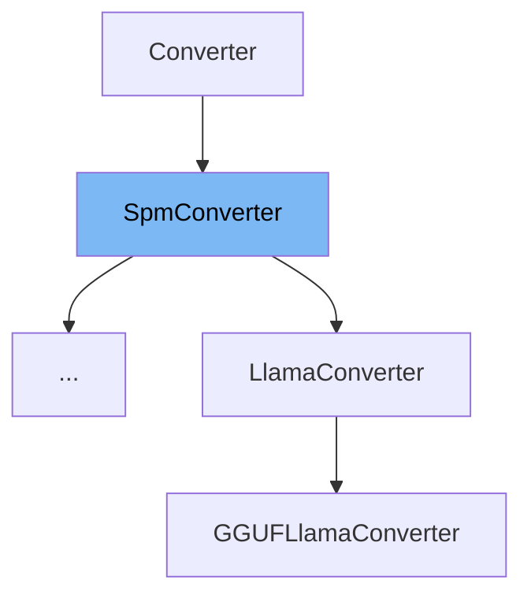

This document will cover the class <SwmToken path="src/transformers/convert_slow_tokenizer.py" pos="1071:4:4" line-data="class T5Converter(SpmConverter):">`SpmConverter`</SwmToken> in detail. We will cover:

1. What is <SwmToken path="src/transformers/convert_slow_tokenizer.py" pos="1071:4:4" line-data="class T5Converter(SpmConverter):">`SpmConverter`</SwmToken>
2. Variables and functions
3. Usage example



# What is <SwmToken path="src/transformers/convert_slow_tokenizer.py" pos="1071:4:4" line-data="class T5Converter(SpmConverter):">`SpmConverter`</SwmToken>

The <SwmToken path="src/transformers/convert_slow_tokenizer.py" pos="1071:4:4" line-data="class T5Converter(SpmConverter):">`SpmConverter`</SwmToken> class in <SwmPath>[src/transformers/convert_slow_tokenizer.py](src/transformers/convert_slow_tokenizer.py)</SwmPath> is a specialized converter used to transform slow tokenizers into their fast counterparts. It leverages the <SwmToken path="src/transformers/convert_slow_tokenizer.py" pos="18:16:16" line-data="All the conversions are grouped here to gather SentencePiece dependencies outside of the fast tokenizers files and">`SentencePiece`</SwmToken> model to handle tokenization, making it a crucial component for converting tokenizers that rely on <SwmToken path="src/transformers/convert_slow_tokenizer.py" pos="18:16:16" line-data="All the conversions are grouped here to gather SentencePiece dependencies outside of the fast tokenizers files and">`SentencePiece`</SwmToken> models.

<SwmSnippet path="/src/transformers/convert_slow_tokenizer.py" line="533">

---

# Variables and functions

The variable <SwmToken path="src/transformers/convert_slow_tokenizer.py" pos="533:1:1" line-data="    handle_byte_fallback = False">`handle_byte_fallback`</SwmToken> is a boolean flag that indicates whether the byte fallback option should be handled. It is set to `False` by default.

```python
    handle_byte_fallback = False
```

---

</SwmSnippet>

<SwmSnippet path="/src/transformers/convert_slow_tokenizer.py" line="534">

---

The variable <SwmToken path="src/transformers/convert_slow_tokenizer.py" pos="534:1:1" line-data="    SpmExtractor = SentencePieceExtractor">`SpmExtractor`</SwmToken> is set to <SwmToken path="src/transformers/convert_slow_tokenizer.py" pos="534:5:5" line-data="    SpmExtractor = SentencePieceExtractor">`SentencePieceExtractor`</SwmToken>, which is used to extract vocabulary and merges from <SwmToken path="src/transformers/convert_slow_tokenizer.py" pos="18:16:16" line-data="All the conversions are grouped here to gather SentencePiece dependencies outside of the fast tokenizers files and">`SentencePiece`</SwmToken> models.

```python
    SpmExtractor = SentencePieceExtractor
```

---

</SwmSnippet>

<SwmSnippet path="/src/transformers/convert_slow_tokenizer.py" line="535">

---

The variable <SwmToken path="src/transformers/convert_slow_tokenizer.py" pos="535:1:1" line-data="    special_tokens = {}">`special_tokens`</SwmToken> is a dictionary that holds special tokens. It is initialized as an empty dictionary.

```python
    special_tokens = {}
```

---

</SwmSnippet>

<SwmSnippet path="/src/transformers/convert_slow_tokenizer.py" line="537">

---

The <SwmToken path="src/transformers/convert_slow_tokenizer.py" pos="537:3:3" line-data="    def __init__(self, *args):">`__init__`</SwmToken> function initializes the <SwmToken path="src/transformers/convert_slow_tokenizer.py" pos="1071:4:4" line-data="class T5Converter(SpmConverter):">`SpmConverter`</SwmToken> class. It requires the <SwmToken path="src/transformers/convert_slow_tokenizer.py" pos="538:7:7" line-data="        requires_backends(self, &quot;protobuf&quot;)">`protobuf`</SwmToken> backend and reads the <SwmToken path="src/transformers/convert_slow_tokenizer.py" pos="18:16:16" line-data="All the conversions are grouped here to gather SentencePiece dependencies outside of the fast tokenizers files and">`SentencePiece`</SwmToken> model from the tokenizer's vocabulary file.

```python
    def __init__(self, *args):
        requires_backends(self, "protobuf")

        super().__init__(*args)

```

---

</SwmSnippet>

<SwmSnippet path="/src/transformers/convert_slow_tokenizer.py" line="558">

---

The <SwmToken path="src/transformers/convert_slow_tokenizer.py" pos="558:3:3" line-data="    def vocab(self, proto):">`vocab`</SwmToken> function takes a <SwmToken path="src/transformers/convert_slow_tokenizer.py" pos="558:8:8" line-data="    def vocab(self, proto):">`proto`</SwmToken> object and returns a list of tuples containing pieces and their scores.

```python
    def vocab(self, proto):
        return [(piece.piece, piece.score) for piece in proto.pieces]

```

---

</SwmSnippet>

<SwmSnippet path="/src/transformers/convert_slow_tokenizer.py" line="561">

---

The <SwmToken path="src/transformers/convert_slow_tokenizer.py" pos="561:3:3" line-data="    def unk_id(self, proto):">`unk_id`</SwmToken> function takes a <SwmToken path="src/transformers/convert_slow_tokenizer.py" pos="561:8:8" line-data="    def unk_id(self, proto):">`proto`</SwmToken> object and returns the unknown token ID from the trainer specification.

```python
    def unk_id(self, proto):
        return proto.trainer_spec.unk_id
```

---

</SwmSnippet>

<SwmSnippet path="/src/transformers/convert_slow_tokenizer.py" line="564">

---

The <SwmToken path="src/transformers/convert_slow_tokenizer.py" pos="564:3:3" line-data="    def tokenizer(self, proto):">`tokenizer`</SwmToken> function creates and returns a <SwmToken path="src/transformers/convert_slow_tokenizer.py" pos="564:3:3" line-data="    def tokenizer(self, proto):">`tokenizer`</SwmToken> object based on the model type specified in the <SwmToken path="src/transformers/convert_slow_tokenizer.py" pos="564:8:8" line-data="    def tokenizer(self, proto):">`proto`</SwmToken> object. It handles both Unigram and BPE models and adds special tokens if necessary.

```python
    def tokenizer(self, proto):
        model_type = proto.trainer_spec.model_type
        vocab_scores = self.vocab(proto)

        if model_type == 1:
            tokenizer = Tokenizer(
                Unigram(
                    vocab_scores,
                    unk_id=self.unk_id(proto),
                    byte_fallback=self.handle_byte_fallback,
                )
            )

        elif model_type == 2:
            _, merges = self.SpmExtractor(self.original_tokenizer.vocab_file).extract(vocab_scores)
            bpe_vocab = {word: i for i, (word, score) in enumerate(vocab_scores)}
            tokenizer = Tokenizer(
                BPE(
                    bpe_vocab,
                    merges,
                    unk_token=proto.trainer_spec.unk_piece,
```

---

</SwmSnippet>

<SwmSnippet path="/src/transformers/convert_slow_tokenizer.py" line="635">

---

The <SwmToken path="src/transformers/convert_slow_tokenizer.py" pos="635:3:3" line-data="    def normalizer(self, proto):">`normalizer`</SwmToken> function returns a sequence of normalizers. If a precompiled character map is available, it includes a <SwmToken path="src/transformers/convert_slow_tokenizer.py" pos="644:10:10" line-data="            return normalizers.Sequence([normalizers.Precompiled(precompiled_charsmap)] + _normalizers)">`Precompiled`</SwmToken> normalizer.

```python
    def normalizer(self, proto):
        precompiled_charsmap = proto.normalizer_spec.precompiled_charsmap
        _normalizers = [
            normalizers.Strip(left=False, right=True),  # stripping is important
            normalizers.Replace(Regex(" {2,}"), "▁"),
        ]
        if not precompiled_charsmap:
            return normalizers.Sequence(_normalizers)
        else:
            return normalizers.Sequence([normalizers.Precompiled(precompiled_charsmap)] + _normalizers)
```

---

</SwmSnippet>

<SwmSnippet path="/src/transformers/convert_slow_tokenizer.py" line="646">

---

The <SwmToken path="src/transformers/convert_slow_tokenizer.py" pos="646:3:3" line-data="    def pre_tokenizer(self, replacement, add_prefix_space):">`pre_tokenizer`</SwmToken> function returns a <SwmToken path="src/transformers/convert_slow_tokenizer.py" pos="648:5:5" line-data="        return pre_tokenizers.Metaspace(replacement=replacement, prepend_scheme=prepend_scheme)">`Metaspace`</SwmToken> pre-tokenizer with a specified replacement character and prepend scheme.

```python
    def pre_tokenizer(self, replacement, add_prefix_space):
        prepend_scheme = _get_prepend_scheme(add_prefix_space, self.original_tokenizer)
        return pre_tokenizers.Metaspace(replacement=replacement, prepend_scheme=prepend_scheme)
```

---

</SwmSnippet>

<SwmSnippet path="/src/transformers/convert_slow_tokenizer.py" line="650">

---

The <SwmToken path="src/transformers/convert_slow_tokenizer.py" pos="650:3:3" line-data="    def post_processor(self):">`post_processor`</SwmToken> function returns `None`. It can be overridden in subclasses to provide specific post-processing logic.

```python
    def post_processor(self):
        return None
```

---

</SwmSnippet>

<SwmSnippet path="/src/transformers/convert_slow_tokenizer.py" line="653">

---

The <SwmToken path="src/transformers/convert_slow_tokenizer.py" pos="653:3:3" line-data="    def decoder(self, replacement, add_prefix_space):">`decoder`</SwmToken> function returns a <SwmToken path="src/transformers/convert_slow_tokenizer.py" pos="655:5:5" line-data="        return decoders.Metaspace(replacement=replacement, prepend_scheme=prepend_scheme)">`Metaspace`</SwmToken> decoder with a specified replacement character and prepend scheme.

```python
    def decoder(self, replacement, add_prefix_space):
        prepend_scheme = _get_prepend_scheme(add_prefix_space, self.original_tokenizer)
        return decoders.Metaspace(replacement=replacement, prepend_scheme=prepend_scheme)
```

---

</SwmSnippet>

<SwmSnippet path="/src/transformers/convert_slow_tokenizer.py" line="657">

---

The <SwmToken path="src/transformers/convert_slow_tokenizer.py" pos="657:3:3" line-data="    def converted(self) -&gt; Tokenizer:">`converted`</SwmToken> function assembles the tokenizer by setting its normalizer, pre-tokenizer, decoder, and post-processor. It returns the fully assembled <SwmToken path="src/transformers/convert_slow_tokenizer.py" pos="657:10:10" line-data="    def converted(self) -&gt; Tokenizer:">`Tokenizer`</SwmToken> object.

```python
    def converted(self) -> Tokenizer:
        tokenizer = self.tokenizer(self.proto)

        # Tokenizer assemble
        normalizer = self.normalizer(self.proto)
        if normalizer is not None:
            tokenizer.normalizer = normalizer

        replacement = "▁"
        add_prefix_space = True
        if hasattr(self.original_tokenizer, "add_prefix_space"):
            add_prefix_space = self.original_tokenizer.add_prefix_space

        pre_tokenizer = self.pre_tokenizer(replacement, add_prefix_space)
        if pre_tokenizer is not None:
            tokenizer.pre_tokenizer = pre_tokenizer

        tokenizer.decoder = self.decoder(replacement, add_prefix_space)
        post_processor = self.post_processor()
        if post_processor:
            tokenizer.post_processor = post_processor
```

---

</SwmSnippet>

# Usage example

The <SwmToken path="src/transformers/convert_slow_tokenizer.py" pos="1071:2:2" line-data="class T5Converter(SpmConverter):">`T5Converter`</SwmToken> class is an example of how <SwmToken path="src/transformers/convert_slow_tokenizer.py" pos="1071:4:4" line-data="class T5Converter(SpmConverter):">`SpmConverter`</SwmToken> is used. It extends <SwmToken path="src/transformers/convert_slow_tokenizer.py" pos="1071:4:4" line-data="class T5Converter(SpmConverter):">`SpmConverter`</SwmToken> and customizes the vocabulary and post-processor for T5 tokenizers.

<SwmSnippet path="/src/transformers/convert_slow_tokenizer.py" line="1071">

---

The <SwmToken path="src/transformers/convert_slow_tokenizer.py" pos="1071:2:2" line-data="class T5Converter(SpmConverter):">`T5Converter`</SwmToken> class extends <SwmToken path="src/transformers/convert_slow_tokenizer.py" pos="1071:4:4" line-data="class T5Converter(SpmConverter):">`SpmConverter`</SwmToken> and customizes the <SwmToken path="src/transformers/convert_slow_tokenizer.py" pos="1072:3:3" line-data="    def vocab(self, proto):">`vocab`</SwmToken> and <SwmToken path="src/transformers/convert_slow_tokenizer.py" pos="1078:3:3" line-data="    def post_processor(self):">`post_processor`</SwmToken> functions to handle T5-specific tokenization.

```python
class T5Converter(SpmConverter):
    def vocab(self, proto):
        num_extra_ids = self.original_tokenizer._extra_ids
        vocab = [(piece.piece, piece.score) for piece in proto.pieces]
        vocab += [(f"<extra_id_{i}>", 0.0) for i in range(num_extra_ids - 1, -1, -1)]
        return vocab

    def post_processor(self):
        return processors.TemplateProcessing(
            single=["$A", "</s>"],
            pair=["$A", "</s>", "$B", "</s>"],
            special_tokens=[
                ("</s>", self.original_tokenizer.convert_tokens_to_ids("</s>")),
            ],
        )
```

---

</SwmSnippet>

&nbsp;

*This is an auto-generated document by Swimm AI 🌊 and has not yet been verified by a human*

<SwmMeta version="3.0.0" repo-id="Z2l0aHViJTNBJTNBdHJhbnNmb3JtZXJzJTNBJTNBc2h1anV1dQ==" repo-name="transformers" doc-type="general-class"><sup>Powered by [Swimm](/)</sup></SwmMeta>
