```mermaid
graph TD;
  StoppingCriteria:::currentBaseStyle
StoppingCriteria --> MaxLengthCriteria
StoppingCriteria --> EosTokenCriteria
StoppingCriteria --> MaxTimeCriteria
StoppingCriteria --> StopStringCriteria
StoppingCriteria --> MaxNewTokensCriteria
StoppingCriteria --> EndOfFunctionCriteria

 classDef currentBaseStyle color:#000000,fill:#7CB9F4

%% Swimm:
%% graph TD;
%%   StoppingCriteria:::currentBaseStyle
%% <SwmToken path="src/transformers/generation/stopping_criteria.py" pos="47:2:2" line-data="class StoppingCriteria(ABC):">`StoppingCriteria`</SwmToken> --> <SwmToken path="src/transformers/generation/stopping_criteria.py" pos="59:2:2" line-data="class MaxLengthCriteria(StoppingCriteria):">`MaxLengthCriteria`</SwmToken>
%% <SwmToken path="src/transformers/generation/stopping_criteria.py" pos="47:2:2" line-data="class StoppingCriteria(ABC):">`StoppingCriteria`</SwmToken> --> <SwmToken path="src/transformers/generation/stopping_criteria.py" pos="470:2:2" line-data="class EosTokenCriteria(StoppingCriteria):">`EosTokenCriteria`</SwmToken>
%% <SwmToken path="src/transformers/generation/stopping_criteria.py" pos="47:2:2" line-data="class StoppingCriteria(ABC):">`StoppingCriteria`</SwmToken> --> <SwmToken path="src/transformers/generation/stopping_criteria.py" pos="118:2:2" line-data="class MaxTimeCriteria(StoppingCriteria):">`MaxTimeCriteria`</SwmToken>
%% <SwmToken path="src/transformers/generation/stopping_criteria.py" pos="47:2:2" line-data="class StoppingCriteria(ABC):">`StoppingCriteria`</SwmToken> --> <SwmToken path="src/transformers/generation/stopping_criteria.py" pos="141:2:2" line-data="class StopStringCriteria(StoppingCriteria):">`StopStringCriteria`</SwmToken>
%% <SwmToken path="src/transformers/generation/stopping_criteria.py" pos="47:2:2" line-data="class StoppingCriteria(ABC):">`StoppingCriteria`</SwmToken> --> <SwmToken path="src/transformers/generation/stopping_criteria.py" pos="88:2:2" line-data="class MaxNewTokensCriteria(StoppingCriteria):">`MaxNewTokensCriteria`</SwmToken>
%% <SwmToken path="src/transformers/generation/stopping_criteria.py" pos="47:2:2" line-data="class StoppingCriteria(ABC):">`StoppingCriteria`</SwmToken> --> EndOfFunctionCriteria
%% 
%%  classDef currentBaseStyle color:#000000,fill:#7CB9F4
```

This document will cover the <SwmToken path="src/transformers/generation/stopping_criteria.py" pos="47:2:2" line-data="class StoppingCriteria(ABC):">`StoppingCriteria`</SwmToken> class in the <SwmToken path="src/transformers/generation/stopping_criteria.py" pos="12:2:2" line-data="from transformers.pytorch_utils import is_torch_greater_or_equal_than_2_4">`transformers`</SwmToken> library. We will cover:

1. What <SwmToken path="src/transformers/generation/stopping_criteria.py" pos="47:2:2" line-data="class StoppingCriteria(ABC):">`StoppingCriteria`</SwmToken> is.
2. Variables and functions in <SwmToken path="src/transformers/generation/stopping_criteria.py" pos="47:2:2" line-data="class StoppingCriteria(ABC):">`StoppingCriteria`</SwmToken>.
3. Usage example of <SwmToken path="src/transformers/generation/stopping_criteria.py" pos="47:2:2" line-data="class StoppingCriteria(ABC):">`StoppingCriteria`</SwmToken> in <SwmToken path="src/transformers/generation/stopping_criteria.py" pos="141:2:2" line-data="class StopStringCriteria(StoppingCriteria):">`StopStringCriteria`</SwmToken>.



# What is <SwmToken path="src/transformers/generation/stopping_criteria.py" pos="47:2:2" line-data="class StoppingCriteria(ABC):">`StoppingCriteria`</SwmToken>

The <SwmToken path="src/transformers/generation/stopping_criteria.py" pos="47:2:2" line-data="class StoppingCriteria(ABC):">`StoppingCriteria`</SwmToken> class is an abstract base class for all stopping criteria that can be applied during generation in the <SwmToken path="src/transformers/generation/stopping_criteria.py" pos="12:2:2" line-data="from transformers.pytorch_utils import is_torch_greater_or_equal_than_2_4">`transformers`</SwmToken> library. It is used to define custom stopping conditions for text generation tasks, allowing users to specify when the generation process should halt based on various criteria.

<SwmSnippet path="/src/transformers/generation/stopping_criteria.py" line="47">

---

# Variables and functions

The <SwmToken path="src/transformers/generation/stopping_criteria.py" pos="47:2:2" line-data="class StoppingCriteria(ABC):">`StoppingCriteria`</SwmToken> class is defined as an abstract base class for all stopping criteria that can be applied during generation. It provides a structure for creating custom stopping criteria.

```python
class StoppingCriteria(ABC):
    """Abstract base class for all stopping criteria that can be applied during generation.

    If your stopping criteria depends on the `scores` input, make sure you pass `return_dict_in_generate=True,
    output_scores=True` to `generate`.
    """
```

---

</SwmSnippet>

<SwmSnippet path="/src/transformers/generation/stopping_criteria.py" line="54">

---

The <SwmToken path="src/transformers/generation/stopping_criteria.py" pos="55:3:3" line-data="    def __call__(self, input_ids: torch.LongTensor, scores: torch.FloatTensor, **kwargs) -&gt; torch.BoolTensor:">`__call__`</SwmToken> function is an abstract method that must be implemented by subclasses. It takes <SwmToken path="src/transformers/generation/stopping_criteria.py" pos="55:8:8" line-data="    def __call__(self, input_ids: torch.LongTensor, scores: torch.FloatTensor, **kwargs) -&gt; torch.BoolTensor:">`input_ids`</SwmToken>, <SwmToken path="src/transformers/generation/stopping_criteria.py" pos="55:16:16" line-data="    def __call__(self, input_ids: torch.LongTensor, scores: torch.FloatTensor, **kwargs) -&gt; torch.BoolTensor:">`scores`</SwmToken>, and additional keyword arguments, and returns a <SwmToken path="src/transformers/generation/stopping_criteria.py" pos="55:30:32" line-data="    def __call__(self, input_ids: torch.LongTensor, scores: torch.FloatTensor, **kwargs) -&gt; torch.BoolTensor:">`torch.BoolTensor`</SwmToken> indicating whether to stop generation for each row.

```python
    @add_start_docstrings(STOPPING_CRITERIA_INPUTS_DOCSTRING)
    def __call__(self, input_ids: torch.LongTensor, scores: torch.FloatTensor, **kwargs) -> torch.BoolTensor:
        raise NotImplementedError("StoppingCriteria needs to be subclassed")
```

---

</SwmSnippet>

# Usage example

Here is an example of how to use <SwmToken path="src/transformers/generation/stopping_criteria.py" pos="47:2:2" line-data="class StoppingCriteria(ABC):">`StoppingCriteria`</SwmToken> in <SwmToken path="src/transformers/generation/stopping_criteria.py" pos="141:2:2" line-data="class StopStringCriteria(StoppingCriteria):">`StopStringCriteria`</SwmToken>.

<SwmSnippet path="/src/transformers/generation/stopping_criteria.py" line="141">

---

<SwmToken path="src/transformers/generation/stopping_criteria.py" pos="141:2:2" line-data="class StopStringCriteria(StoppingCriteria):">`StopStringCriteria`</SwmToken> is a subclass of <SwmToken path="src/transformers/generation/stopping_criteria.py" pos="141:4:4" line-data="class StopStringCriteria(StoppingCriteria):">`StoppingCriteria`</SwmToken> that stops generation whenever specific string sequences are generated. It preprocesses the strings together with the tokenizer vocab to find positions where tokens can validly complete the stop strings. Generation is stopped as soon as a token is generated that completes any of the stop strings.

```python
class StopStringCriteria(StoppingCriteria):
    """
    This class can be used to stop generation whenever specific string sequences are generated. It preprocesses
    the strings together with the tokenizer vocab to find positions where tokens can validly complete the stop strings.

    Generation is stopped as soon as a token is generated that completes any of the stop strings.
    We want to catch any instance in which the stop string would be present in the decoded output, which means
    we must also catch cases with "overhangs" off one or both ends. To make this more concrete, for the stop string
    "stop", any of the following token sequences would trigger the match:

    - ["st", "op"]
    - ["stop"]
    - ["st", "opera"]
    - ["sto", "pper"]
    - ["las", "topper"]
    - ["s", "to", "pped"]

    Note that a match will only be triggered if the stop string is at the end of the generated sequence. In other
    words, these sequences will not trigger a match:

    - ["stop", "at"]
```

---

</SwmSnippet>

&nbsp;

*This is an auto-generated document by Swimm AI 🌊 and has not yet been verified by a human*

<SwmMeta version="3.0.0" repo-id="Z2l0aHViJTNBJTNBdHJhbnNmb3JtZXJzJTNBJTNBc2h1anV1dQ==" repo-name="transformers" doc-type="general-class"><sup>Powered by [Swimm](/)</sup></SwmMeta>
