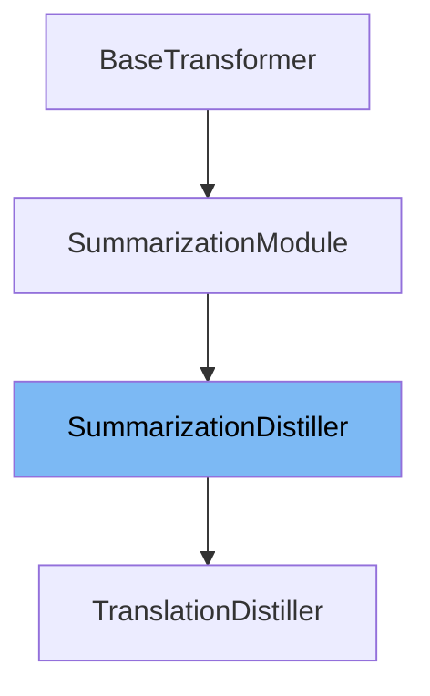

This document will cover the class <SwmToken path="examples/research_projects/seq2seq-distillation/distillation.py" pos="258:4:4" line-data="class TranslationDistiller(SummarizationDistiller):">`SummarizationDistiller`</SwmToken> in detail. We will cover:

1. What <SwmToken path="examples/research_projects/seq2seq-distillation/distillation.py" pos="258:4:4" line-data="class TranslationDistiller(SummarizationDistiller):">`SummarizationDistiller`</SwmToken> is.
2. Main variables and functions in <SwmToken path="examples/research_projects/seq2seq-distillation/distillation.py" pos="258:4:4" line-data="class TranslationDistiller(SummarizationDistiller):">`SummarizationDistiller`</SwmToken>.
3. Example of how to use <SwmToken path="examples/research_projects/seq2seq-distillation/distillation.py" pos="258:4:4" line-data="class TranslationDistiller(SummarizationDistiller):">`SummarizationDistiller`</SwmToken> in <SwmToken path="examples/research_projects/seq2seq-distillation/distillation.py" pos="258:2:2" line-data="class TranslationDistiller(SummarizationDistiller):">`TranslationDistiller`</SwmToken>.



# What is <SwmToken path="examples/research_projects/seq2seq-distillation/distillation.py" pos="258:4:4" line-data="class TranslationDistiller(SummarizationDistiller):">`SummarizationDistiller`</SwmToken>

The <SwmToken path="examples/research_projects/seq2seq-distillation/distillation.py" pos="258:4:4" line-data="class TranslationDistiller(SummarizationDistiller):">`SummarizationDistiller`</SwmToken> class is designed to support models like <SwmToken path="examples/research_projects/seq2seq-distillation/distillation.py" pos="259:6:6" line-data="    &quot;&quot;&quot;Supports T5, mBART, Marian, other models that inherit from Bart.&quot;&quot;&quot;">`T5`</SwmToken>, Bart, Pegasus, and other models that inherit from Bart. It is used for the purpose of distilling a teacher model into a student model, which involves training a smaller model (student) to mimic the behavior of a larger, pre-trained model (teacher). This class is part of the sequence-to-sequence distillation project and extends the <SwmToken path="examples/research_projects/seq2seq-distillation/distillation.py" pos="134:1:1" line-data="        SummarizationModule.add_model_specific_args(parser, root_dir)">`SummarizationModule`</SwmToken>.

<SwmSnippet path="/examples/research_projects/seq2seq-distillation/distillation.py" line="30">

---

# Variables and functions

The variable <SwmToken path="examples/research_projects/seq2seq-distillation/distillation.py" pos="30:1:1" line-data="    loss_names = [&quot;loss&quot;, &quot;ce_loss&quot;, &quot;mlm_loss&quot;, &quot;hid_loss_enc&quot;, &quot;hid_loss_dec&quot;]">`loss_names`</SwmToken> is a list that contains the names of different types of losses used during the distillation process. These include 'loss', <SwmToken path="examples/research_projects/seq2seq-distillation/distillation.py" pos="30:12:12" line-data="    loss_names = [&quot;loss&quot;, &quot;ce_loss&quot;, &quot;mlm_loss&quot;, &quot;hid_loss_enc&quot;, &quot;hid_loss_dec&quot;]">`ce_loss`</SwmToken>, <SwmToken path="examples/research_projects/seq2seq-distillation/distillation.py" pos="30:17:17" line-data="    loss_names = [&quot;loss&quot;, &quot;ce_loss&quot;, &quot;mlm_loss&quot;, &quot;hid_loss_enc&quot;, &quot;hid_loss_dec&quot;]">`mlm_loss`</SwmToken>, <SwmToken path="examples/research_projects/seq2seq-distillation/distillation.py" pos="30:22:22" line-data="    loss_names = [&quot;loss&quot;, &quot;ce_loss&quot;, &quot;mlm_loss&quot;, &quot;hid_loss_enc&quot;, &quot;hid_loss_dec&quot;]">`hid_loss_enc`</SwmToken>, and <SwmToken path="examples/research_projects/seq2seq-distillation/distillation.py" pos="30:27:27" line-data="    loss_names = [&quot;loss&quot;, &quot;ce_loss&quot;, &quot;mlm_loss&quot;, &quot;hid_loss_enc&quot;, &quot;hid_loss_dec&quot;]">`hid_loss_dec`</SwmToken>.

```python
    loss_names = ["loss", "ce_loss", "mlm_loss", "hid_loss_enc", "hid_loss_dec"]
```

---

</SwmSnippet>

<SwmSnippet path="/examples/research_projects/seq2seq-distillation/distillation.py" line="32">

---

The <SwmToken path="examples/research_projects/seq2seq-distillation/distillation.py" pos="32:3:3" line-data="    def __init__(self, hparams):">`__init__`</SwmToken> function initializes the <SwmToken path="examples/research_projects/seq2seq-distillation/distillation.py" pos="258:4:4" line-data="class TranslationDistiller(SummarizationDistiller):">`SummarizationDistiller`</SwmToken> class. It sets up the output directory, loads the teacher model, and creates or loads the student model. It also configures various parameters and prepares the models for distillation.

```python
    def __init__(self, hparams):
        assert Path(hparams.data_dir).exists()
        self.output_dir = Path(hparams.output_dir)
        self.output_dir.mkdir(exist_ok=True)

        save_dir = self.output_dir.joinpath("student")

        hparams.model_name_or_path = str(save_dir)  # Tell lightning we are training the student
        teacher = AutoModelForSeq2SeqLM.from_pretrained(hparams.teacher).eval()
        use_task_specific_params(teacher, hparams.task)  # We copy good generation parameters to student by default
        if hparams.student is not None:
            student = AutoModelForSeq2SeqLM.from_pretrained(hparams.student)
            use_task_specific_params(student, hparams.task)
            e_layer_ids, d_layer_ids = None, None
        else:
            student, e_layer_ids, d_layer_ids = create_student_by_copying_alternating_layers(
                teacher, e=hparams.student_encoder_layers, d=hparams.student_decoder_layers, save_path=save_dir
            )

        if hparams.length_penalty != -1:
            student.config.length_penalty = hparams.length_penalty
```

---

</SwmSnippet>

<SwmSnippet path="/examples/research_projects/seq2seq-distillation/distillation.py" line="113">

---

The <SwmToken path="examples/research_projects/seq2seq-distillation/distillation.py" pos="113:3:3" line-data="    def calc_ce_loss(self, mask, s_logits, t_logits):">`calc_ce_loss`</SwmToken> function calculates the cross-entropy loss between the student and teacher logits. This function is crucial for the distillation process as it ensures that the student model's outputs are similar to the teacher model's outputs.

```python
    def calc_ce_loss(self, mask, s_logits, t_logits):
        """Copy pasted from distillbert (transformers/examples/distillation/)"""
        # mask has False at padding_idx
        sel_mask = mask[:, :, None].expand_as(s_logits)
        vocab_size = s_logits.size(-1)
        s_logits_slct = torch.masked_select(s_logits, sel_mask)  # (bs * seq_length * voc_size) modulo the 1s in mask
        t_logits_slct = torch.masked_select(t_logits, sel_mask)  # (bs * seq_length * voc_size) modulo the 1s in mask
        s_logits_slct = s_logits_slct.view(-1, vocab_size)  # (bs * seq_length, voc_size) modulo the 1s in mask
        t_logits_slct = t_logits_slct.view(-1, vocab_size)  # (bs * seq_length, voc_size) modulo the 1s in mask
        assert t_logits_slct.size() == s_logits_slct.size()
        loss_ce = (
            self.ce_loss_fct(
                nn.functional.log_softmax(s_logits_slct / self.temperature, dim=-1),
                nn.functional.softmax(t_logits_slct / self.temperature, dim=-1),
            )
            * (self.temperature) ** 2
        )
        return loss_ce
```

---

</SwmSnippet>

<SwmSnippet path="/examples/research_projects/seq2seq-distillation/distillation.py" line="132">

---

The <SwmToken path="examples/research_projects/seq2seq-distillation/distillation.py" pos="133:3:3" line-data="    def add_model_specific_args(parser, root_dir):">`add_model_specific_args`</SwmToken> function adds model-specific arguments to the parser. This function is used to configure the distillation process with various hyperparameters and settings.

```python
    @staticmethod
    def add_model_specific_args(parser, root_dir):
        SummarizationModule.add_model_specific_args(parser, root_dir)
        add_distill_args(parser)
        return parser
```

---

</SwmSnippet>

<SwmSnippet path="/examples/research_projects/seq2seq-distillation/distillation.py" line="138">

---

The <SwmToken path="examples/research_projects/seq2seq-distillation/distillation.py" pos="138:3:3" line-data="    def _step(self, batch: dict) -&gt; tuple:">`_step`</SwmToken> function computes the loss for a batch of data. It handles the forward pass through the student model, calculates the various losses, and blends them into a single loss value.

```python
    def _step(self, batch: dict) -> tuple:
        """Compute the loss for a batch"""
        pad_token_id = self.tokenizer.pad_token_id
        input_ids, src_mask, labels = batch["input_ids"], batch["attention_mask"], batch["labels"]
        if isinstance(self.model, T5ForConditionalGeneration):
            decoder_input_ids = self.model._shift_right(labels)
        else:
            decoder_input_ids = shift_tokens_right(labels, pad_token_id)

        # noinspection PyCallingNonCallable
        student_outputs = self(
            input_ids,
            attention_mask=src_mask,
            decoder_input_ids=decoder_input_ids,
            output_hidden_states=self.do_calc_hidden_loss,
            output_attentions=False,
            use_cache=False,
        )
        lm_logits = student_outputs["logits"]

        # Same cross entropy vs. label smoothing logic as finetune.py
```

---

</SwmSnippet>

<SwmSnippet path="/examples/research_projects/seq2seq-distillation/distillation.py" line="220">

---

The <SwmToken path="examples/research_projects/seq2seq-distillation/distillation.py" pos="221:3:3" line-data="    def calc_hidden_loss(attention_mask, hidden_states, hidden_states_T, matches, normalize_hidden):">`calc_hidden_loss`</SwmToken> function calculates the mean squared error (MSE) loss between the hidden states of the student and teacher models. This function is used for intermediate supervision during the distillation process.

```python
    @staticmethod
    def calc_hidden_loss(attention_mask, hidden_states, hidden_states_T, matches, normalize_hidden):
        """MSE(student_hid, teacher_hid[matches]). Called "Intermediate supervision" in paper. Inspired by TinyBERT."""
        msg = "expected list or tuple for hidden_states, got tensor of shape: "
        assert not isinstance(hidden_states, torch.Tensor), f"{msg}{hidden_states.shape}"
        assert not isinstance(hidden_states_T, torch.Tensor), f"{msg}{hidden_states_T.shape}"
        mask = attention_mask.to(hidden_states[0])
        valid_count = mask.sum() * hidden_states[0].size(-1)
        student_states = torch.stack([hidden_states[i] for i in range(len(matches))])
        teacher_states = torch.stack([hidden_states_T[j] for j in matches])
        assert student_states.shape == teacher_states.shape, f"{student_states.shape} != {teacher_states.shape}"
        if normalize_hidden:
            student_states = nn.functional.layer_norm(student_states, student_states.shape[1:])
            teacher_states = nn.functional.layer_norm(teacher_states, teacher_states.shape[1:])
        mse = nn.functional.mse_loss(student_states, teacher_states, reduction="none")
        masked_mse = (mse * mask.unsqueeze(0).unsqueeze(-1)).sum() / valid_count
        return masked_mse
```

---

</SwmSnippet>

# Usage example

The <SwmToken path="examples/research_projects/seq2seq-distillation/distillation.py" pos="258:4:4" line-data="class TranslationDistiller(SummarizationDistiller):">`SummarizationDistiller`</SwmToken> class is used in the <SwmToken path="examples/research_projects/seq2seq-distillation/distillation.py" pos="258:2:2" line-data="class TranslationDistiller(SummarizationDistiller):">`TranslationDistiller`</SwmToken> class to support models like <SwmToken path="examples/research_projects/seq2seq-distillation/distillation.py" pos="259:6:6" line-data="    &quot;&quot;&quot;Supports T5, mBART, Marian, other models that inherit from Bart.&quot;&quot;&quot;">`T5`</SwmToken>, <SwmToken path="examples/research_projects/seq2seq-distillation/distillation.py" pos="259:9:9" line-data="    &quot;&quot;&quot;Supports T5, mBART, Marian, other models that inherit from Bart.&quot;&quot;&quot;">`mBART`</SwmToken>, and Marian. Here is an example of how <SwmToken path="examples/research_projects/seq2seq-distillation/distillation.py" pos="258:4:4" line-data="class TranslationDistiller(SummarizationDistiller):">`SummarizationDistiller`</SwmToken> is extended and used in <SwmToken path="examples/research_projects/seq2seq-distillation/distillation.py" pos="258:2:2" line-data="class TranslationDistiller(SummarizationDistiller):">`TranslationDistiller`</SwmToken>.

<SwmSnippet path="/examples/research_projects/seq2seq-distillation/distillation.py" line="258">

---

# Usage example

The <SwmToken path="examples/research_projects/seq2seq-distillation/distillation.py" pos="258:2:2" line-data="class TranslationDistiller(SummarizationDistiller):">`TranslationDistiller`</SwmToken> class extends <SwmToken path="examples/research_projects/seq2seq-distillation/distillation.py" pos="258:4:4" line-data="class TranslationDistiller(SummarizationDistiller):">`SummarizationDistiller`</SwmToken> and adds specific functionality for translation tasks. It sets up the source and target languages and configures the tokenizer accordingly.

```python
class TranslationDistiller(SummarizationDistiller):
    """Supports T5, mBART, Marian, other models that inherit from Bart."""

    mode = "translation"
    metric_names = ["bleu"]
    default_val_metric = "bleu"

    def __init__(self, hparams, **kwargs):
        super().__init__(hparams, **kwargs)
        assert hparams.src_lang is not None
        assert hparams.tgt_lang is not None
        self.dataset_kwargs["src_lang"] = hparams.src_lang
        self.dataset_kwargs["tgt_lang"] = hparams.tgt_lang
        if self.model.config.decoder_start_token_id is None and isinstance(self.tokenizer, MBartTokenizer):
            self.decoder_start_token_id = self.tokenizer.lang_code_to_id[hparams.tgt_lang]
```

---

</SwmSnippet>

&nbsp;

*This is an auto-generated document by Swimm AI 🌊 and has not yet been verified by a human*

<SwmMeta version="3.0.0" repo-id="Z2l0aHViJTNBJTNBdHJhbnNmb3JtZXJzJTNBJTNBc2h1anV1dQ==" repo-name="transformers"><sup>Powered by [Swimm](/)</sup></SwmMeta>
