```mermaid
graph TD;
 TFPreTrainedModel --> TFBertPreTrainedModel:::currentBaseStyle
TFBertPreTrainedModel --> TFBertModel
TFBertPreTrainedModel --> TFBertForSequenceClassification
TFBertPreTrainedModel --> TFBertForMultipleChoice
TFBertPreTrainedModel --> TFBertForMaskedLM
TFBertPreTrainedModel --> TFBertForQuestionAnswering
TFBertPreTrainedModel --> TFBertForPreTraining
TFBertPreTrainedModel --> TFBertForTokenClassification
TFBertPreTrainedModel --> TFBertForNextSentencePrediction
TFBertPreTrainedModel --> TFBertLMHeadModel

 classDef currentBaseStyle color:#000000,fill:#7CB9F4

%% Swimm:
%% graph TD;
%%  <SwmToken path="src/transformers/models/bert/modeling_tf_bert.py" pos="707:4:4" line-data="class TFBertPreTrainedModel(TFPreTrainedModel):">`TFPreTrainedModel`</SwmToken> --> TFBertPreTrainedModel:::currentBaseStyle
%% <SwmToken path="src/transformers/models/bert/modeling_tf_bert.py" pos="707:2:2" line-data="class TFBertPreTrainedModel(TFPreTrainedModel):">`TFBertPreTrainedModel`</SwmToken> --> <SwmToken path="src/transformers/models/bert/modeling_tf_bert.py" pos="845:2:2" line-data="class TFBertModel(TFBertPreTrainedModel):">`TFBertModel`</SwmToken>
%% <SwmToken path="src/transformers/models/bert/modeling_tf_bert.py" pos="707:2:2" line-data="class TFBertPreTrainedModel(TFPreTrainedModel):">`TFBertPreTrainedModel`</SwmToken> --> <SwmToken path="src/transformers/models/bert/modeling_tf_bert.py" pos="1378:2:2" line-data="class TFBertForSequenceClassification(TFBertPreTrainedModel, TFSequenceClassificationLoss):">`TFBertForSequenceClassification`</SwmToken>
%% <SwmToken path="src/transformers/models/bert/modeling_tf_bert.py" pos="707:2:2" line-data="class TFBertPreTrainedModel(TFPreTrainedModel):">`TFBertPreTrainedModel`</SwmToken> --> <SwmToken path="src/transformers/models/bert/modeling_tf_bert.py" pos="1482:2:2" line-data="class TFBertForMultipleChoice(TFBertPreTrainedModel, TFMultipleChoiceLoss):">`TFBertForMultipleChoice`</SwmToken>
%% <SwmToken path="src/transformers/models/bert/modeling_tf_bert.py" pos="707:2:2" line-data="class TFBertPreTrainedModel(TFPreTrainedModel):">`TFBertPreTrainedModel`</SwmToken> --> <SwmToken path="src/transformers/models/bert/modeling_tf_bert.py" pos="1053:2:2" line-data="class TFBertForMaskedLM(TFBertPreTrainedModel, TFMaskedLanguageModelingLoss):">`TFBertForMaskedLM`</SwmToken>
%% <SwmToken path="src/transformers/models/bert/modeling_tf_bert.py" pos="707:2:2" line-data="class TFBertPreTrainedModel(TFPreTrainedModel):">`TFBertPreTrainedModel`</SwmToken> --> <SwmToken path="src/transformers/models/bert/modeling_tf_bert.py" pos="1747:2:2" line-data="class TFBertForQuestionAnswering(TFBertPreTrainedModel, TFQuestionAnsweringLoss):">`TFBertForQuestionAnswering`</SwmToken>
%% <SwmToken path="src/transformers/models/bert/modeling_tf_bert.py" pos="707:2:2" line-data="class TFBertPreTrainedModel(TFPreTrainedModel):">`TFBertPreTrainedModel`</SwmToken> --> <SwmToken path="src/transformers/models/bert/modeling_tf_bert.py" pos="720:12:12" line-data="    Output type of :class:`~transformers.TFBertForPreTraining`.">`TFBertForPreTraining`</SwmToken>
%% <SwmToken path="src/transformers/models/bert/modeling_tf_bert.py" pos="707:2:2" line-data="class TFBertPreTrainedModel(TFPreTrainedModel):">`TFBertPreTrainedModel`</SwmToken> --> <SwmToken path="src/transformers/models/bert/modeling_tf_bert.py" pos="1638:2:2" line-data="class TFBertForTokenClassification(TFBertPreTrainedModel, TFTokenClassificationLoss):">`TFBertForTokenClassification`</SwmToken>
%% <SwmToken path="src/transformers/models/bert/modeling_tf_bert.py" pos="707:2:2" line-data="class TFBertPreTrainedModel(TFPreTrainedModel):">`TFBertPreTrainedModel`</SwmToken> --> <SwmToken path="src/transformers/models/bert/modeling_tf_bert.py" pos="1272:2:2" line-data="class TFBertForNextSentencePrediction(TFBertPreTrainedModel, TFNextSentencePredictionLoss):">`TFBertForNextSentencePrediction`</SwmToken>
%% <SwmToken path="src/transformers/models/bert/modeling_tf_bert.py" pos="707:2:2" line-data="class TFBertPreTrainedModel(TFPreTrainedModel):">`TFBertPreTrainedModel`</SwmToken> --> <SwmToken path="src/transformers/models/bert/modeling_tf_bert.py" pos="1161:2:2" line-data="class TFBertLMHeadModel(TFBertPreTrainedModel, TFCausalLanguageModelingLoss):">`TFBertLMHeadModel`</SwmToken>
%% 
%%  classDef currentBaseStyle color:#000000,fill:#7CB9F4
```

This document will cover the class <SwmToken path="src/transformers/models/bert/modeling_tf_bert.py" pos="707:2:2" line-data="class TFBertPreTrainedModel(TFPreTrainedModel):">`TFBertPreTrainedModel`</SwmToken> in the <SwmToken path="src/transformers/models/bert/modeling_tf_bert.py" pos="720:10:10" line-data="    Output type of :class:`~transformers.TFBertForPreTraining`.">`transformers`</SwmToken> repository. We will cover:

1. What <SwmToken path="src/transformers/models/bert/modeling_tf_bert.py" pos="707:2:2" line-data="class TFBertPreTrainedModel(TFPreTrainedModel):">`TFBertPreTrainedModel`</SwmToken> is.
2. Variables and functions defined in <SwmToken path="src/transformers/models/bert/modeling_tf_bert.py" pos="707:2:2" line-data="class TFBertPreTrainedModel(TFPreTrainedModel):">`TFBertPreTrainedModel`</SwmToken>.
3. Usage example of <SwmToken path="src/transformers/models/bert/modeling_tf_bert.py" pos="707:2:2" line-data="class TFBertPreTrainedModel(TFPreTrainedModel):">`TFBertPreTrainedModel`</SwmToken> in <SwmToken path="src/transformers/models/bert/modeling_tf_bert.py" pos="845:2:2" line-data="class TFBertModel(TFBertPreTrainedModel):">`TFBertModel`</SwmToken>.



# What is <SwmToken path="src/transformers/models/bert/modeling_tf_bert.py" pos="707:2:2" line-data="class TFBertPreTrainedModel(TFPreTrainedModel):">`TFBertPreTrainedModel`</SwmToken>

<SwmToken path="src/transformers/models/bert/modeling_tf_bert.py" pos="707:2:2" line-data="class TFBertPreTrainedModel(TFPreTrainedModel):">`TFBertPreTrainedModel`</SwmToken> is an abstract class in the <SwmToken path="src/transformers/models/bert/modeling_tf_bert.py" pos="720:10:10" line-data="    Output type of :class:`~transformers.TFBertForPreTraining`.">`transformers`</SwmToken> repository, specifically in the file <SwmPath>[src/transformers/models/bert/modeling_tf_bert.py](src/transformers/models/bert/modeling_tf_bert.py)</SwmPath>. It handles weights initialization and provides a simple interface for downloading and loading pretrained models. This class is essential for managing the pretrained BERT models in <SwmToken path="src/transformers/models/bert/modeling_tf_bert.py" pos="24:2:2" line-data="import tensorflow as tf">`tensorflow`</SwmToken>.

<SwmSnippet path="/src/transformers/models/bert/modeling_tf_bert.py" line="713">

---

# Variables and functions

The variable <SwmToken path="src/transformers/models/bert/modeling_tf_bert.py" pos="713:1:1" line-data="    config_class = BertConfig">`config_class`</SwmToken> is set to <SwmToken path="src/transformers/models/bert/modeling_tf_bert.py" pos="713:5:5" line-data="    config_class = BertConfig">`BertConfig`</SwmToken>. This specifies the configuration class that will be used for the BERT model.

```python
    config_class = BertConfig
    base_model_prefix = "bert"
```

---

</SwmSnippet>

<SwmSnippet path="/src/transformers/models/bert/modeling_tf_bert.py" line="714">

---

The variable <SwmToken path="src/transformers/models/bert/modeling_tf_bert.py" pos="714:1:1" line-data="    base_model_prefix = &quot;bert&quot;">`base_model_prefix`</SwmToken> is set to <SwmToken path="src/transformers/models/bert/modeling_tf_bert.py" pos="714:6:6" line-data="    base_model_prefix = &quot;bert&quot;">`bert`</SwmToken>. This prefix is used to identify the base model in the pretrained model files.

```python
    base_model_prefix = "bert"
```

---

</SwmSnippet>

<SwmSnippet path="/src/transformers/models/bert/modeling_tf_bert.py" line="707">

---

The class <SwmToken path="src/transformers/models/bert/modeling_tf_bert.py" pos="707:2:2" line-data="class TFBertPreTrainedModel(TFPreTrainedModel):">`TFBertPreTrainedModel`</SwmToken> inherits from <SwmToken path="src/transformers/models/bert/modeling_tf_bert.py" pos="707:4:4" line-data="class TFBertPreTrainedModel(TFPreTrainedModel):">`TFPreTrainedModel`</SwmToken>. It provides an abstract class to handle weights initialization and a simple interface for downloading and loading pretrained models.

```python
class TFBertPreTrainedModel(TFPreTrainedModel):
    """
    An abstract class to handle weights initialization and a simple interface for downloading and loading pretrained
    models.
    """
```

---

</SwmSnippet>

# Usage example

Here is an example of how to use <SwmToken path="src/transformers/models/bert/modeling_tf_bert.py" pos="707:2:2" line-data="class TFBertPreTrainedModel(TFPreTrainedModel):">`TFBertPreTrainedModel`</SwmToken> in <SwmToken path="src/transformers/models/bert/modeling_tf_bert.py" pos="845:2:2" line-data="class TFBertModel(TFBertPreTrainedModel):">`TFBertModel`</SwmToken>.

<SwmSnippet path="/src/transformers/models/bert/modeling_tf_bert.py" line="845">

---

# Usage example

<SwmToken path="src/transformers/models/bert/modeling_tf_bert.py" pos="845:2:2" line-data="class TFBertModel(TFBertPreTrainedModel):">`TFBertModel`</SwmToken> inherits from <SwmToken path="src/transformers/models/bert/modeling_tf_bert.py" pos="845:4:4" line-data="class TFBertModel(TFBertPreTrainedModel):">`TFBertPreTrainedModel`</SwmToken>. It initializes the BERT model using the <SwmToken path="src/transformers/models/bert/modeling_tf_bert.py" pos="849:7:7" line-data="        self.bert = TFBertMainLayer(config, name=&quot;bert&quot;)">`TFBertMainLayer`</SwmToken> and defines the <SwmToken path="src/transformers/models/bert/modeling_tf_bert.py" pos="858:3:3" line-data="    def call(">`call`</SwmToken> method to process the inputs and return the model outputs.

```python
class TFBertModel(TFBertPreTrainedModel):
    def __init__(self, config: BertConfig, *inputs, **kwargs):
        super().__init__(config, *inputs, **kwargs)

        self.bert = TFBertMainLayer(config, name="bert")

    @add_start_docstrings_to_model_forward(BERT_INPUTS_DOCSTRING.format("batch_size, sequence_length"))
    @add_code_sample_docstrings(
        tokenizer_class=_TOKENIZER_FOR_DOC,
        checkpoint=_CHECKPOINT_FOR_DOC,
        output_type=TFBaseModelOutputWithPooling,
        config_class=_CONFIG_FOR_DOC,
    )
    def call(
        self,
        input_ids: Optional[TFModelInputType] = None,
        attention_mask: Optional[Union[np.ndarray, tf.Tensor]] = None,
        token_type_ids: Optional[Union[np.ndarray, tf.Tensor]] = None,
        position_ids: Optional[Union[np.ndarray, tf.Tensor]] = None,
        head_mask: Optional[Union[np.ndarray, tf.Tensor]] = None,
        inputs_embeds: Optional[Union[np.ndarray, tf.Tensor]] = None,
```

---

</SwmSnippet>

&nbsp;

*This is an auto-generated document by Swimm AI 🌊 and has not yet been verified by a human*

<SwmMeta version="3.0.0" repo-id="Z2l0aHViJTNBJTNBdHJhbnNmb3JtZXJzJTNBJTNBc2h1anV1dQ==" repo-name="transformers"><sup>Powered by [Swimm](/)</sup></SwmMeta>
