```mermaid
graph TD;
 TFPreTrainedModel --> TFBertPreTrainedModel:::currentBaseStyle
TFBertPreTrainedModel --> TFBertModel
TFBertPreTrainedModel --> TFBertForPreTraining
TFBertPreTrainedModel --> TFBertLMHeadModel
TFBertPreTrainedModel --> TFBertForQuestionAnswering
TFBertPreTrainedModel --> TFBertForMaskedLM
TFBertPreTrainedModel --> TFBertForSequenceClassification
TFBertPreTrainedModel --> TFBertForMultipleChoice
TFBertPreTrainedModel --> TFBertForNextSentencePrediction
TFBertPreTrainedModel --> 1[...]

 classDef currentBaseStyle color:#000000,fill:#7CB9F4

%% Swimm:
%% graph TD;
%%  <SwmToken path="src/transformers/models/bert/modeling_tf_bert.py" pos="46:1:1" line-data="    TFPreTrainedModel,">`TFPreTrainedModel`</SwmToken> --> TFBertPreTrainedModel:::currentBaseStyle
%% <SwmToken path="src/transformers/models/bert/modeling_tf_bert.py" pos="1904:4:4" line-data="class TFBertForTokenClassification(TFBertPreTrainedModel, TFTokenClassificationLoss):">`TFBertPreTrainedModel`</SwmToken> --> <SwmToken path="src/transformers/models/bert/modeling_tf_bert.py" pos="295:24:24" line-data="            # Apply the attention mask is (precomputed for all layers in TFBertModel call() function)">`TFBertModel`</SwmToken>
%% <SwmToken path="src/transformers/models/bert/modeling_tf_bert.py" pos="1904:4:4" line-data="class TFBertForTokenClassification(TFBertPreTrainedModel, TFTokenClassificationLoss):">`TFBertPreTrainedModel`</SwmToken> --> <SwmToken path="src/transformers/models/bert/modeling_tf_bert.py" pos="1029:9:9" line-data="    Output type of [`TFBertForPreTraining`].">`TFBertForPreTraining`</SwmToken>
%% <SwmToken path="src/transformers/models/bert/modeling_tf_bert.py" pos="1904:4:4" line-data="class TFBertForTokenClassification(TFBertPreTrainedModel, TFTokenClassificationLoss):">`TFBertPreTrainedModel`</SwmToken> --> <SwmToken path="src/transformers/models/bert/modeling_tf_bert.py" pos="1459:2:2" line-data="class TFBertLMHeadModel(TFBertPreTrainedModel, TFCausalLanguageModelingLoss):">`TFBertLMHeadModel`</SwmToken>
%% <SwmToken path="src/transformers/models/bert/modeling_tf_bert.py" pos="1904:4:4" line-data="class TFBertForTokenClassification(TFBertPreTrainedModel, TFTokenClassificationLoss):">`TFBertPreTrainedModel`</SwmToken> --> <SwmToken path="src/transformers/models/bert/modeling_tf_bert.py" pos="2006:2:2" line-data="class TFBertForQuestionAnswering(TFBertPreTrainedModel, TFQuestionAnsweringLoss):">`TFBertForQuestionAnswering`</SwmToken>
%% <SwmToken path="src/transformers/models/bert/modeling_tf_bert.py" pos="1904:4:4" line-data="class TFBertForTokenClassification(TFBertPreTrainedModel, TFTokenClassificationLoss):">`TFBertPreTrainedModel`</SwmToken> --> <SwmToken path="src/transformers/models/bert/modeling_tf_bert.py" pos="1363:2:2" line-data="class TFBertForMaskedLM(TFBertPreTrainedModel, TFMaskedLanguageModelingLoss):">`TFBertForMaskedLM`</SwmToken>
%% <SwmToken path="src/transformers/models/bert/modeling_tf_bert.py" pos="1904:4:4" line-data="class TFBertForTokenClassification(TFBertPreTrainedModel, TFTokenClassificationLoss):">`TFBertPreTrainedModel`</SwmToken> --> <SwmToken path="src/transformers/models/bert/modeling_tf_bert.py" pos="1695:2:2" line-data="class TFBertForSequenceClassification(TFBertPreTrainedModel, TFSequenceClassificationLoss):">`TFBertForSequenceClassification`</SwmToken>
%% <SwmToken path="src/transformers/models/bert/modeling_tf_bert.py" pos="1904:4:4" line-data="class TFBertForTokenClassification(TFBertPreTrainedModel, TFTokenClassificationLoss):">`TFBertPreTrainedModel`</SwmToken> --> <SwmToken path="src/transformers/models/bert/modeling_tf_bert.py" pos="1793:2:2" line-data="class TFBertForMultipleChoice(TFBertPreTrainedModel, TFMultipleChoiceLoss):">`TFBertForMultipleChoice`</SwmToken>
%% <SwmToken path="src/transformers/models/bert/modeling_tf_bert.py" pos="1904:4:4" line-data="class TFBertForTokenClassification(TFBertPreTrainedModel, TFTokenClassificationLoss):">`TFBertPreTrainedModel`</SwmToken> --> <SwmToken path="src/transformers/models/bert/modeling_tf_bert.py" pos="1599:2:2" line-data="class TFBertForNextSentencePrediction(TFBertPreTrainedModel, TFNextSentencePredictionLoss):">`TFBertForNextSentencePrediction`</SwmToken>
%% <SwmToken path="src/transformers/models/bert/modeling_tf_bert.py" pos="1904:4:4" line-data="class TFBertForTokenClassification(TFBertPreTrainedModel, TFTokenClassificationLoss):">`TFBertPreTrainedModel`</SwmToken> --> 1[...]
%% 
%%  classDef currentBaseStyle color:#000000,fill:#7CB9F4
```

This document will cover the class <SwmToken path="src/transformers/models/bert/modeling_tf_bert.py" pos="1904:4:4" line-data="class TFBertForTokenClassification(TFBertPreTrainedModel, TFTokenClassificationLoss):">`TFBertPreTrainedModel`</SwmToken>. We will cover:

1. What <SwmToken path="src/transformers/models/bert/modeling_tf_bert.py" pos="1904:4:4" line-data="class TFBertForTokenClassification(TFBertPreTrainedModel, TFTokenClassificationLoss):">`TFBertPreTrainedModel`</SwmToken> is.
2. Main variables and functions in <SwmToken path="src/transformers/models/bert/modeling_tf_bert.py" pos="1904:4:4" line-data="class TFBertForTokenClassification(TFBertPreTrainedModel, TFTokenClassificationLoss):">`TFBertPreTrainedModel`</SwmToken>.
3. Usage example of <SwmToken path="src/transformers/models/bert/modeling_tf_bert.py" pos="1904:4:4" line-data="class TFBertForTokenClassification(TFBertPreTrainedModel, TFTokenClassificationLoss):">`TFBertPreTrainedModel`</SwmToken> in <SwmToken path="src/transformers/models/bert/modeling_tf_bert.py" pos="1904:2:2" line-data="class TFBertForTokenClassification(TFBertPreTrainedModel, TFTokenClassificationLoss):">`TFBertForTokenClassification`</SwmToken>.



# What is <SwmToken path="src/transformers/models/bert/modeling_tf_bert.py" pos="1904:4:4" line-data="class TFBertForTokenClassification(TFBertPreTrainedModel, TFTokenClassificationLoss):">`TFBertPreTrainedModel`</SwmToken>

<SwmToken path="src/transformers/models/bert/modeling_tf_bert.py" pos="1904:4:4" line-data="class TFBertForTokenClassification(TFBertPreTrainedModel, TFTokenClassificationLoss):">`TFBertPreTrainedModel`</SwmToken> is an abstract class in the <SwmToken path="src/transformers/models/bert/modeling_tf_bert.py" pos="1069:12:12" line-data="    TensorFlow models and layers in `transformers` accept two formats as input:">`transformers`</SwmToken> library, specifically in the file <SwmPath>[src/transformers/models/bert/modeling_tf_bert.py](src/transformers/models/bert/modeling_tf_bert.py)</SwmPath>. It handles weights initialization and provides a simple interface for downloading and loading pretrained models. This class is essential for managing the pretrained BERT models in <SwmToken path="src/transformers/models/bert/modeling_tf_bert.py" pos="26:2:2" line-data="import tensorflow as tf">`tensorflow`</SwmToken>.

<SwmSnippet path="/src/transformers/models/bert/modeling_tf_bert.py" line="1022">

---

# Variables and functions

The variable <SwmToken path="src/transformers/models/bert/modeling_tf_bert.py" pos="1022:1:1" line-data="    config_class = BertConfig">`config_class`</SwmToken> is set to <SwmToken path="src/transformers/models/bert/modeling_tf_bert.py" pos="1022:5:5" line-data="    config_class = BertConfig">`BertConfig`</SwmToken>. This specifies the configuration class that will be used for the BERT model.

```python
    config_class = BertConfig
```

---

</SwmSnippet>

<SwmSnippet path="/src/transformers/models/bert/modeling_tf_bert.py" line="1023">

---

The variable <SwmToken path="src/transformers/models/bert/modeling_tf_bert.py" pos="1023:1:1" line-data="    base_model_prefix = &quot;bert&quot;">`base_model_prefix`</SwmToken> is set to <SwmToken path="src/transformers/models/bert/modeling_tf_bert.py" pos="1023:6:6" line-data="    base_model_prefix = &quot;bert&quot;">`bert`</SwmToken>. This prefix is used to identify the base model when loading pretrained weights.

```python
    base_model_prefix = "bert"
```

---

</SwmSnippet>

# Usage example

Here is an example of how to use <SwmToken path="src/transformers/models/bert/modeling_tf_bert.py" pos="1904:4:4" line-data="class TFBertForTokenClassification(TFBertPreTrainedModel, TFTokenClassificationLoss):">`TFBertPreTrainedModel`</SwmToken> in <SwmToken path="src/transformers/models/bert/modeling_tf_bert.py" pos="1904:2:2" line-data="class TFBertForTokenClassification(TFBertPreTrainedModel, TFTokenClassificationLoss):">`TFBertForTokenClassification`</SwmToken>.

<SwmSnippet path="/src/transformers/models/bert/modeling_tf_bert.py" line="1904">

---

<SwmToken path="src/transformers/models/bert/modeling_tf_bert.py" pos="1904:2:2" line-data="class TFBertForTokenClassification(TFBertPreTrainedModel, TFTokenClassificationLoss):">`TFBertForTokenClassification`</SwmToken> is a subclass of <SwmToken path="src/transformers/models/bert/modeling_tf_bert.py" pos="1904:4:4" line-data="class TFBertForTokenClassification(TFBertPreTrainedModel, TFTokenClassificationLoss):">`TFBertPreTrainedModel`</SwmToken>. It adds a token classification head on top of the BERT model for tasks like <SwmToken path="src/transformers/models/bert/modeling_tf_bert.py" pos="1900:1:5" line-data="    Named-Entity-Recognition (NER) tasks.">`Named-Entity-Recognition`</SwmToken> (NER).

```python
class TFBertForTokenClassification(TFBertPreTrainedModel, TFTokenClassificationLoss):
    # names with a '.' represents the authorized unexpected/missing layers when a TF model is loaded from a PT model
    _keys_to_ignore_on_load_unexpected = [
        r"pooler",
        r"mlm___cls",
        r"nsp___cls",
        r"cls.predictions",
        r"cls.seq_relationship",
    ]
    _keys_to_ignore_on_load_missing = [r"dropout"]

    def __init__(self, config: BertConfig, *inputs, **kwargs):
        super().__init__(config, *inputs, **kwargs)

        self.num_labels = config.num_labels

        self.bert = TFBertMainLayer(config, add_pooling_layer=False, name="bert")
        classifier_dropout = (
            config.classifier_dropout if config.classifier_dropout is not None else config.hidden_dropout_prob
        )
        self.dropout = keras.layers.Dropout(rate=classifier_dropout)
```

---

</SwmSnippet>

&nbsp;

*This is an auto-generated document by Swimm AI 🌊 and has not yet been verified by a human*

<SwmMeta version="3.0.0" repo-id="Z2l0aHViJTNBJTNBdHJhbnNmb3JtZXJzJTNBJTNBc2h1anV1dQ==" repo-name="transformers" doc-type="general-class"><sup>Powered by [Swimm](/)</sup></SwmMeta>
