This document will cover the class <SwmToken path="src/transformers/modeling_tf_utils.py" pos="1400:2:2" line-data="class TFSharedEmbeddings(tf.keras.layers.Layer):">`TFSharedEmbeddings`</SwmToken> in the <SwmToken path="src/transformers/modeling_tf_utils.py" pos="263:7:7" line-data="        config (:class:`~transformers.PretrainedConfig`):">`transformers`</SwmToken> repository. We will cover:

1. What is <SwmToken path="src/transformers/modeling_tf_utils.py" pos="1400:2:2" line-data="class TFSharedEmbeddings(tf.keras.layers.Layer):">`TFSharedEmbeddings`</SwmToken>
2. Variables and functions
3. Usage example

```mermaid
graph TD;
  TFSharedEmbeddings:::currentBaseStyle
TFSharedEmbeddings --> TFBartLearnedPositionalEmbedding
TFSharedEmbeddings --> TFBlenderbotLearnedPositionalEmbedding
TFSharedEmbeddings --> TFMBartLearnedPositionalEmbedding
TFSharedEmbeddings --> TFLEDLearnedPositionalEmbedding
TFSharedEmbeddings --> TFBlenderbotSmallLearnedPositionalEmbedding

 classDef currentBaseStyle color:#000000,fill:#7CB9F4

%% Swimm:
%% graph TD;
%%   TFSharedEmbeddings:::currentBaseStyle
%% <SwmToken path="src/transformers/modeling_tf_utils.py" pos="1400:2:2" line-data="class TFSharedEmbeddings(tf.keras.layers.Layer):">`TFSharedEmbeddings`</SwmToken> --> TFBartLearnedPositionalEmbedding
%% <SwmToken path="src/transformers/modeling_tf_utils.py" pos="1400:2:2" line-data="class TFSharedEmbeddings(tf.keras.layers.Layer):">`TFSharedEmbeddings`</SwmToken> --> <SwmToken path="src/transformers/models/blenderbot_small/modeling_tf_blenderbot_small.py" pos="115:14:14" line-data="# Copied from transformers.models.blenderbot.modeling_tf_blenderbot.TFBlenderbotLearnedPositionalEmbedding with Blenderbot-&gt;BlenderbotSmall">`TFBlenderbotLearnedPositionalEmbedding`</SwmToken>
%% <SwmToken path="src/transformers/modeling_tf_utils.py" pos="1400:2:2" line-data="class TFSharedEmbeddings(tf.keras.layers.Layer):">`TFSharedEmbeddings`</SwmToken> --> TFMBartLearnedPositionalEmbedding
%% <SwmToken path="src/transformers/modeling_tf_utils.py" pos="1400:2:2" line-data="class TFSharedEmbeddings(tf.keras.layers.Layer):">`TFSharedEmbeddings`</SwmToken> --> TFLEDLearnedPositionalEmbedding
%% <SwmToken path="src/transformers/modeling_tf_utils.py" pos="1400:2:2" line-data="class TFSharedEmbeddings(tf.keras.layers.Layer):">`TFSharedEmbeddings`</SwmToken> --> <SwmToken path="src/transformers/models/blenderbot_small/modeling_tf_blenderbot_small.py" pos="116:2:2" line-data="class TFBlenderbotSmallLearnedPositionalEmbedding(TFSharedEmbeddings):">`TFBlenderbotSmallLearnedPositionalEmbedding`</SwmToken>
%% 
%%  classDef currentBaseStyle color:#000000,fill:#7CB9F4
```



# What is <SwmToken path="src/transformers/modeling_tf_utils.py" pos="1400:2:2" line-data="class TFSharedEmbeddings(tf.keras.layers.Layer):">`TFSharedEmbeddings`</SwmToken>

<SwmToken path="src/transformers/modeling_tf_utils.py" pos="1400:2:2" line-data="class TFSharedEmbeddings(tf.keras.layers.Layer):">`TFSharedEmbeddings`</SwmToken> is a class in <SwmPath>[src/transformers/modeling_tf_utils.py](src/transformers/modeling_tf_utils.py)</SwmPath> that constructs shared token embeddings. The weights of the embedding layer are usually shared with the weights of the linear decoder when performing language modeling. This class is essential for models that require shared embeddings between the input and output layers, ensuring that the same embedding matrix is used for both encoding and decoding.

<SwmSnippet path="/src/transformers/modeling_tf_utils.py" line="1419">

---

# Variables and functions

The constructor initializes the <SwmToken path="src/transformers/modeling_tf_utils.py" pos="1400:2:2" line-data="class TFSharedEmbeddings(tf.keras.layers.Layer):">`TFSharedEmbeddings`</SwmToken> class. It takes <SwmToken path="src/transformers/modeling_tf_utils.py" pos="1419:8:8" line-data="    def __init__(self, vocab_size: int, hidden_size: int, initializer_range: Optional[float] = None, **kwargs):">`vocab_size`</SwmToken>, <SwmToken path="src/transformers/modeling_tf_utils.py" pos="1419:14:14" line-data="    def __init__(self, vocab_size: int, hidden_size: int, initializer_range: Optional[float] = None, **kwargs):">`hidden_size`</SwmToken>, and an optional <SwmToken path="src/transformers/modeling_tf_utils.py" pos="1419:20:20" line-data="    def __init__(self, vocab_size: int, hidden_size: int, initializer_range: Optional[float] = None, **kwargs):">`initializer_range`</SwmToken> as arguments. The <SwmToken path="src/transformers/modeling_tf_utils.py" pos="1419:8:8" line-data="    def __init__(self, vocab_size: int, hidden_size: int, initializer_range: Optional[float] = None, **kwargs):">`vocab_size`</SwmToken> is the number of unique tokens, <SwmToken path="src/transformers/modeling_tf_utils.py" pos="1419:14:14" line-data="    def __init__(self, vocab_size: int, hidden_size: int, initializer_range: Optional[float] = None, **kwargs):">`hidden_size`</SwmToken> is the size of the embedding vectors, and <SwmToken path="src/transformers/modeling_tf_utils.py" pos="1419:20:20" line-data="    def __init__(self, vocab_size: int, hidden_size: int, initializer_range: Optional[float] = None, **kwargs):">`initializer_range`</SwmToken> is the standard deviation for weight initialization.

```python
    def __init__(self, vocab_size: int, hidden_size: int, initializer_range: Optional[float] = None, **kwargs):
        super().__init__(**kwargs)
        self.vocab_size = vocab_size
        self.hidden_size = hidden_size
        self.initializer_range = hidden_size ** -0.5 if initializer_range is None else initializer_range

```

---

</SwmSnippet>

<SwmSnippet path="/src/transformers/modeling_tf_utils.py" line="1425">

---

The <SwmToken path="src/transformers/modeling_tf_utils.py" pos="1425:3:3" line-data="    def build(self, input_shape):">`build`</SwmToken> function creates the shared token embedding layer. It initializes the weights of the embedding layer using the specified <SwmToken path="src/transformers/modeling_tf_utils.py" pos="1431:26:26" line-data="            &quot;weight&quot;, shape=[self.vocab_size, self.hidden_size], initializer=get_initializer(self.initializer_range)">`initializer_range`</SwmToken>.

```python
    def build(self, input_shape):
        """
        Build shared token embedding layer Shared weights logic adapted from
        https://github.com/tensorflow/models/blob/a009f4fb9d2fc4949e32192a944688925ef78659/official/transformer/v2/embedding_layer.py#L24
        """
        self.weight = self.add_weight(
            "weight", shape=[self.vocab_size, self.hidden_size], initializer=get_initializer(self.initializer_range)
        )
        super().build(input_shape)
```

---

</SwmSnippet>

<SwmSnippet path="/src/transformers/modeling_tf_utils.py" line="1435">

---

The <SwmToken path="src/transformers/modeling_tf_utils.py" pos="1435:3:3" line-data="    def get_config(self):">`get_config`</SwmToken> function returns the configuration of the <SwmToken path="src/transformers/modeling_tf_utils.py" pos="1400:2:2" line-data="class TFSharedEmbeddings(tf.keras.layers.Layer):">`TFSharedEmbeddings`</SwmToken> layer, including <SwmToken path="src/transformers/modeling_tf_utils.py" pos="1437:2:2" line-data="            &quot;vocab_size&quot;: self.vocab_size,">`vocab_size`</SwmToken>, <SwmToken path="src/transformers/modeling_tf_utils.py" pos="1438:2:2" line-data="            &quot;hidden_size&quot;: self.hidden_size,">`hidden_size`</SwmToken>, and <SwmToken path="src/transformers/modeling_tf_utils.py" pos="1439:2:2" line-data="            &quot;initializer_range&quot;: self.initializer_range,">`initializer_range`</SwmToken>.

```python
    def get_config(self):
        config = {
            "vocab_size": self.vocab_size,
            "hidden_size": self.hidden_size,
            "initializer_range": self.initializer_range,
        }
        base_config = super().get_config()

        return dict(list(base_config.items()) + list(config.items()))
```

---

</SwmSnippet>

<SwmSnippet path="/src/transformers/modeling_tf_utils.py" line="1445">

---

The <SwmToken path="src/transformers/modeling_tf_utils.py" pos="1445:3:3" line-data="    def call(self, inputs: tf.Tensor, mode: str = &quot;embedding&quot;) -&gt; tf.Tensor:">`call`</SwmToken> function is the main function of the <SwmToken path="src/transformers/modeling_tf_utils.py" pos="1400:2:2" line-data="class TFSharedEmbeddings(tf.keras.layers.Layer):">`TFSharedEmbeddings`</SwmToken> class. It takes <SwmToken path="src/transformers/modeling_tf_utils.py" pos="1445:8:8" line-data="    def call(self, inputs: tf.Tensor, mode: str = &quot;embedding&quot;) -&gt; tf.Tensor:">`inputs`</SwmToken> and a <SwmToken path="src/transformers/modeling_tf_utils.py" pos="1445:16:16" line-data="    def call(self, inputs: tf.Tensor, mode: str = &quot;embedding&quot;) -&gt; tf.Tensor:">`mode`</SwmToken> as arguments. The <SwmToken path="src/transformers/modeling_tf_utils.py" pos="1445:16:16" line-data="    def call(self, inputs: tf.Tensor, mode: str = &quot;embedding&quot;) -&gt; tf.Tensor:">`mode`</SwmToken> can be either <SwmToken path="src/transformers/modeling_tf_utils.py" pos="1445:24:24" line-data="    def call(self, inputs: tf.Tensor, mode: str = &quot;embedding&quot;) -&gt; tf.Tensor:">`embedding`</SwmToken> or <SwmToken path="src/transformers/modeling_tf_utils.py" pos="1453:3:3" line-data="                In linear mode, should be a float tensor with shape :obj:`[batch_size, length, hidden_size]`.">`linear`</SwmToken>. In <SwmToken path="src/transformers/modeling_tf_utils.py" pos="1445:24:24" line-data="    def call(self, inputs: tf.Tensor, mode: str = &quot;embedding&quot;) -&gt; tf.Tensor:">`embedding`</SwmToken> mode, it returns the token embeddings for the input <SwmToken path="src/transformers/modeling_tf_utils.py" pos="1095:5:5" line-data="                      Valid model ids can be located at the root-level, like ``bert-base-uncased``, or namespaced under">`ids`</SwmToken>. In <SwmToken path="src/transformers/modeling_tf_utils.py" pos="1453:3:3" line-data="                In linear mode, should be a float tensor with shape :obj:`[batch_size, length, hidden_size]`.">`linear`</SwmToken> mode, it decodes the final hidden state to logits.

```python
    def call(self, inputs: tf.Tensor, mode: str = "embedding") -> tf.Tensor:
        """
        Get token embeddings of inputs or decode final hidden state.

        Args:
            inputs (:obj:`tf.Tensor`):
                In embedding mode, should be an int64 tensor with shape :obj:`[batch_size, length]`.

                In linear mode, should be a float tensor with shape :obj:`[batch_size, length, hidden_size]`.
            mode (:obj:`str`, defaults to :obj:`"embedding"`):
               A valid value is either :obj:`"embedding"` or :obj:`"linear"`, the first one indicates that the layer
               should be used as an embedding layer, the second one that the layer should be used as a linear decoder.

        Returns:
            :obj:`tf.Tensor`: In embedding mode, the output is a float32 embedding tensor, with shape
            :obj:`[batch_size, length, embedding_size]`.

            In linear mode, the output is a float32 with shape :obj:`[batch_size, length, vocab_size]`.

        Raises:
            ValueError: if :obj:`mode` is not valid.
```

---

</SwmSnippet>

<SwmSnippet path="/src/transformers/modeling_tf_utils.py" line="1477">

---

The <SwmToken path="src/transformers/modeling_tf_utils.py" pos="1477:3:3" line-data="    def _embedding(self, input_ids):">`_embedding`</SwmToken> function applies the embedding based on the input tensor. It uses <SwmToken path="src/transformers/modeling_tf_utils.py" pos="1479:3:5" line-data="        return tf.gather(self.weight, input_ids)">`tf.gather`</SwmToken> to retrieve the embeddings for the input <SwmToken path="src/transformers/modeling_tf_utils.py" pos="1095:5:5" line-data="                      Valid model ids can be located at the root-level, like ``bert-base-uncased``, or namespaced under">`ids`</SwmToken> from the weight matrix.

```python
    def _embedding(self, input_ids):
        """Applies embedding based on inputs tensor."""
        return tf.gather(self.weight, input_ids)
```

---

</SwmSnippet>

<SwmSnippet path="/src/transformers/modeling_tf_utils.py" line="1481">

---

The <SwmToken path="src/transformers/modeling_tf_utils.py" pos="1481:3:3" line-data="    def _linear(self, inputs):">`_linear`</SwmToken> function computes logits by running the inputs through a linear layer. It reshapes the inputs and performs a matrix multiplication with the transposed weight matrix to produce the logits.

```python
    def _linear(self, inputs):
        """
        Computes logits by running inputs through a linear layer.

        Args:
            inputs: A float32 tensor with shape [..., hidden_size]

        Returns:
            float32 tensor with shape [..., vocab_size].
        """
        first_dims = shape_list(inputs)[:-1]
        x = tf.reshape(inputs, [-1, self.hidden_size])
        logits = tf.matmul(x, self.weight, transpose_b=True)

        return tf.reshape(logits, first_dims + [self.vocab_size])
```

---

</SwmSnippet>

# Usage example

Here is an example of how to use <SwmToken path="src/transformers/modeling_tf_utils.py" pos="1400:2:2" line-data="class TFSharedEmbeddings(tf.keras.layers.Layer):">`TFSharedEmbeddings`</SwmToken> in <SwmToken path="src/transformers/models/blenderbot_small/modeling_tf_blenderbot_small.py" pos="116:2:2" line-data="class TFBlenderbotSmallLearnedPositionalEmbedding(TFSharedEmbeddings):">`TFBlenderbotSmallLearnedPositionalEmbedding`</SwmToken>.

<SwmSnippet path="/src/transformers/models/blenderbot_small/modeling_tf_blenderbot_small.py" line="48">

---

# Usage example

The <SwmToken path="src/transformers/models/blenderbot_small/modeling_tf_blenderbot_small.py" pos="116:2:2" line-data="class TFBlenderbotSmallLearnedPositionalEmbedding(TFSharedEmbeddings):">`TFBlenderbotSmallLearnedPositionalEmbedding`</SwmToken> class uses <SwmToken path="src/transformers/modeling_tf_utils.py" pos="1400:2:2" line-data="class TFSharedEmbeddings(tf.keras.layers.Layer):">`TFSharedEmbeddings`</SwmToken> to create shared token embeddings. This ensures that the same embedding matrix is used for both encoding and decoding, which is crucial for models like Blenderbot.

```python
)
from ...utils import logging
from .configuration_blenderbot_small import BlenderbotSmallConfig


logger = logging.get_logger(__name__)
```

---

</SwmSnippet>

&nbsp;

*This is an auto-generated document by Swimm AI 🌊 and has not yet been verified by a human*

<SwmMeta version="3.0.0" repo-id="Z2l0aHViJTNBJTNBdHJhbnNmb3JtZXJzJTNBJTNBc2h1anV1dQ==" repo-name="transformers"><sup>Powered by [Swimm](/)</sup></SwmMeta>
