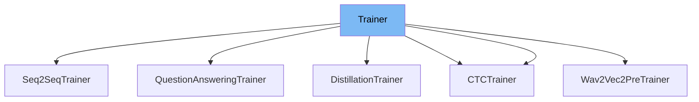

This document will cover the <SwmToken path="examples/pytorch/question-answering/trainer_qa.py" pos="28:4:4" line-data="class QuestionAnsweringTrainer(Trainer):">`Trainer`</SwmToken> class in the <SwmPath>[examples/research_projects/jax-projects/big_bird/bigbird_flax.py](examples/research_projects/jax-projects/big_bird/bigbird_flax.py)</SwmPath> file. We will cover:

1. What <SwmToken path="examples/pytorch/question-answering/trainer_qa.py" pos="28:4:4" line-data="class QuestionAnsweringTrainer(Trainer):">`Trainer`</SwmToken> is.
2. Variables and functions in <SwmToken path="examples/pytorch/question-answering/trainer_qa.py" pos="28:4:4" line-data="class QuestionAnsweringTrainer(Trainer):">`Trainer`</SwmToken>.
3. Usage example of <SwmToken path="examples/pytorch/question-answering/trainer_qa.py" pos="28:4:4" line-data="class QuestionAnsweringTrainer(Trainer):">`Trainer`</SwmToken> in <SwmToken path="examples/pytorch/question-answering/trainer_qa.py" pos="28:2:2" line-data="class QuestionAnsweringTrainer(Trainer):">`QuestionAnsweringTrainer`</SwmToken>.



# What is Trainer

The <SwmToken path="examples/pytorch/question-answering/trainer_qa.py" pos="28:4:4" line-data="class QuestionAnsweringTrainer(Trainer):">`Trainer`</SwmToken> class in <SwmPath>[examples/research_projects/jax-projects/big_bird/bigbird_flax.py](examples/research_projects/jax-projects/big_bird/bigbird_flax.py)</SwmPath> is designed to handle the training loop for the <SwmToken path="examples/research_projects/jax-projects/big_bird/bigbird_flax.py" pos="72:11:11" line-data="    model_id: str = &quot;google/bigbird-roberta-base&quot;">`bigbird`</SwmToken> model for natural questions. It manages the training state, data collation, logging, and checkpointing. The class encapsulates the logic for training and evaluating the model, making it easier to manage and extend.

<SwmSnippet path="/examples/research_projects/jax-projects/big_bird/bigbird_flax.py" line="190">

---

# Variables and functions

The variable <SwmToken path="examples/research_projects/jax-projects/big_bird/bigbird_flax.py" pos="190:1:1" line-data="    args: Args">`args`</SwmToken> is an instance of the <SwmToken path="examples/research_projects/jax-projects/big_bird/bigbird_flax.py" pos="190:1:1" line-data="    args: Args">`args`</SwmToken> dataclass, which holds various configuration parameters for the training process, such as model ID, logging steps, save steps, learning rate, and paths to training and validation data.

```python
    args: Args
```

---

</SwmSnippet>

<SwmSnippet path="/examples/research_projects/jax-projects/big_bird/bigbird_flax.py" line="191">

---

The variable <SwmToken path="examples/research_projects/jax-projects/big_bird/bigbird_flax.py" pos="191:1:1" line-data="    data_collator: Callable">`data_collator`</SwmToken> is a callable that processes and batches the input data. It ensures that the data is in the correct format and shape for the model.

```python
    data_collator: Callable
```

---

</SwmSnippet>

<SwmSnippet path="/examples/research_projects/jax-projects/big_bird/bigbird_flax.py" line="192">

---

The variable <SwmToken path="examples/research_projects/jax-projects/big_bird/bigbird_flax.py" pos="192:1:1" line-data="    train_step_fn: Callable">`train_step_fn`</SwmToken> is a callable function that performs a single training step. It computes the loss, gradients, and updates the model parameters.

```python
    train_step_fn: Callable
```

---

</SwmSnippet>

<SwmSnippet path="/examples/research_projects/jax-projects/big_bird/bigbird_flax.py" line="193">

---

The variable <SwmToken path="examples/research_projects/jax-projects/big_bird/bigbird_flax.py" pos="193:1:1" line-data="    val_step_fn: Callable">`val_step_fn`</SwmToken> is a callable function that performs a single validation step. It computes the loss on the validation dataset.

```python
    val_step_fn: Callable
```

---

</SwmSnippet>

<SwmSnippet path="/examples/research_projects/jax-projects/big_bird/bigbird_flax.py" line="194">

---

The variable <SwmToken path="examples/research_projects/jax-projects/big_bird/bigbird_flax.py" pos="194:1:1" line-data="    model_save_fn: Callable">`model_save_fn`</SwmToken> is a callable function responsible for saving the model's state, including its parameters and optimizer state.

```python
    model_save_fn: Callable
```

---

</SwmSnippet>

<SwmSnippet path="/examples/research_projects/jax-projects/big_bird/bigbird_flax.py" line="195">

---

The variable <SwmToken path="examples/research_projects/jax-projects/big_bird/bigbird_flax.py" pos="195:1:1" line-data="    logger: wandb">`logger`</SwmToken> is an instance of the <SwmToken path="examples/research_projects/jax-projects/big_bird/bigbird_flax.py" pos="195:4:4" line-data="    logger: wandb">`wandb`</SwmToken> logger, which is used for logging training metrics and other information to Weights & Biases.

```python
    logger: wandb
```

---

</SwmSnippet>

<SwmSnippet path="/examples/research_projects/jax-projects/big_bird/bigbird_flax.py" line="196">

---

The variable <SwmToken path="examples/research_projects/jax-projects/big_bird/bigbird_flax.py" pos="196:1:1" line-data="    scheduler_fn: Callable = None">`scheduler_fn`</SwmToken> is an optional callable that defines the learning rate schedule for the optimizer.

```python
    scheduler_fn: Callable = None
```

---

</SwmSnippet>

<SwmSnippet path="/examples/research_projects/jax-projects/big_bird/bigbird_flax.py" line="198">

---

The function <SwmToken path="examples/research_projects/jax-projects/big_bird/bigbird_flax.py" pos="198:3:3" line-data="    def create_state(self, model, tx, num_train_steps, ckpt_dir=None):">`create_state`</SwmToken> initializes the training state, including the model parameters, optimizer, and loss function. It can also restore the state from a checkpoint if provided.

```python
    def create_state(self, model, tx, num_train_steps, ckpt_dir=None):
        params = model.params
        state = TrainState.create(
            apply_fn=model.__call__,
            params=params,
            tx=tx,
            loss_fn=calculate_loss_for_nq,
        )
        if ckpt_dir is not None:
            params, opt_state, step, args, data_collator = restore_checkpoint(ckpt_dir, state)
            tx_args = {
                "lr": args.lr,
                "init_lr": args.init_lr,
                "warmup_steps": args.warmup_steps,
                "num_train_steps": num_train_steps,
                "weight_decay": args.weight_decay,
            }
            tx, lr = build_tx(**tx_args)
            state = train_state.TrainState(
                step=step,
                apply_fn=model.__call__,
```

---

</SwmSnippet>

<SwmSnippet path="/examples/research_projects/jax-projects/big_bird/bigbird_flax.py" line="230">

---

The function <SwmToken path="examples/research_projects/jax-projects/big_bird/bigbird_flax.py" pos="230:3:3" line-data="    def train(self, state, tr_dataset, val_dataset):">`train`</SwmToken> handles the main training loop. It iterates over the training dataset for a specified number of epochs, performs training steps, logs metrics, and saves checkpoints at specified intervals.

```python
    def train(self, state, tr_dataset, val_dataset):
        args = self.args
        total = len(tr_dataset) // args.batch_size

        rng = jax.random.PRNGKey(0)
        drp_rng = jax.random.split(rng, jax.device_count())
        for epoch in range(args.max_epochs):
            running_loss = jnp.array(0, dtype=jnp.float32)
            tr_dataloader = get_batched_dataset(tr_dataset, args.batch_size, seed=epoch)
            i = 0
            for batch in tqdm(tr_dataloader, total=total, desc=f"Running EPOCH-{epoch}"):
                batch = self.data_collator(batch)
                state, metrics, drp_rng = self.train_step_fn(state, drp_rng, **batch)
                running_loss += jax_utils.unreplicate(metrics["loss"])
                i += 1
                if i % args.logging_steps == 0:
                    state_step = jax_utils.unreplicate(state.step)
                    tr_loss = running_loss.item() / i
                    lr = self.scheduler_fn(state_step - 1)

                    eval_loss = self.evaluate(state, val_dataset)
```

---

</SwmSnippet>

<SwmSnippet path="/examples/research_projects/jax-projects/big_bird/bigbird_flax.py" line="260">

---

The function <SwmToken path="examples/research_projects/jax-projects/big_bird/bigbird_flax.py" pos="260:3:3" line-data="    def evaluate(self, state, dataset):">`evaluate`</SwmToken> computes the loss on the validation dataset. It iterates over the validation dataset and aggregates the loss for reporting.

```python
    def evaluate(self, state, dataset):
        dataloader = get_batched_dataset(dataset, self.args.batch_size)
        total = len(dataset) // self.args.batch_size
        running_loss = jnp.array(0, dtype=jnp.float32)
        i = 0
        for batch in tqdm(dataloader, total=total, desc="Evaluating ... "):
            batch = self.data_collator(batch)
            metrics = self.val_step_fn(state, **batch)
            running_loss += jax_utils.unreplicate(metrics["loss"])
            i += 1
        return running_loss / i
```

---

</SwmSnippet>

<SwmSnippet path="/examples/research_projects/jax-projects/big_bird/bigbird_flax.py" line="272">

---

The function <SwmToken path="examples/research_projects/jax-projects/big_bird/bigbird_flax.py" pos="272:3:3" line-data="    def save_checkpoint(self, save_dir, state):">`save_checkpoint`</SwmToken> saves the current state of the model, including its parameters and optimizer state, to a specified directory.

```python
    def save_checkpoint(self, save_dir, state):
        state = jax_utils.unreplicate(state)
        print(f"SAVING CHECKPOINT IN {save_dir}", end=" ... ")
        self.model_save_fn(save_dir, params=state.params)
        with open(os.path.join(save_dir, "opt_state.msgpack"), "wb") as f:
            f.write(to_bytes(state.opt_state))
        joblib.dump(self.args, os.path.join(save_dir, "args.joblib"))
        joblib.dump(self.data_collator, os.path.join(save_dir, "data_collator.joblib"))
        with open(os.path.join(save_dir, "training_state.json"), "w") as f:
            json.dump({"step": state.step.item()}, f)
        print("DONE")
```

---

</SwmSnippet>

<SwmSnippet path="/examples/research_projects/jax-projects/big_bird/bigbird_flax.py" line="285">

---

The function <SwmToken path="examples/research_projects/jax-projects/big_bird/bigbird_flax.py" pos="285:2:2" line-data="def restore_checkpoint(save_dir, state):">`restore_checkpoint`</SwmToken> restores the model state from a checkpoint directory. It loads the model parameters, optimizer state, and other relevant information.

```python
def restore_checkpoint(save_dir, state):
    print(f"RESTORING CHECKPOINT FROM {save_dir}", end=" ... ")
    with open(os.path.join(save_dir, "flax_model.msgpack"), "rb") as f:
        params = from_bytes(state.params, f.read())

    with open(os.path.join(save_dir, "opt_state.msgpack"), "rb") as f:
        opt_state = from_bytes(state.opt_state, f.read())

    args = joblib.load(os.path.join(save_dir, "args.joblib"))
    data_collator = joblib.load(os.path.join(save_dir, "data_collator.joblib"))

    with open(os.path.join(save_dir, "training_state.json"), "r") as f:
        training_state = json.load(f)
    step = training_state["step"]

    print("DONE")
    return params, opt_state, step, args, data_collator
```

---

</SwmSnippet>

# Usage example

Here is an example of how to use the <SwmToken path="examples/pytorch/question-answering/trainer_qa.py" pos="28:4:4" line-data="class QuestionAnsweringTrainer(Trainer):">`Trainer`</SwmToken> class in <SwmToken path="examples/pytorch/question-answering/trainer_qa.py" pos="28:2:2" line-data="class QuestionAnsweringTrainer(Trainer):">`QuestionAnsweringTrainer`</SwmToken>.

<SwmSnippet path="/examples/pytorch/question-answering/trainer_qa.py" line="23">

---

# Usage example

The <SwmToken path="examples/pytorch/question-answering/trainer_qa.py" pos="28:2:2" line-data="class QuestionAnsweringTrainer(Trainer):">`QuestionAnsweringTrainer`</SwmToken> class extends the <SwmToken path="examples/pytorch/question-answering/trainer_qa.py" pos="28:4:4" line-data="class QuestionAnsweringTrainer(Trainer):">`Trainer`</SwmToken> class and customizes it for the <SwmToken path="examples/pytorch/question-answering/trainer_qa.py" pos="16:14:16" line-data="A subclass of `Trainer` specific to Question-Answering tasks">`Question-Answering`</SwmToken> task. It sets up the model, data collator, and training loop specific to question answering.

```python
if is_torch_tpu_available():
    import torch_xla.core.xla_model as xm
    import torch_xla.debug.metrics as met


class QuestionAnsweringTrainer(Trainer):
```

---

</SwmSnippet>

&nbsp;

*This is an auto-generated document by Swimm AI 🌊 and has not yet been verified by a human*

<SwmMeta version="3.0.0" repo-id="Z2l0aHViJTNBJTNBdHJhbnNmb3JtZXJzJTNBJTNBc2h1anV1dQ==" repo-name="transformers"><sup>Powered by [Swimm](/)</sup></SwmMeta>
