```mermaid
graph TD;
  TrainerCallback:::currentBaseStyle
TrainerCallback --> DefaultFlowCallback
TrainerCallback --> PrinterCallback
TrainerCallback --> ProgressCallback
TrainerCallback --> NotebookProgressCallback
TrainerCallback --> TensorBoardCallback
TrainerCallback --> CallbackHandler
TrainerCallback --> EarlyStoppingCallback
TrainerCallback --> 1[...]

 classDef currentBaseStyle color:#000000,fill:#7CB9F4

%% Swimm:
%% graph TD;
%%   TrainerCallback:::currentBaseStyle
%% <SwmToken path="src/transformers/trainer_callback.py" pos="277:4:4" line-data="class CallbackHandler(TrainerCallback):">`TrainerCallback`</SwmToken> --> <SwmToken path="src/transformers/trainer_callback.py" pos="291:12:12" line-data="        if not any(isinstance(cb, DefaultFlowCallback) for cb in self.callbacks):">`DefaultFlowCallback`</SwmToken>
%% <SwmToken path="src/transformers/trainer_callback.py" pos="277:4:4" line-data="class CallbackHandler(TrainerCallback):">`TrainerCallback`</SwmToken> --> <SwmToken path="src/transformers/trainer_callback.py" pos="196:18:18" line-data="    see the code of the simple :class:`~transformer.PrinterCallback`.">`PrinterCallback`</SwmToken>
%% <SwmToken path="src/transformers/trainer_callback.py" pos="277:4:4" line-data="class CallbackHandler(TrainerCallback):">`TrainerCallback`</SwmToken> --> <SwmToken path="src/transformers/trainer_callback.py" pos="452:2:2" line-data="class ProgressCallback(TrainerCallback):">`ProgressCallback`</SwmToken>
%% <SwmToken path="src/transformers/trainer_callback.py" pos="277:4:4" line-data="class CallbackHandler(TrainerCallback):">`TrainerCallback`</SwmToken> --> NotebookProgressCallback
%% <SwmToken path="src/transformers/trainer_callback.py" pos="277:4:4" line-data="class CallbackHandler(TrainerCallback):">`TrainerCallback`</SwmToken> --> TensorBoardCallback
%% <SwmToken path="src/transformers/trainer_callback.py" pos="277:4:4" line-data="class CallbackHandler(TrainerCallback):">`TrainerCallback`</SwmToken> --> <SwmToken path="src/transformers/trainer_callback.py" pos="277:2:2" line-data="class CallbackHandler(TrainerCallback):">`CallbackHandler`</SwmToken>
%% <SwmToken path="src/transformers/trainer_callback.py" pos="277:4:4" line-data="class CallbackHandler(TrainerCallback):">`TrainerCallback`</SwmToken> --> <SwmToken path="src/transformers/trainer_callback.py" pos="505:2:2" line-data="class EarlyStoppingCallback(TrainerCallback):">`EarlyStoppingCallback`</SwmToken>
%% <SwmToken path="src/transformers/trainer_callback.py" pos="277:4:4" line-data="class CallbackHandler(TrainerCallback):">`TrainerCallback`</SwmToken> --> 1[...]
%% 
%%  classDef currentBaseStyle color:#000000,fill:#7CB9F4
```

This document will cover the <SwmToken path="src/transformers/trainer_callback.py" pos="277:4:4" line-data="class CallbackHandler(TrainerCallback):">`TrainerCallback`</SwmToken> class. We will cover:

1. What <SwmToken path="src/transformers/trainer_callback.py" pos="277:4:4" line-data="class CallbackHandler(TrainerCallback):">`TrainerCallback`</SwmToken> is.
2. Variables and functions in <SwmToken path="src/transformers/trainer_callback.py" pos="277:4:4" line-data="class CallbackHandler(TrainerCallback):">`TrainerCallback`</SwmToken>.
3. Usage example of <SwmToken path="src/transformers/trainer_callback.py" pos="277:4:4" line-data="class CallbackHandler(TrainerCallback):">`TrainerCallback`</SwmToken> in <SwmToken path="src/transformers/trainer_callback.py" pos="277:2:2" line-data="class CallbackHandler(TrainerCallback):">`CallbackHandler`</SwmToken>.



# What is <SwmToken path="src/transformers/trainer_callback.py" pos="277:4:4" line-data="class CallbackHandler(TrainerCallback):">`TrainerCallback`</SwmToken>

The <SwmToken path="src/transformers/trainer_callback.py" pos="277:4:4" line-data="class CallbackHandler(TrainerCallback):">`TrainerCallback`</SwmToken> class is designed to inspect the state of the training loop at various events and make decisions based on that state. It is used within the <SwmToken path="src/transformers/trainer_callback.py" pos="210:26:26" line-data="        Event called at the end of the initialization of the :class:`~transformers.Trainer`.">`Trainer`</SwmToken> class to customize and control the training process. The class provides hooks for different stages of the training loop, such as initialization, beginning and end of training, epochs, steps, evaluation, saving, logging, and prediction.

<SwmSnippet path="/src/transformers/trainer_callback.py" line="208">

---

# Variables and functions

The function <SwmToken path="src/transformers/trainer_callback.py" pos="208:3:3" line-data="    def on_init_end(self, args: TrainingArguments, state: TrainerState, control: TrainerControl, **kwargs):">`on_init_end`</SwmToken> is called at the end of the initialization of the <SwmToken path="src/transformers/trainer_callback.py" pos="210:26:26" line-data="        Event called at the end of the initialization of the :class:`~transformers.Trainer`.">`Trainer`</SwmToken>.

```python
    def on_init_end(self, args: TrainingArguments, state: TrainerState, control: TrainerControl, **kwargs):
        """
        Event called at the end of the initialization of the :class:`~transformers.Trainer`.
        """
```

---

</SwmSnippet>

<SwmSnippet path="/src/transformers/trainer_callback.py" line="214">

---

The function <SwmToken path="src/transformers/trainer_callback.py" pos="214:3:3" line-data="    def on_train_begin(self, args: TrainingArguments, state: TrainerState, control: TrainerControl, **kwargs):">`on_train_begin`</SwmToken> is called at the beginning of training.

```python
    def on_train_begin(self, args: TrainingArguments, state: TrainerState, control: TrainerControl, **kwargs):
        """
        Event called at the beginning of training.
        """
```

---

</SwmSnippet>

<SwmSnippet path="/src/transformers/trainer_callback.py" line="220">

---

The function <SwmToken path="src/transformers/trainer_callback.py" pos="220:3:3" line-data="    def on_train_end(self, args: TrainingArguments, state: TrainerState, control: TrainerControl, **kwargs):">`on_train_end`</SwmToken> is called at the end of training.

```python
    def on_train_end(self, args: TrainingArguments, state: TrainerState, control: TrainerControl, **kwargs):
        """
        Event called at the end of training.
        """
```

---

</SwmSnippet>

<SwmSnippet path="/src/transformers/trainer_callback.py" line="226">

---

The function <SwmToken path="src/transformers/trainer_callback.py" pos="226:3:3" line-data="    def on_epoch_begin(self, args: TrainingArguments, state: TrainerState, control: TrainerControl, **kwargs):">`on_epoch_begin`</SwmToken> is called at the beginning of an epoch.

```python
    def on_epoch_begin(self, args: TrainingArguments, state: TrainerState, control: TrainerControl, **kwargs):
        """
        Event called at the beginning of an epoch.
        """
```

---

</SwmSnippet>

<SwmSnippet path="/src/transformers/trainer_callback.py" line="232">

---

The function <SwmToken path="src/transformers/trainer_callback.py" pos="232:3:3" line-data="    def on_epoch_end(self, args: TrainingArguments, state: TrainerState, control: TrainerControl, **kwargs):">`on_epoch_end`</SwmToken> is called at the end of an epoch.

```python
    def on_epoch_end(self, args: TrainingArguments, state: TrainerState, control: TrainerControl, **kwargs):
        """
        Event called at the end of an epoch.
        """
```

---

</SwmSnippet>

<SwmSnippet path="/src/transformers/trainer_callback.py" line="238">

---

The function <SwmToken path="src/transformers/trainer_callback.py" pos="238:3:3" line-data="    def on_step_begin(self, args: TrainingArguments, state: TrainerState, control: TrainerControl, **kwargs):">`on_step_begin`</SwmToken> is called at the beginning of a training step. If using gradient accumulation, one training step might take several inputs.

```python
    def on_step_begin(self, args: TrainingArguments, state: TrainerState, control: TrainerControl, **kwargs):
        """
        Event called at the beginning of a training step. If using gradient accumulation, one training step might take
        several inputs.
```

---

</SwmSnippet>

<SwmSnippet path="/src/transformers/trainer_callback.py" line="245">

---

The function <SwmToken path="src/transformers/trainer_callback.py" pos="245:3:3" line-data="    def on_step_end(self, args: TrainingArguments, state: TrainerState, control: TrainerControl, **kwargs):">`on_step_end`</SwmToken> is called at the end of a training step. If using gradient accumulation, one training step might take several inputs.

```python
    def on_step_end(self, args: TrainingArguments, state: TrainerState, control: TrainerControl, **kwargs):
        """
        Event called at the end of a training step. If using gradient accumulation, one training step might take
        several inputs.
```

---

</SwmSnippet>

<SwmSnippet path="/src/transformers/trainer_callback.py" line="252">

---

The function <SwmToken path="src/transformers/trainer_callback.py" pos="252:3:3" line-data="    def on_evaluate(self, args: TrainingArguments, state: TrainerState, control: TrainerControl, **kwargs):">`on_evaluate`</SwmToken> is called after an evaluation phase.

```python
    def on_evaluate(self, args: TrainingArguments, state: TrainerState, control: TrainerControl, **kwargs):
        """
        Event called after an evaluation phase.
        """
```

---

</SwmSnippet>

<SwmSnippet path="/src/transformers/trainer_callback.py" line="258">

---

The function <SwmToken path="src/transformers/trainer_callback.py" pos="258:3:3" line-data="    def on_save(self, args: TrainingArguments, state: TrainerState, control: TrainerControl, **kwargs):">`on_save`</SwmToken> is called after a checkpoint save.

```python
    def on_save(self, args: TrainingArguments, state: TrainerState, control: TrainerControl, **kwargs):
        """
        Event called after a checkpoint save.
        """
```

---

</SwmSnippet>

<SwmSnippet path="/src/transformers/trainer_callback.py" line="264">

---

The function <SwmToken path="src/transformers/trainer_callback.py" pos="264:3:3" line-data="    def on_log(self, args: TrainingArguments, state: TrainerState, control: TrainerControl, **kwargs):">`on_log`</SwmToken> is called after logging the last logs.

```python
    def on_log(self, args: TrainingArguments, state: TrainerState, control: TrainerControl, **kwargs):
        """
        Event called after logging the last logs.
        """
```

---

</SwmSnippet>

<SwmSnippet path="/src/transformers/trainer_callback.py" line="270">

---

The function <SwmToken path="src/transformers/trainer_callback.py" pos="270:3:3" line-data="    def on_prediction_step(self, args: TrainingArguments, state: TrainerState, control: TrainerControl, **kwargs):">`on_prediction_step`</SwmToken> is called after a prediction step.

```python
    def on_prediction_step(self, args: TrainingArguments, state: TrainerState, control: TrainerControl, **kwargs):
        """
        Event called after a prediction step.
        """
```

---

</SwmSnippet>

# Usage example

The <SwmToken path="src/transformers/trainer_callback.py" pos="277:2:2" line-data="class CallbackHandler(TrainerCallback):">`CallbackHandler`</SwmToken> class is an example of how <SwmToken path="src/transformers/trainer_callback.py" pos="277:4:4" line-data="class CallbackHandler(TrainerCallback):">`TrainerCallback`</SwmToken> is used. It manages a list of callbacks and calls their respective events in order.

<SwmSnippet path="/src/transformers/trainer_callback.py" line="277">

---

# Usage example

The <SwmToken path="src/transformers/trainer_callback.py" pos="277:2:2" line-data="class CallbackHandler(TrainerCallback):">`CallbackHandler`</SwmToken> class extends <SwmToken path="src/transformers/trainer_callback.py" pos="277:4:4" line-data="class CallbackHandler(TrainerCallback):">`TrainerCallback`</SwmToken> and implements methods to manage and invoke a list of callbacks. It includes methods like <SwmToken path="src/transformers/trainer_callback.py" pos="283:3:3" line-data="            self.add_callback(cb)">`add_callback`</SwmToken>, <SwmToken path="src/transformers/trainer_callback.py" pos="310:3:3" line-data="    def pop_callback(self, callback):">`pop_callback`</SwmToken>, <SwmToken path="src/transformers/trainer_callback.py" pos="322:3:3" line-data="    def remove_callback(self, callback):">`remove_callback`</SwmToken>, and <SwmToken path="src/transformers/trainer_callback.py" pos="336:5:5" line-data="        return self.call_event(&quot;on_init_end&quot;, args, state, control)">`call_event`</SwmToken> to handle the callbacks and their events.

```python
class CallbackHandler(TrainerCallback):
    """Internal class that just calls the list of callbacks in order."""

    def __init__(self, callbacks, model, tokenizer, optimizer, lr_scheduler):
        self.callbacks = []
        for cb in callbacks:
            self.add_callback(cb)
        self.model = model
        self.tokenizer = tokenizer
        self.optimizer = optimizer
        self.lr_scheduler = lr_scheduler
        self.train_dataloader = None
        self.eval_dataloader = None

        if not any(isinstance(cb, DefaultFlowCallback) for cb in self.callbacks):
            logger.warning(
                "The Trainer will not work properly if you don't have a `DefaultFlowCallback` in its callbacks. You\n"
                + "should add one before training with `trainer.add_callback(DefaultFlowCallback). The current list of"
                + "callbacks is\n:"
                + self.callback_list
            )
```

---

</SwmSnippet>

&nbsp;

*This is an auto-generated document by Swimm AI 🌊 and has not yet been verified by a human*

<SwmMeta version="3.0.0" repo-id="Z2l0aHViJTNBJTNBdHJhbnNmb3JtZXJzJTNBJTNBc2h1anV1dQ==" repo-name="transformers"><sup>Powered by [Swimm](/)</sup></SwmMeta>
