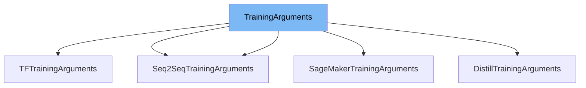

This document will cover the <SwmToken path="src/transformers/training_args.py" pos="69:2:2" line-data="class TrainingArguments:">`TrainingArguments`</SwmToken> class in the <SwmToken path="src/transformers/training_args.py" pos="74:6:6" line-data="    Using :class:`~transformers.HfArgumentParser` we can turn this class into `argparse">`transformers`</SwmToken> repository. We will cover:

1. What <SwmToken path="src/transformers/training_args.py" pos="69:2:2" line-data="class TrainingArguments:">`TrainingArguments`</SwmToken> is.
2. Main variables and functions in <SwmToken path="src/transformers/training_args.py" pos="69:2:2" line-data="class TrainingArguments:">`TrainingArguments`</SwmToken>.
3. Example of how to use <SwmToken path="src/transformers/training_args.py" pos="69:2:2" line-data="class TrainingArguments:">`TrainingArguments`</SwmToken> in `SageMakerTrainingArguments`.



# What is <SwmToken path="src/transformers/training_args.py" pos="69:2:2" line-data="class TrainingArguments:">`TrainingArguments`</SwmToken>

<SwmToken path="src/transformers/training_args.py" pos="69:2:2" line-data="class TrainingArguments:">`TrainingArguments`</SwmToken> is a class in <SwmPath>[src/transformers/training_args.py](src/transformers/training_args.py)</SwmPath> that encapsulates all the arguments related to the training loop. It is used to configure various aspects of the training process, such as the output directory, batch size, learning rate, and more. This class can be converted into command-line arguments using <SwmToken path="src/transformers/training_args.py" pos="74:8:8" line-data="    Using :class:`~transformers.HfArgumentParser` we can turn this class into `argparse">`HfArgumentParser`</SwmToken>, making it easy to specify training parameters from the command line.

<SwmSnippet path="/src/transformers/training_args.py" line="341">

---

# Variables and functions

The variable <SwmToken path="src/transformers/training_args.py" pos="341:1:1" line-data="    output_dir: str = field(">`output_dir`</SwmToken> is used to specify the output directory where the model predictions and checkpoints will be written.

```python
    output_dir: str = field(
        metadata={"help": "The output directory where the model predictions and checkpoints will be written."},
    )
```

---

</SwmSnippet>

<SwmSnippet path="/src/transformers/training_args.py" line="344">

---

The variable <SwmToken path="src/transformers/training_args.py" pos="344:1:1" line-data="    overwrite_output_dir: bool = field(">`overwrite_output_dir`</SwmToken> is a boolean that indicates whether to overwrite the content of the output directory. It defaults to `False`.

```python
    overwrite_output_dir: bool = field(
        default=False,
        metadata={
            "help": (
                "Overwrite the content of the output directory."
                "Use this to continue training if output_dir points to a checkpoint directory."
            )
        },
    )
```

---

</SwmSnippet>

<SwmSnippet path="/src/transformers/training_args.py" line="354">

---

The variable <SwmToken path="src/transformers/training_args.py" pos="354:1:1" line-data="    do_train: bool = field(default=False, metadata={&quot;help&quot;: &quot;Whether to run training.&quot;})">`do_train`</SwmToken> is a boolean that specifies whether to run training. It defaults to `False`.

```python
    do_train: bool = field(default=False, metadata={"help": "Whether to run training."})
```

---

</SwmSnippet>

<SwmSnippet path="/src/transformers/training_args.py" line="355">

---

The variable <SwmToken path="src/transformers/training_args.py" pos="355:1:1" line-data="    do_eval: bool = field(default=False, metadata={&quot;help&quot;: &quot;Whether to run eval on the dev set.&quot;})">`do_eval`</SwmToken> is a boolean that specifies whether to run evaluation on the validation set. It defaults to `False`.

```python
    do_eval: bool = field(default=False, metadata={"help": "Whether to run eval on the dev set."})
```

---

</SwmSnippet>

<SwmSnippet path="/src/transformers/training_args.py" line="356">

---

The variable <SwmToken path="src/transformers/training_args.py" pos="356:1:1" line-data="    do_predict: bool = field(default=False, metadata={&quot;help&quot;: &quot;Whether to run predictions on the test set.&quot;})">`do_predict`</SwmToken> is a boolean that specifies whether to run predictions on the test set. It defaults to `False`.

```python
    do_predict: bool = field(default=False, metadata={"help": "Whether to run predictions on the test set."})
```

---

</SwmSnippet>

<SwmSnippet path="/src/transformers/training_args.py" line="357">

---

The variable <SwmToken path="src/transformers/training_args.py" pos="357:1:1" line-data="    evaluation_strategy: IntervalStrategy = field(">`evaluation_strategy`</SwmToken> specifies the evaluation strategy to adopt during training. Possible values are 'no', 'steps', and 'epoch'. It defaults to 'no'.

```python
    evaluation_strategy: IntervalStrategy = field(
        default="no",
        metadata={"help": "The evaluation strategy to use."},
    )
```

---

</SwmSnippet>

<SwmSnippet path="/src/transformers/training_args.py" line="361">

---

The variable <SwmToken path="src/transformers/training_args.py" pos="361:1:1" line-data="    prediction_loss_only: bool = field(">`prediction_loss_only`</SwmToken> is a boolean that, when set to `True`, only returns the loss during evaluation and predictions. It defaults to `False`.

```python
    prediction_loss_only: bool = field(
        default=False,
        metadata={"help": "When performing evaluation and predictions, only returns the loss."},
    )
```

---

</SwmSnippet>

<SwmSnippet path="/src/transformers/training_args.py" line="366">

---

The variable <SwmToken path="src/transformers/training_args.py" pos="366:1:1" line-data="    per_device_train_batch_size: int = field(">`per_device_train_batch_size`</SwmToken> specifies the batch size per <SwmToken path="src/transformers/training_args.py" pos="367:21:23" line-data="        default=8, metadata={&quot;help&quot;: &quot;Batch size per GPU/TPU core/CPU for training.&quot;}">`GPU/TPU`</SwmToken> <SwmToken path="src/transformers/training_args.py" pos="367:25:27" line-data="        default=8, metadata={&quot;help&quot;: &quot;Batch size per GPU/TPU core/CPU for training.&quot;}">`core/CPU`</SwmToken> for training. It defaults to 8.

```python
    per_device_train_batch_size: int = field(
        default=8, metadata={"help": "Batch size per GPU/TPU core/CPU for training."}
    )
```

---

</SwmSnippet>

<SwmSnippet path="/src/transformers/training_args.py" line="369">

---

The variable <SwmToken path="src/transformers/training_args.py" pos="369:1:1" line-data="    per_device_eval_batch_size: int = field(">`per_device_eval_batch_size`</SwmToken> specifies the batch size per <SwmToken path="src/transformers/training_args.py" pos="370:21:23" line-data="        default=8, metadata={&quot;help&quot;: &quot;Batch size per GPU/TPU core/CPU for evaluation.&quot;}">`GPU/TPU`</SwmToken> <SwmToken path="src/transformers/training_args.py" pos="370:25:27" line-data="        default=8, metadata={&quot;help&quot;: &quot;Batch size per GPU/TPU core/CPU for evaluation.&quot;}">`core/CPU`</SwmToken> for evaluation. It defaults to 8.

```python
    per_device_eval_batch_size: int = field(
        default=8, metadata={"help": "Batch size per GPU/TPU core/CPU for evaluation."}
    )
```

---

</SwmSnippet>

<SwmSnippet path="/src/transformers/training_args.py" line="373">

---

The variable <SwmToken path="src/transformers/training_args.py" pos="373:1:1" line-data="    per_gpu_train_batch_size: Optional[int] = field(">`per_gpu_train_batch_size`</SwmToken> is deprecated and replaced by <SwmToken path="src/transformers/training_args.py" pos="376:17:17" line-data="            &quot;help&quot;: &quot;Deprecated, the use of `--per_device_train_batch_size` is preferred. &quot;">`per_device_train_batch_size`</SwmToken>. It specifies the batch size per <SwmToken path="src/transformers/training_args.py" pos="377:8:10" line-data="            &quot;Batch size per GPU/TPU core/CPU for training.&quot;">`GPU/TPU`</SwmToken> <SwmToken path="src/transformers/training_args.py" pos="377:12:14" line-data="            &quot;Batch size per GPU/TPU core/CPU for training.&quot;">`core/CPU`</SwmToken> for training.

```python
    per_gpu_train_batch_size: Optional[int] = field(
        default=None,
        metadata={
            "help": "Deprecated, the use of `--per_device_train_batch_size` is preferred. "
            "Batch size per GPU/TPU core/CPU for training."
        },
    )
```

---

</SwmSnippet>

<SwmSnippet path="/src/transformers/training_args.py" line="380">

---

The variable <SwmToken path="src/transformers/training_args.py" pos="380:1:1" line-data="    per_gpu_eval_batch_size: Optional[int] = field(">`per_gpu_eval_batch_size`</SwmToken> is deprecated and replaced by <SwmToken path="src/transformers/training_args.py" pos="383:17:17" line-data="            &quot;help&quot;: &quot;Deprecated, the use of `--per_device_eval_batch_size` is preferred.&quot;">`per_device_eval_batch_size`</SwmToken>. It specifies the batch size per <SwmToken path="src/transformers/training_args.py" pos="384:8:10" line-data="            &quot;Batch size per GPU/TPU core/CPU for evaluation.&quot;">`GPU/TPU`</SwmToken> <SwmToken path="src/transformers/training_args.py" pos="384:12:14" line-data="            &quot;Batch size per GPU/TPU core/CPU for evaluation.&quot;">`core/CPU`</SwmToken> for evaluation.

```python
    per_gpu_eval_batch_size: Optional[int] = field(
        default=None,
        metadata={
            "help": "Deprecated, the use of `--per_device_eval_batch_size` is preferred."
            "Batch size per GPU/TPU core/CPU for evaluation."
        },
    )
```

---

</SwmSnippet>

<SwmSnippet path="/src/transformers/training_args.py" line="388">

---

The variable <SwmToken path="src/transformers/training_args.py" pos="388:1:1" line-data="    gradient_accumulation_steps: int = field(">`gradient_accumulation_steps`</SwmToken> specifies the number of update steps to accumulate before performing a <SwmToken path="src/transformers/training_args.py" pos="390:28:30" line-data="        metadata={&quot;help&quot;: &quot;Number of updates steps to accumulate before performing a backward/update pass.&quot;},">`backward/update`</SwmToken> pass. It defaults to 1.

```python
    gradient_accumulation_steps: int = field(
        default=1,
        metadata={"help": "Number of updates steps to accumulate before performing a backward/update pass."},
    )
```

---

</SwmSnippet>

<SwmSnippet path="/src/transformers/training_args.py" line="392">

---

The variable <SwmToken path="src/transformers/training_args.py" pos="392:1:1" line-data="    eval_accumulation_steps: Optional[int] = field(">`eval_accumulation_steps`</SwmToken> specifies the number of prediction steps to accumulate before moving the tensors to the CPU. It is optional.

```python
    eval_accumulation_steps: Optional[int] = field(
        default=None,
        metadata={"help": "Number of predictions steps to accumulate before moving the tensors to the CPU."},
    )
```

---

</SwmSnippet>

<SwmSnippet path="/src/transformers/training_args.py" line="397">

---

The variable <SwmToken path="src/transformers/training_args.py" pos="397:1:1" line-data="    learning_rate: float = field(default=5e-5, metadata={&quot;help&quot;: &quot;The initial learning rate for AdamW.&quot;})">`learning_rate`</SwmToken> specifies the initial learning rate for the <SwmToken path="src/transformers/training_args.py" pos="397:36:36" line-data="    learning_rate: float = field(default=5e-5, metadata={&quot;help&quot;: &quot;The initial learning rate for AdamW.&quot;})">`AdamW`</SwmToken> optimizer. It defaults to <SwmToken path="src/transformers/training_args.py" pos="397:12:14" line-data="    learning_rate: float = field(default=5e-5, metadata={&quot;help&quot;: &quot;The initial learning rate for AdamW.&quot;})">`5e-5`</SwmToken>.

```python
    learning_rate: float = field(default=5e-5, metadata={"help": "The initial learning rate for AdamW."})
```

---

</SwmSnippet>

<SwmSnippet path="/src/transformers/training_args.py" line="398">

---

The variable <SwmToken path="src/transformers/training_args.py" pos="398:1:1" line-data="    weight_decay: float = field(default=0.0, metadata={&quot;help&quot;: &quot;Weight decay for AdamW if we apply some.&quot;})">`weight_decay`</SwmToken> specifies the weight decay to apply (if not zero) to all layers except all bias and <SwmToken path="src/transformers/training_args.py" pos="127:33:33" line-data="            The weight decay to apply (if not zero) to all layers except all bias and LayerNorm weights in">`LayerNorm`</SwmToken> weights in the <SwmToken path="src/transformers/training_args.py" pos="398:32:32" line-data="    weight_decay: float = field(default=0.0, metadata={&quot;help&quot;: &quot;Weight decay for AdamW if we apply some.&quot;})">`AdamW`</SwmToken> optimizer. It defaults to 0.

```python
    weight_decay: float = field(default=0.0, metadata={"help": "Weight decay for AdamW if we apply some."})
```

---

</SwmSnippet>

<SwmSnippet path="/src/transformers/training_args.py" line="399">

---

The variable <SwmToken path="src/transformers/training_args.py" pos="399:1:1" line-data="    adam_beta1: float = field(default=0.9, metadata={&quot;help&quot;: &quot;Beta1 for AdamW optimizer&quot;})">`adam_beta1`</SwmToken> specifies the <SwmToken path="src/transformers/training_args.py" pos="399:26:26" line-data="    adam_beta1: float = field(default=0.9, metadata={&quot;help&quot;: &quot;Beta1 for AdamW optimizer&quot;})">`Beta1`</SwmToken> hyperparameter for the <SwmToken path="src/transformers/training_args.py" pos="399:30:30" line-data="    adam_beta1: float = field(default=0.9, metadata={&quot;help&quot;: &quot;Beta1 for AdamW optimizer&quot;})">`AdamW`</SwmToken> optimizer. It defaults to <SwmToken path="src/transformers/training_args.py" pos="399:12:14" line-data="    adam_beta1: float = field(default=0.9, metadata={&quot;help&quot;: &quot;Beta1 for AdamW optimizer&quot;})">`0.9`</SwmToken>.

```python
    adam_beta1: float = field(default=0.9, metadata={"help": "Beta1 for AdamW optimizer"})
```

---

</SwmSnippet>

<SwmSnippet path="/src/transformers/training_args.py" line="400">

---

The variable <SwmToken path="src/transformers/training_args.py" pos="400:1:1" line-data="    adam_beta2: float = field(default=0.999, metadata={&quot;help&quot;: &quot;Beta2 for AdamW optimizer&quot;})">`adam_beta2`</SwmToken> specifies the <SwmToken path="src/transformers/training_args.py" pos="400:26:26" line-data="    adam_beta2: float = field(default=0.999, metadata={&quot;help&quot;: &quot;Beta2 for AdamW optimizer&quot;})">`Beta2`</SwmToken> hyperparameter for the <SwmToken path="src/transformers/training_args.py" pos="400:30:30" line-data="    adam_beta2: float = field(default=0.999, metadata={&quot;help&quot;: &quot;Beta2 for AdamW optimizer&quot;})">`AdamW`</SwmToken> optimizer. It defaults to <SwmToken path="src/transformers/training_args.py" pos="400:12:14" line-data="    adam_beta2: float = field(default=0.999, metadata={&quot;help&quot;: &quot;Beta2 for AdamW optimizer&quot;})">`0.999`</SwmToken>.

```python
    adam_beta2: float = field(default=0.999, metadata={"help": "Beta2 for AdamW optimizer"})
```

---

</SwmSnippet>

<SwmSnippet path="/src/transformers/training_args.py" line="401">

---

The variable <SwmToken path="src/transformers/training_args.py" pos="401:1:1" line-data="    adam_epsilon: float = field(default=1e-8, metadata={&quot;help&quot;: &quot;Epsilon for AdamW optimizer.&quot;})">`adam_epsilon`</SwmToken> specifies the epsilon hyperparameter for the <SwmToken path="src/transformers/training_args.py" pos="401:30:30" line-data="    adam_epsilon: float = field(default=1e-8, metadata={&quot;help&quot;: &quot;Epsilon for AdamW optimizer.&quot;})">`AdamW`</SwmToken> optimizer. It defaults to <SwmToken path="src/transformers/training_args.py" pos="401:12:14" line-data="    adam_epsilon: float = field(default=1e-8, metadata={&quot;help&quot;: &quot;Epsilon for AdamW optimizer.&quot;})">`1e-8`</SwmToken>.

```python
    adam_epsilon: float = field(default=1e-8, metadata={"help": "Epsilon for AdamW optimizer."})
```

---

</SwmSnippet>

<SwmSnippet path="/src/transformers/training_args.py" line="402">

---

The variable <SwmToken path="src/transformers/training_args.py" pos="402:1:1" line-data="    max_grad_norm: float = field(default=1.0, metadata={&quot;help&quot;: &quot;Max gradient norm.&quot;})">`max_grad_norm`</SwmToken> specifies the maximum gradient norm for gradient clipping. It defaults to <SwmToken path="src/transformers/training_args.py" pos="402:12:14" line-data="    max_grad_norm: float = field(default=1.0, metadata={&quot;help&quot;: &quot;Max gradient norm.&quot;})">`1.0`</SwmToken>.

```python
    max_grad_norm: float = field(default=1.0, metadata={"help": "Max gradient norm."})
```

---

</SwmSnippet>

<SwmSnippet path="/src/transformers/training_args.py" line="404">

---

The variable <SwmToken path="src/transformers/training_args.py" pos="404:1:1" line-data="    num_train_epochs: float = field(default=3.0, metadata={&quot;help&quot;: &quot;Total number of training epochs to perform.&quot;})">`num_train_epochs`</SwmToken> specifies the total number of training epochs to perform. It defaults to <SwmToken path="src/transformers/training_args.py" pos="404:12:14" line-data="    num_train_epochs: float = field(default=3.0, metadata={&quot;help&quot;: &quot;Total number of training epochs to perform.&quot;})">`3.0`</SwmToken>.

```python
    num_train_epochs: float = field(default=3.0, metadata={"help": "Total number of training epochs to perform."})
```

---

</SwmSnippet>

<SwmSnippet path="/src/transformers/training_args.py" line="405">

---

The variable <SwmToken path="src/transformers/training_args.py" pos="405:1:1" line-data="    max_steps: int = field(">`max_steps`</SwmToken> specifies the total number of training steps to perform. If set to a positive number, it overrides <SwmToken path="src/transformers/training_args.py" pos="407:36:36" line-data="        metadata={&quot;help&quot;: &quot;If &gt; 0: set total number of training steps to perform. Override num_train_epochs.&quot;},">`num_train_epochs`</SwmToken>. It defaults to -1.

```python
    max_steps: int = field(
        default=-1,
        metadata={"help": "If > 0: set total number of training steps to perform. Override num_train_epochs."},
    )
```

---

</SwmSnippet>

<SwmSnippet path="/src/transformers/training_args.py" line="409">

---

The variable <SwmToken path="src/transformers/training_args.py" pos="409:1:1" line-data="    lr_scheduler_type: SchedulerType = field(">`lr_scheduler_type`</SwmToken> specifies the scheduler type to use. It defaults to 'linear'.

```python
    lr_scheduler_type: SchedulerType = field(
        default="linear",
        metadata={"help": "The scheduler type to use."},
    )
```

---

</SwmSnippet>

<SwmSnippet path="/src/transformers/training_args.py" line="413">

---

The variable <SwmToken path="src/transformers/training_args.py" pos="413:1:1" line-data="    warmup_ratio: float = field(">`warmup_ratio`</SwmToken> specifies the ratio of total training steps used for a linear warmup from 0 to <SwmToken path="src/transformers/training_args.py" pos="397:1:1" line-data="    learning_rate: float = field(default=5e-5, metadata={&quot;help&quot;: &quot;The initial learning rate for AdamW.&quot;})">`learning_rate`</SwmToken>. It defaults to <SwmToken path="src/transformers/training_args.py" pos="414:3:5" line-data="        default=0.0, metadata={&quot;help&quot;: &quot;Linear warmup over warmup_ratio fraction of total steps.&quot;}">`0.0`</SwmToken>.

```python
    warmup_ratio: float = field(
        default=0.0, metadata={"help": "Linear warmup over warmup_ratio fraction of total steps."}
    )
```

---

</SwmSnippet>

<SwmSnippet path="/src/transformers/training_args.py" line="416">

---

The variable <SwmToken path="src/transformers/training_args.py" pos="416:1:1" line-data="    warmup_steps: int = field(default=0, metadata={&quot;help&quot;: &quot;Linear warmup over warmup_steps.&quot;})">`warmup_steps`</SwmToken> specifies the number of steps used for a linear warmup from 0 to <SwmToken path="src/transformers/training_args.py" pos="397:1:1" line-data="    learning_rate: float = field(default=5e-5, metadata={&quot;help&quot;: &quot;The initial learning rate for AdamW.&quot;})">`learning_rate`</SwmToken>. It defaults to 0.

```python
    warmup_steps: int = field(default=0, metadata={"help": "Linear warmup over warmup_steps."})
```

---

</SwmSnippet>

<SwmSnippet path="/src/transformers/training_args.py" line="418">

---

The variable <SwmToken path="src/transformers/training_args.py" pos="418:1:1" line-data="    log_level: Optional[str] = field(">`log_level`</SwmToken> specifies the logger log level to use on the main process. Possible choices are 'debug', 'info', 'warning', 'error', and 'critical', plus a 'passive' level which doesn't set anything and lets the application set the level. It defaults to 'passive'.

```python
    log_level: Optional[str] = field(
        default="passive",
        metadata={
            "help": "Logger log level to use on the main node. Possible choices are the log levels as strings: 'debug', 'info', 'warning', 'error' and 'critical', plus a 'passive' level which doesn't set anything and lets the application set the level. Defaults to 'passive'.",
            "choices": trainer_log_levels.keys(),
        },
    )
```

---

</SwmSnippet>

<SwmSnippet path="/src/transformers/training_args.py" line="425">

---

The variable <SwmToken path="src/transformers/training_args.py" pos="425:1:1" line-data="    log_level_replica: Optional[str] = field(">`log_level_replica`</SwmToken> specifies the logger log level to use on replicas. It has the same choices and defaults as <SwmToken path="src/transformers/training_args.py" pos="428:35:35" line-data="            &quot;help&quot;: &quot;Logger log level to use on replica nodes. Same choices and defaults as ``log_level``&quot;,">`log_level`</SwmToken>.

```python
    log_level_replica: Optional[str] = field(
        default="passive",
        metadata={
            "help": "Logger log level to use on replica nodes. Same choices and defaults as ``log_level``",
            "choices": trainer_log_levels.keys(),
        },
    )
```

---

</SwmSnippet>

&nbsp;

*This is an auto-generated document by Swimm AI 🌊 and has not yet been verified by a human*

<SwmMeta version="3.0.0" repo-id="Z2l0aHViJTNBJTNBdHJhbnNmb3JtZXJzJTNBJTNBc2h1anV1dQ==" repo-name="transformers"><sup>Powered by [Swimm](/)</sup></SwmMeta>
