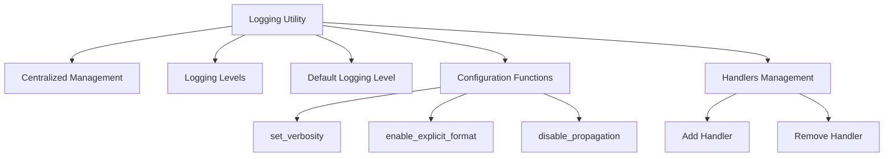

Logging is used to track events that happen when some software runs. It can be crucial for debugging and understanding the flow of a program.

The logging utility in this repository provides a centralized way to manage log messages, ensuring consistency and control over how messages are formatted and where they are output.

The logging levels available include debug, info, warning, error, and critical, which help categorize the importance and type of log messages.

The default logging level is set to warning, but it can be adjusted based on the environment variable <SwmToken path="src/transformers/utils/logging.py" pos="48:3:3" line-data="    If TRANSFORMERS_VERBOSITY env var is set to one of the valid choices return that as the new default level. If it is">`TRANSFORMERS_VERBOSITY`</SwmToken> or programmatically using provided functions.

The <SwmToken path="src/transformers/utils/logging.py" pos="73:2:2" line-data="def _configure_library_root_logger() -&gt; None:">`_configure_library_root_logger`</SwmToken> function sets up the root logger with a default handler and applies the default logging level.

Functions like <SwmToken path="src/transformers/utils/logging.py" pos="145:2:2" line-data="def set_verbosity(verbosity: int) -&gt; None:">`set_verbosity`</SwmToken>, <SwmToken path="src/transformers/utils/logging.py" pos="239:2:2" line-data="def enable_explicit_format() -&gt; None:">`enable_explicit_format`</SwmToken>, and <SwmToken path="src/transformers/utils/logging.py" pos="220:2:2" line-data="def disable_propagation() -&gt; None:">`disable_propagation`</SwmToken> allow fine-grained control over the logging behavior, such as changing the verbosity level, formatting log messages, and controlling log propagation.

Handlers can be added or removed from the root logger to customize where log messages are sent, such as to a file or a console.



<SwmSnippet path="/src/transformers/utils/logging.py" line="35">

---

# Logging Levels

The logging levels available include debug, info, warning, error, and critical, which help categorize the importance and type of log messages.

```python
log_levels = {
    "debug": logging.DEBUG,
    "info": logging.INFO,
    "warning": logging.WARNING,
    "error": logging.ERROR,
    "critical": logging.CRITICAL,
}
```

---

</SwmSnippet>

<SwmSnippet path="/src/transformers/utils/logging.py" line="43">

---

# Default Logging Level

The default logging level is set to warning.

```python
_default_log_level = logging.WARNING
```

---

</SwmSnippet>

<SwmSnippet path="/src/transformers/utils/logging.py" line="73">

---

# Configure Root Logger

The <SwmToken path="src/transformers/utils/logging.py" pos="73:2:2" line-data="def _configure_library_root_logger() -&gt; None:">`_configure_library_root_logger`</SwmToken> function sets up the root logger with a default handler and applies the default logging level.

```python
def _configure_library_root_logger() -> None:

    global _default_handler

    with _lock:
        if _default_handler:
            # This library has already configured the library root logger.
            return
        _default_handler = logging.StreamHandler()  # Set sys.stderr as stream.
        _default_handler.flush = sys.stderr.flush

        # Apply our default configuration to the library root logger.
        library_root_logger = _get_library_root_logger()
        library_root_logger.addHandler(_default_handler)
        library_root_logger.setLevel(_get_default_logging_level())
        library_root_logger.propagate = False
```

---

</SwmSnippet>

<SwmSnippet path="/src/transformers/utils/logging.py" line="109">

---

# Get Logger

The <SwmToken path="src/transformers/utils/logging.py" pos="109:2:2" line-data="def get_logger(name: Optional[str] = None) -&gt; logging.Logger:">`get_logger`</SwmToken> function returns a logger with the specified name, configuring the root logger if it hasn't been configured yet.

```python
def get_logger(name: Optional[str] = None) -> logging.Logger:
    """
    Return a logger with the specified name.

    This function is not supposed to be directly accessed unless you are writing a custom transformers module.
    """

    if name is None:
        name = _get_library_name()

    _configure_library_root_logger()
    return logging.getLogger(name)
```

---

</SwmSnippet>

<SwmSnippet path="/src/transformers/utils/logging.py" line="145">

---

# Set Verbosity

The <SwmToken path="src/transformers/utils/logging.py" pos="145:2:2" line-data="def set_verbosity(verbosity: int) -&gt; None:">`set_verbosity`</SwmToken> function allows changing the verbosity level of the root logger.

```python
def set_verbosity(verbosity: int) -> None:
    """
    Set the verbosity level for the 🤗 Transformers's root logger.

    Args:
        verbosity (:obj:`int`):
            Logging level, e.g., one of:

            - ``transformers.logging.CRITICAL`` or ``transformers.logging.FATAL``
            - ``transformers.logging.ERROR``
            - ``transformers.logging.WARNING`` or ``transformers.logging.WARN``
            - ``transformers.logging.INFO``
            - ``transformers.logging.DEBUG``
    """

    _configure_library_root_logger()
    _get_library_root_logger().setLevel(verbosity)

```

---

</SwmSnippet>

<SwmSnippet path="/src/transformers/utils/logging.py" line="239">

---

# Enable Explicit Format

The <SwmToken path="src/transformers/utils/logging.py" pos="239:2:2" line-data="def enable_explicit_format() -&gt; None:">`enable_explicit_format`</SwmToken> function sets a specific format for log messages.

```python
def enable_explicit_format() -> None:
    """
    Enable explicit formatting for every HuggingFace Transformers's logger. The explicit formatter is as follows:

    ::

        [LEVELNAME|FILENAME|LINE NUMBER] TIME >> MESSAGE

    All handlers currently bound to the root logger are affected by this method.
    """
    handlers = _get_library_root_logger().handlers

    for handler in handlers:
        formatter = logging.Formatter("[%(levelname)s|%(filename)s:%(lineno)s] %(asctime)s >> %(message)s")
        handler.setFormatter(formatter)
```

---

</SwmSnippet>

<SwmSnippet path="/src/transformers/utils/logging.py" line="220">

---

# Disable Propagation

The <SwmToken path="src/transformers/utils/logging.py" pos="220:2:2" line-data="def disable_propagation() -&gt; None:">`disable_propagation`</SwmToken> function disables the propagation of log messages to ancestor loggers.

```python
def disable_propagation() -> None:
    """
    Disable propagation of the library log outputs. Note that log propagation is disabled by default.
    """

    _configure_library_root_logger()
    _get_library_root_logger().propagate = False
```

---

</SwmSnippet>

# Main functions

There are several main functions in this folder. Some of them are <SwmToken path="src/transformers/utils/logging.py" pos="145:2:2" line-data="def set_verbosity(verbosity: int) -&gt; None:">`set_verbosity`</SwmToken>, <SwmToken path="src/transformers/utils/logging.py" pos="239:2:2" line-data="def enable_explicit_format() -&gt; None:">`enable_explicit_format`</SwmToken>, and <SwmToken path="src/transformers/utils/logging.py" pos="220:2:2" line-data="def disable_propagation() -&gt; None:">`disable_propagation`</SwmToken>. We will dive a little into <SwmToken path="src/transformers/utils/logging.py" pos="145:2:2" line-data="def set_verbosity(verbosity: int) -&gt; None:">`set_verbosity`</SwmToken> and <SwmToken path="src/transformers/utils/logging.py" pos="239:2:2" line-data="def enable_explicit_format() -&gt; None:">`enable_explicit_format`</SwmToken>.

<SwmSnippet path="/src/transformers/utils/logging.py" line="145">

---

## <SwmToken path="src/transformers/utils/logging.py" pos="145:2:2" line-data="def set_verbosity(verbosity: int) -&gt; None:">`set_verbosity`</SwmToken>

The <SwmToken path="src/transformers/utils/logging.py" pos="145:2:2" line-data="def set_verbosity(verbosity: int) -&gt; None:">`set_verbosity`</SwmToken> function sets the verbosity level for the root logger. This function allows you to control the amount of log output by specifying a logging level such as DEBUG, INFO, WARNING, ERROR, or CRITICAL.

```python
def set_verbosity(verbosity: int) -> None:
    """
    Set the verbosity level for the 🤗 Transformers's root logger.

    Args:
        verbosity (:obj:`int`):
            Logging level, e.g., one of:

            - ``transformers.logging.CRITICAL`` or ``transformers.logging.FATAL``
            - ``transformers.logging.ERROR``
            - ``transformers.logging.WARNING`` or ``transformers.logging.WARN``
            - ``transformers.logging.INFO``
            - ``transformers.logging.DEBUG``
    """

    _configure_library_root_logger()
    _get_library_root_logger().setLevel(verbosity)

```

---

</SwmSnippet>

<SwmSnippet path="/src/transformers/utils/logging.py" line="239">

---

## <SwmToken path="src/transformers/utils/logging.py" pos="239:2:2" line-data="def enable_explicit_format() -&gt; None:">`enable_explicit_format`</SwmToken>

The <SwmToken path="src/transformers/utils/logging.py" pos="239:2:2" line-data="def enable_explicit_format() -&gt; None:">`enable_explicit_format`</SwmToken> function enables explicit formatting for the log messages. The format includes the log level, filename, line number, timestamp, and the message itself. This is useful for debugging and understanding the context of log messages.

```python
def enable_explicit_format() -> None:
    """
    Enable explicit formatting for every HuggingFace Transformers's logger. The explicit formatter is as follows:

    ::

        [LEVELNAME|FILENAME|LINE NUMBER] TIME >> MESSAGE

    All handlers currently bound to the root logger are affected by this method.
    """
    handlers = _get_library_root_logger().handlers

    for handler in handlers:
        formatter = logging.Formatter("[%(levelname)s|%(filename)s:%(lineno)s] %(asctime)s >> %(message)s")
        handler.setFormatter(formatter)
```

---

</SwmSnippet>

<SwmSnippet path="/src/transformers/utils/logging.py" line="220">

---

## <SwmToken path="src/transformers/utils/logging.py" pos="220:2:2" line-data="def disable_propagation() -&gt; None:">`disable_propagation`</SwmToken>

The <SwmToken path="src/transformers/utils/logging.py" pos="220:2:2" line-data="def disable_propagation() -&gt; None:">`disable_propagation`</SwmToken> function disables the propagation of log messages to ancestor loggers. This is useful when you want to prevent log messages from being handled by multiple loggers, which can result in duplicate log entries.

```python
def disable_propagation() -> None:
    """
    Disable propagation of the library log outputs. Note that log propagation is disabled by default.
    """

    _configure_library_root_logger()
    _get_library_root_logger().propagate = False
```

---

</SwmSnippet>

&nbsp;

*This is an auto-generated document by Swimm AI 🌊 and has not yet been verified by a human*

<SwmMeta version="3.0.0" repo-id="Z2l0aHViJTNBJTNBdHJhbnNmb3JtZXJzJTNBJTNBc2h1anV1dQ==" repo-name="transformers"><sup>Powered by [Swimm](/)</sup></SwmMeta>
