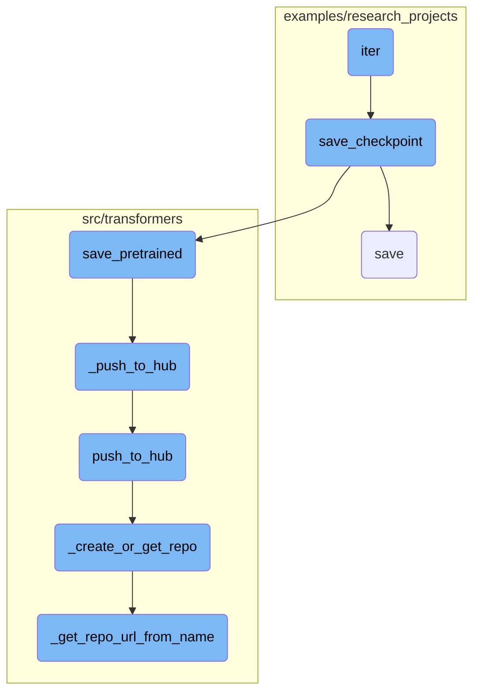
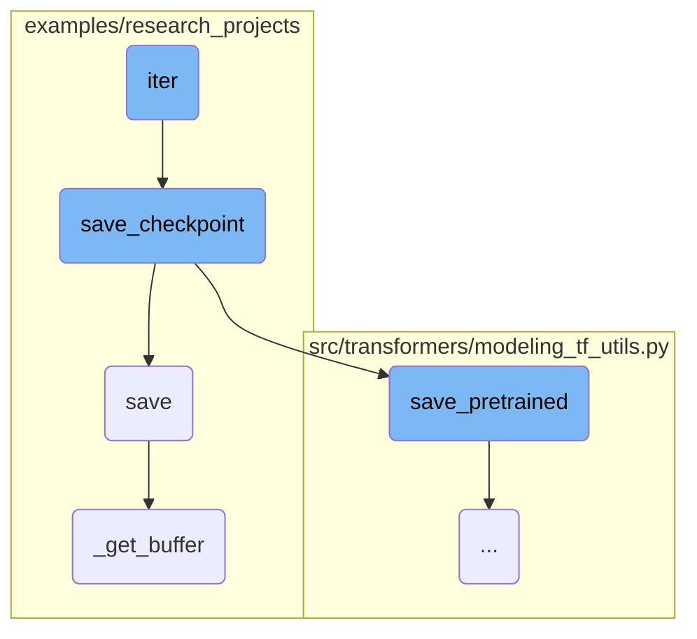

In this document, we will explain the purpose and functionality of the <SwmToken path="examples/research_projects/distillation/distiller.py" pos="501:3:3" line-data="    def iter(self):">`iter`</SwmToken> function. The <SwmToken path="examples/research_projects/distillation/distiller.py" pos="501:3:3" line-data="    def iter(self):">`iter`</SwmToken> function is responsible for updating global iteration counts, logging information to <SwmToken path="examples/research_projects/distillation/distiller.py" pos="503:12:12" line-data="        Update global counts, write to tensorboard and save checkpoint.">`tensorboard`</SwmToken>, and saving checkpoints at specified intervals.

The <SwmToken path="examples/research_projects/distillation/distiller.py" pos="501:3:3" line-data="    def iter(self):">`iter`</SwmToken> function works by first updating the global iteration counts. It then checks if the total number of iterations has reached a specified interval for logging information. If so, it logs the necessary information to <SwmToken path="examples/research_projects/distillation/distiller.py" pos="503:12:12" line-data="        Update global counts, write to tensorboard and save checkpoint.">`tensorboard`</SwmToken> and updates the last log time. Additionally, it checks if the total number of iterations has reached a specified interval for saving checkpoints. If this condition is met, it triggers the saving of the current state of the model.

Here is a high level diagram of the flow, showing only the most important functions:



# Flow drill down

First, we'll zoom into this section of the flow:



<SwmSnippet path="/examples/research_projects/distillation/distiller.py" line="501">

---

## Updating global counts

The <SwmToken path="examples/research_projects/distillation/distiller.py" pos="501:3:3" line-data="    def iter(self):">`iter`</SwmToken> function updates the global iteration counts and logs information to <SwmToken path="examples/research_projects/distillation/distiller.py" pos="503:12:12" line-data="        Update global counts, write to tensorboard and save checkpoint.">`tensorboard`</SwmToken> at specified intervals. It also triggers the saving of checkpoints based on the checkpoint interval.

```python
    def iter(self):
        """
        Update global counts, write to tensorboard and save checkpoint.
        """
        self.n_iter += 1
        self.n_total_iter += 1

        if self.n_total_iter % self.params.log_interval == 0:
            self.log_tensorboard()
            self.last_log = time.time()
        if self.n_total_iter % self.params.checkpoint_interval == 0:
            self.save_checkpoint()
```

---

</SwmSnippet>

<SwmSnippet path="/examples/research_projects/distillation/distiller.py" line="593">

---

## Saving checkpoints

The <SwmToken path="examples/research_projects/distillation/distiller.py" pos="593:3:3" line-data="    def save_checkpoint(self, checkpoint_name: str = &quot;checkpoint.pth&quot;):">`save_checkpoint`</SwmToken> function saves the current state of the model. It ensures that only the master process performs the save operation and stores the model's state dictionary to a specified path.

```python
    def save_checkpoint(self, checkpoint_name: str = "checkpoint.pth"):
        """
        Save the current state. Only by the master process.
        """
        if not self.is_master:
            return
        mdl_to_save = self.student.module if hasattr(self.student, "module") else self.student
        mdl_to_save.config.save_pretrained(self.dump_path)
        state_dict = mdl_to_save.state_dict()
        torch.save(state_dict, os.path.join(self.dump_path, checkpoint_name))
```

---

</SwmSnippet>

<SwmSnippet path="/examples/research_projects/lxmert/visualizing_image.py" line="194">

---

## Saving images

The <SwmToken path="examples/research_projects/lxmert/visualizing_image.py" pos="194:3:3" line-data="    def save(self, saveas=None):">`save`</SwmToken> function handles saving images in different formats. It uses the <SwmToken path="examples/research_projects/lxmert/visualizing_image.py" pos="200:3:3" line-data="                self._get_buffer()[:, :, ::-1],">`_get_buffer`</SwmToken> function to retrieve the image buffer and then saves the image using OpenCV or Matplotlib based on the file extension.

```python
    def save(self, saveas=None):
        if saveas is None:
            saveas = self.saveas
        if saveas.lower().endswith(".jpg") or saveas.lower().endswith(".png"):
            cv2.imwrite(
                saveas,
                self._get_buffer()[:, :, ::-1],
            )
        else:
            self.fig.savefig(saveas)
```

---

</SwmSnippet>

<SwmSnippet path="/examples/research_projects/lxmert/visualizing_image.py" line="230">

---

### Retrieving image buffer

The <SwmToken path="examples/research_projects/lxmert/visualizing_image.py" pos="230:3:3" line-data="    def _get_buffer(self):">`_get_buffer`</SwmToken> function retrieves the image buffer, handling different backends and resizing the image if necessary. It processes the image data to create a visualized image with proper alpha blending.

```python
    def _get_buffer(self):
        if not self.pynb:
            s, (width, height) = self.canvas.print_to_buffer()
            if (width, height) != (self.width, self.height):
                img = cv2.resize(self.img, (width, height))
            else:
                img = self.img
        else:
            buf = io.BytesIO()  # works for cairo backend
            self.canvas.print_rgba(buf)
            width, height = self.width, self.height
            s = buf.getvalue()
            img = self.img

        buffer = np.frombuffer(s, dtype="uint8")
        img_rgba = buffer.reshape(height, width, 4)
        rgb, alpha = np.split(img_rgba, [3], axis=2)

        try:
            import numexpr as ne  # fuse them with numexpr

```

---

</SwmSnippet>

Now, lets zoom into this section of the flow:

```mermaid
graph TD;
      subgraph src/transformers
ebd8b60066c2a044818b3bc6e78c44b93142a9b06e4cfb0f15bb954e1a8932bc(save_pretrained):::mainFlowStyle --> 994e0029179b3d2067ea40f3c2b875d28874c47947ff788b3bfc10fc9c5f5635(_push_to_hub):::mainFlowStyle
end

subgraph src/transformers
994e0029179b3d2067ea40f3c2b875d28874c47947ff788b3bfc10fc9c5f5635(_push_to_hub):::mainFlowStyle --> d22bd972f192f0d5bca2b91d3617e1784ba275509ca05df21db911a8b21dce73(push_to_hub):::mainFlowStyle
end

subgraph src/transformers
d22bd972f192f0d5bca2b91d3617e1784ba275509ca05df21db911a8b21dce73(push_to_hub):::mainFlowStyle --> 11f568aab05fc59ba0062a5a0d68382c26e99a15e1aec7bab95b54f2291936f3(_create_or_get_repo):::mainFlowStyle
end

subgraph src/transformers
11f568aab05fc59ba0062a5a0d68382c26e99a15e1aec7bab95b54f2291936f3(_create_or_get_repo):::mainFlowStyle --> b641b04a36ff5cc31767390e915bb3e7758cf49bdb40f3cc2145f7c55540e658(_get_repo_url_from_name):::mainFlowStyle
end


      classDef mainFlowStyle color:#000000,fill:#7CB9F4
classDef rootsStyle color:#000000,fill:#00FFF4
classDef Style1 color:#000000,fill:#00FFAA
classDef Style2 color:#000000,fill:#FFFF00
classDef Style3 color:#000000,fill:#AA7CB9

%% Swimm:
%% graph TD;
%%       subgraph <SwmPath>[src/transformers/](src/transformers/)</SwmPath>
%% ebd8b60066c2a044818b3bc6e78c44b93142a9b06e4cfb0f15bb954e1a8932bc(save_pretrained):::mainFlowStyle --> 994e0029179b3d2067ea40f3c2b875d28874c47947ff788b3bfc10fc9c5f5635(_push_to_hub):::mainFlowStyle
%% end
%% 
%% subgraph <SwmPath>[src/transformers/](src/transformers/)</SwmPath>
%% 994e0029179b3d2067ea40f3c2b875d28874c47947ff788b3bfc10fc9c5f5635(_push_to_hub):::mainFlowStyle --> d22bd972f192f0d5bca2b91d3617e1784ba275509ca05df21db911a8b21dce73(push_to_hub):::mainFlowStyle
%% end
%% 
%% subgraph <SwmPath>[src/transformers/](src/transformers/)</SwmPath>
%% d22bd972f192f0d5bca2b91d3617e1784ba275509ca05df21db911a8b21dce73(push_to_hub):::mainFlowStyle --> 11f568aab05fc59ba0062a5a0d68382c26e99a15e1aec7bab95b54f2291936f3(_create_or_get_repo):::mainFlowStyle
%% end
%% 
%% subgraph <SwmPath>[src/transformers/](src/transformers/)</SwmPath>
%% 11f568aab05fc59ba0062a5a0d68382c26e99a15e1aec7bab95b54f2291936f3(_create_or_get_repo):::mainFlowStyle --> b641b04a36ff5cc31767390e915bb3e7758cf49bdb40f3cc2145f7c55540e658(_get_repo_url_from_name):::mainFlowStyle
%% end
%% 
%% 
%%       classDef mainFlowStyle color:#000000,fill:#7CB9F4
%% classDef rootsStyle color:#000000,fill:#00FFF4
%% classDef Style1 color:#000000,fill:#00FFAA
%% classDef Style2 color:#000000,fill:#FFFF00
%% classDef Style3 color:#000000,fill:#AA7CB9
```



<SwmSnippet path="/src/transformers/modeling_tf_utils.py" line="1022">

---

## <SwmToken path="src/transformers/modeling_tf_utils.py" pos="1022:3:3" line-data="    def save_pretrained(self, save_directory, saved_model=False, version=1, push_to_hub=False, **kwargs):">`save_pretrained`</SwmToken>

The <SwmToken path="src/transformers/modeling_tf_utils.py" pos="1022:3:3" line-data="    def save_pretrained(self, save_directory, saved_model=False, version=1, push_to_hub=False, **kwargs):">`save_pretrained`</SwmToken> function is responsible for saving a model and its configuration to a specified directory. It ensures that the directory exists, saves the model in the specified format, and optionally pushes the model to the Hugging Face Hub if <SwmToken path="src/transformers/modeling_tf_utils.py" pos="1022:21:21" line-data="    def save_pretrained(self, save_directory, saved_model=False, version=1, push_to_hub=False, **kwargs):">`push_to_hub`</SwmToken> is set to True.

```python
    def save_pretrained(self, save_directory, saved_model=False, version=1, push_to_hub=False, **kwargs):
        """
        Save a model and its configuration file to a directory, so that it can be re-loaded using the
        :func:`~transformers.TFPreTrainedModel.from_pretrained` class method.

        Arguments:
            save_directory (:obj:`str`):
                Directory to which to save. Will be created if it doesn't exist.
            saved_model (:obj:`bool`, `optional`, defaults to :obj:`False`):
                If the model has to be saved in saved model format as well or not.
            version (:obj:`int`, `optional`, defaults to 1):
                The version of the saved model. A saved model needs to be versioned in order to be properly loaded by
                TensorFlow Serving as detailed in the official documentation
                https://www.tensorflow.org/tfx/serving/serving_basic
            push_to_hub (:obj:`bool`, `optional`, defaults to :obj:`False`):
                Whether or not to push your model to the Hugging Face model hub after saving it.

                .. warning::

                    Using :obj:`push_to_hub=True` will synchronize the repository you are pushing to with
                    :obj:`save_directory`, which requires :obj:`save_directory` to be a local clone of the repo you are
```

---

</SwmSnippet>

<SwmSnippet path="/src/transformers/file_utils.py" line="2098">

---

### <SwmToken path="src/transformers/file_utils.py" pos="2098:3:3" line-data="    def _push_to_hub(cls, repo: Repository, commit_message: Optional[str] = None) -&gt; str:">`_push_to_hub`</SwmToken>

The <SwmToken path="src/transformers/file_utils.py" pos="2098:3:3" line-data="    def _push_to_hub(cls, repo: Repository, commit_message: Optional[str] = None) -&gt; str:">`_push_to_hub`</SwmToken> function handles the actual process of pushing the model to the Hugging Face Hub. It constructs a commit message based on the class type and uses the <SwmToken path="src/transformers/file_utils.py" pos="2107:3:5" line-data="        return repo.push_to_hub(commit_message=commit_message)">`repo.push_to_hub`</SwmToken> method to push the changes.

```python
    def _push_to_hub(cls, repo: Repository, commit_message: Optional[str] = None) -> str:
        if commit_message is None:
            if "Tokenizer" in cls.__name__:
                commit_message = "add tokenizer"
            elif "Config" in cls.__name__:
                commit_message = "add config"
            else:
                commit_message = "add model"

        return repo.push_to_hub(commit_message=commit_message)
```

---

</SwmSnippet>

<SwmSnippet path="/src/transformers/file_utils.py" line="1939">

---

### <SwmToken path="src/transformers/file_utils.py" pos="1939:3:3" line-data="    def push_to_hub(">`push_to_hub`</SwmToken>

The <SwmToken path="src/transformers/file_utils.py" pos="1939:3:3" line-data="    def push_to_hub(">`push_to_hub`</SwmToken> function provides a higher-level interface for pushing model checkpoints or tokenizer files to the Hugging Face Hub. It manages the repository creation or retrieval, saves the model files, and commits and pushes the changes.

```python
    def push_to_hub(
        self,
        repo_path_or_name: Optional[str] = None,
        repo_url: Optional[str] = None,
        use_temp_dir: bool = False,
        commit_message: Optional[str] = None,
        organization: Optional[str] = None,
        private: Optional[bool] = None,
        use_auth_token: Optional[Union[bool, str]] = None,
    ) -> str:
        """
        Upload model checkpoint or tokenizer files to the 🤗 Model Hub while synchronizing a local clone of the repo in
        :obj:`repo_path_or_name`.

        Parameters:
            repo_path_or_name (:obj:`str`, `optional`):
                Can either be a repository name for your model or tokenizer in the Hub or a path to a local folder (in
                which case the repository will have the name of that local folder). If not specified, will default to
                the name given by :obj:`repo_url` and a local directory with that name will be created.
            repo_url (:obj:`str`, `optional`):
                Specify this in case you want to push to an existing repository in the hub. If unspecified, a new
```

---

</SwmSnippet>

<SwmSnippet path="/src/transformers/file_utils.py" line="2066">

---

### <SwmToken path="src/transformers/file_utils.py" pos="2066:3:3" line-data="    def _create_or_get_repo(">`_create_or_get_repo`</SwmToken>

The <SwmToken path="src/transformers/file_utils.py" pos="2066:3:3" line-data="    def _create_or_get_repo(">`_create_or_get_repo`</SwmToken> function is responsible for creating a new repository or retrieving an existing one. It ensures that the repository path exists and clones the repository if necessary.

```python
    def _create_or_get_repo(
        cls,
        repo_path_or_name: Optional[str] = None,
        repo_url: Optional[str] = None,
        organization: Optional[str] = None,
        private: bool = None,
        use_auth_token: Optional[Union[bool, str]] = None,
    ) -> Repository:
        if repo_path_or_name is None and repo_url is None:
            raise ValueError("You need to specify a `repo_path_or_name` or a `repo_url`.")

        if use_auth_token is None and repo_url is None:
            use_auth_token = True

        if repo_path_or_name is None:
            repo_path_or_name = repo_url.split("/")[-1]

        if repo_url is None and not os.path.exists(repo_path_or_name):
            repo_name = Path(repo_path_or_name).name
            repo_url = cls._get_repo_url_from_name(
                repo_name, organization=organization, private=private, use_auth_token=use_auth_token
```

---

</SwmSnippet>

<SwmSnippet path="/src/transformers/file_utils.py" line="2036">

---

### <SwmToken path="src/transformers/file_utils.py" pos="2036:3:3" line-data="    def _get_repo_url_from_name(">`_get_repo_url_from_name`</SwmToken>

The <SwmToken path="src/transformers/file_utils.py" pos="2036:3:3" line-data="    def _get_repo_url_from_name(">`_get_repo_url_from_name`</SwmToken> function generates the repository URL based on the repository name, organization, and other parameters. It handles authentication and ensures that the repository exists or creates it if it does not.

```python
    def _get_repo_url_from_name(
        repo_name: str,
        organization: Optional[str] = None,
        private: bool = None,
        use_auth_token: Optional[Union[bool, str]] = None,
    ) -> str:
        if isinstance(use_auth_token, str):
            token = use_auth_token
        elif use_auth_token:
            token = HfFolder.get_token()
            if token is None:
                raise ValueError(
                    "You must login to the Hugging Face hub on this computer by typing `transformers-cli login` and "
                    "entering your credentials to use `use_auth_token=True`. Alternatively, you can pass your own "
                    "token as the `use_auth_token` argument."
                )
        else:
            token = None

        # Special provision for the test endpoint (CI)
        return HfApi(endpoint=HUGGINGFACE_CO_RESOLVE_ENDPOINT).create_repo(
```

---

</SwmSnippet>

# Where is this flow used?

This flow is used multiple times in the codebase as represented in the following diagram:

(Note - these are only some of the entry points of this flow)

```mermaid
graph TD;
      227eaee48f790cb276fab7c3bb5c4aed07dc34a153c81931559b3ec413b1cb32(main):::rootsStyle --> a3eed5832bf5ad0c25c9ea747a5451534b4bf497205c463bc7076b2598c402d9(train)

a3eed5832bf5ad0c25c9ea747a5451534b4bf497205c463bc7076b2598c402d9(train) --> 6e607b060f7c1df9e5d57b2ad94926566134955ed97b0934bff72d2b25b99233(step)

6e607b060f7c1df9e5d57b2ad94926566134955ed97b0934bff72d2b25b99233(step) --> 15596689f074c099319f83dad04385d5b062acd336562aa582ce6f27f587ab09(optimize)

15596689f074c099319f83dad04385d5b062acd336562aa582ce6f27f587ab09(optimize) --> ef01ee1bf20092c3bdf6ab5794e44146f134e3cf8e7a0b994f80b9f026184c88(iter):::mainFlowStyle

227eaee48f790cb276fab7c3bb5c4aed07dc34a153c81931559b3ec413b1cb32(main):::rootsStyle --> a3eed5832bf5ad0c25c9ea747a5451534b4bf497205c463bc7076b2598c402d9(train)

subgraph src/transformers/models/tapas/tokenization_tapas.py
356c2e3b9aa8d609c3283b0721451e81f57a0eaa4d8f1e60fd75694ef1aec032(__call__):::rootsStyle --> b265aee4243ba863561bc6d8912bd43a8d963ab7da77f8bd96007d3788bf88cc(batch_encode_plus)
end

subgraph src/transformers/models/tapas/tokenization_tapas.py
b265aee4243ba863561bc6d8912bd43a8d963ab7da77f8bd96007d3788bf88cc(batch_encode_plus) --> edaf8d3235689dffebfeca6d6159a4f1044f939364ef2e71abd0d5ad7a064f1e(_batch_encode_plus)
end

subgraph src/transformers/models/tapas/tokenization_tapas.py
edaf8d3235689dffebfeca6d6159a4f1044f939364ef2e71abd0d5ad7a064f1e(_batch_encode_plus) --> 604df6e44650f53f4e57019d8e2d70f21eea23a2b9b993f7a9c21eae399527d6(_batch_prepare_for_model)
end

subgraph src/transformers/models/tapas/tokenization_tapas.py
604df6e44650f53f4e57019d8e2d70f21eea23a2b9b993f7a9c21eae399527d6(_batch_prepare_for_model) --> a94f97389a7d9e844922df01057bcfcef848e69b09fb9f8cd1e7b48d9c843501(prepare_for_model)
end

subgraph src/transformers/models/tapas/tokenization_tapas.py
a94f97389a7d9e844922df01057bcfcef848e69b09fb9f8cd1e7b48d9c843501(prepare_for_model) --> 6edbe5cb985313ec1e34113d60cedd6fd3437d32238f9d4947fd98fe4336de3c(add_numeric_table_values)
end

subgraph src/transformers/models/tapas/tokenization_tapas.py
6edbe5cb985313ec1e34113d60cedd6fd3437d32238f9d4947fd98fe4336de3c(add_numeric_table_values) --> 28e6f47d6d2eb71e6c487be1d1240d1671c78a3047a4a131d2abee35772cafdf(_consolidate_numeric_values)
end

28e6f47d6d2eb71e6c487be1d1240d1671c78a3047a4a131d2abee35772cafdf(_consolidate_numeric_values) --> ef01ee1bf20092c3bdf6ab5794e44146f134e3cf8e7a0b994f80b9f026184c88(iter):::mainFlowStyle

227eaee48f790cb276fab7c3bb5c4aed07dc34a153c81931559b3ec413b1cb32(main):::rootsStyle --> a3eed5832bf5ad0c25c9ea747a5451534b4bf497205c463bc7076b2598c402d9(train)

227eaee48f790cb276fab7c3bb5c4aed07dc34a153c81931559b3ec413b1cb32(main):::rootsStyle --> a3eed5832bf5ad0c25c9ea747a5451534b4bf497205c463bc7076b2598c402d9(train)


      classDef mainFlowStyle color:#000000,fill:#7CB9F4
classDef rootsStyle color:#000000,fill:#00FFF4
classDef Style1 color:#000000,fill:#00FFAA
classDef Style2 color:#000000,fill:#FFFF00
classDef Style3 color:#000000,fill:#AA7CB9

%% Swimm:
%% graph TD;
%%       227eaee48f790cb276fab7c3bb5c4aed07dc34a153c81931559b3ec413b1cb32(main):::rootsStyle --> a3eed5832bf5ad0c25c9ea747a5451534b4bf497205c463bc7076b2598c402d9(train)
%% 
%% a3eed5832bf5ad0c25c9ea747a5451534b4bf497205c463bc7076b2598c402d9(train) --> 6e607b060f7c1df9e5d57b2ad94926566134955ed97b0934bff72d2b25b99233(step)
%% 
%% 6e607b060f7c1df9e5d57b2ad94926566134955ed97b0934bff72d2b25b99233(step) --> 15596689f074c099319f83dad04385d5b062acd336562aa582ce6f27f587ab09(optimize)
%% 
%% 15596689f074c099319f83dad04385d5b062acd336562aa582ce6f27f587ab09(optimize) --> ef01ee1bf20092c3bdf6ab5794e44146f134e3cf8e7a0b994f80b9f026184c88(iter):::mainFlowStyle
%% 
%% 227eaee48f790cb276fab7c3bb5c4aed07dc34a153c81931559b3ec413b1cb32(main):::rootsStyle --> a3eed5832bf5ad0c25c9ea747a5451534b4bf497205c463bc7076b2598c402d9(train)
%% 
%% subgraph <SwmPath>[src/transformers/models/tapas/tokenization_tapas.py](src/transformers/models/tapas/tokenization_tapas.py)</SwmPath>
%% 356c2e3b9aa8d609c3283b0721451e81f57a0eaa4d8f1e60fd75694ef1aec032(__call__):::rootsStyle --> b265aee4243ba863561bc6d8912bd43a8d963ab7da77f8bd96007d3788bf88cc(batch_encode_plus)
%% end
%% 
%% subgraph <SwmPath>[src/transformers/models/tapas/tokenization_tapas.py](src/transformers/models/tapas/tokenization_tapas.py)</SwmPath>
%% b265aee4243ba863561bc6d8912bd43a8d963ab7da77f8bd96007d3788bf88cc(batch_encode_plus) --> edaf8d3235689dffebfeca6d6159a4f1044f939364ef2e71abd0d5ad7a064f1e(_batch_encode_plus)
%% end
%% 
%% subgraph <SwmPath>[src/transformers/models/tapas/tokenization_tapas.py](src/transformers/models/tapas/tokenization_tapas.py)</SwmPath>
%% edaf8d3235689dffebfeca6d6159a4f1044f939364ef2e71abd0d5ad7a064f1e(_batch_encode_plus) --> 604df6e44650f53f4e57019d8e2d70f21eea23a2b9b993f7a9c21eae399527d6(_batch_prepare_for_model)
%% end
%% 
%% subgraph <SwmPath>[src/transformers/models/tapas/tokenization_tapas.py](src/transformers/models/tapas/tokenization_tapas.py)</SwmPath>
%% 604df6e44650f53f4e57019d8e2d70f21eea23a2b9b993f7a9c21eae399527d6(_batch_prepare_for_model) --> a94f97389a7d9e844922df01057bcfcef848e69b09fb9f8cd1e7b48d9c843501(prepare_for_model)
%% end
%% 
%% subgraph <SwmPath>[src/transformers/models/tapas/tokenization_tapas.py](src/transformers/models/tapas/tokenization_tapas.py)</SwmPath>
%% a94f97389a7d9e844922df01057bcfcef848e69b09fb9f8cd1e7b48d9c843501(prepare_for_model) --> 6edbe5cb985313ec1e34113d60cedd6fd3437d32238f9d4947fd98fe4336de3c(add_numeric_table_values)
%% end
%% 
%% subgraph <SwmPath>[src/transformers/models/tapas/tokenization_tapas.py](src/transformers/models/tapas/tokenization_tapas.py)</SwmPath>
%% 6edbe5cb985313ec1e34113d60cedd6fd3437d32238f9d4947fd98fe4336de3c(add_numeric_table_values) --> 28e6f47d6d2eb71e6c487be1d1240d1671c78a3047a4a131d2abee35772cafdf(_consolidate_numeric_values)
%% end
%% 
%% 28e6f47d6d2eb71e6c487be1d1240d1671c78a3047a4a131d2abee35772cafdf(_consolidate_numeric_values) --> ef01ee1bf20092c3bdf6ab5794e44146f134e3cf8e7a0b994f80b9f026184c88(iter):::mainFlowStyle
%% 
%% 227eaee48f790cb276fab7c3bb5c4aed07dc34a153c81931559b3ec413b1cb32(main):::rootsStyle --> a3eed5832bf5ad0c25c9ea747a5451534b4bf497205c463bc7076b2598c402d9(train)
%% 
%% 227eaee48f790cb276fab7c3bb5c4aed07dc34a153c81931559b3ec413b1cb32(main):::rootsStyle --> a3eed5832bf5ad0c25c9ea747a5451534b4bf497205c463bc7076b2598c402d9(train)
%% 
%% 
%%       classDef mainFlowStyle color:#000000,fill:#7CB9F4
%% classDef rootsStyle color:#000000,fill:#00FFF4
%% classDef Style1 color:#000000,fill:#00FFAA
%% classDef Style2 color:#000000,fill:#FFFF00
%% classDef Style3 color:#000000,fill:#AA7CB9
```



&nbsp;

*This is an auto-generated document by Swimm AI 🌊 and has not yet been verified by a human*

<SwmMeta version="3.0.0" repo-id="Z2l0aHViJTNBJTNBdHJhbnNmb3JtZXJzJTNBJTNBc2h1anV1dQ==" repo-name="transformers"><sup>Powered by [Swimm](/)</sup></SwmMeta>
